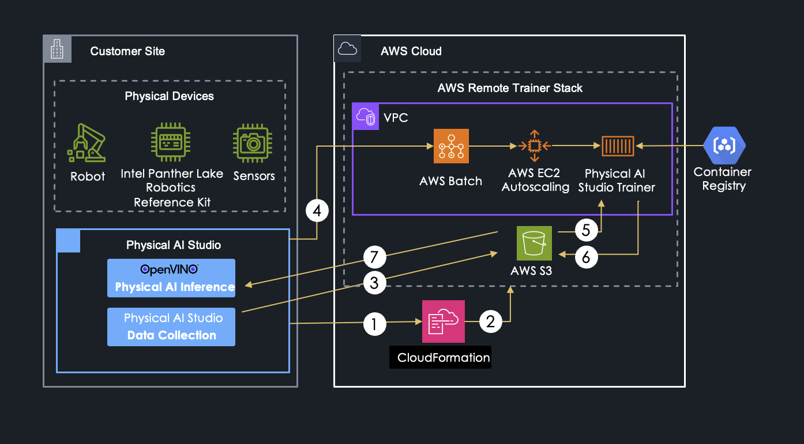
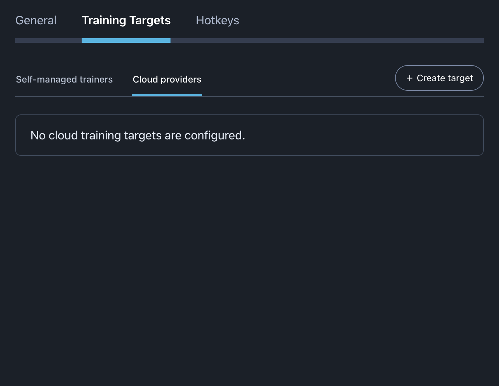
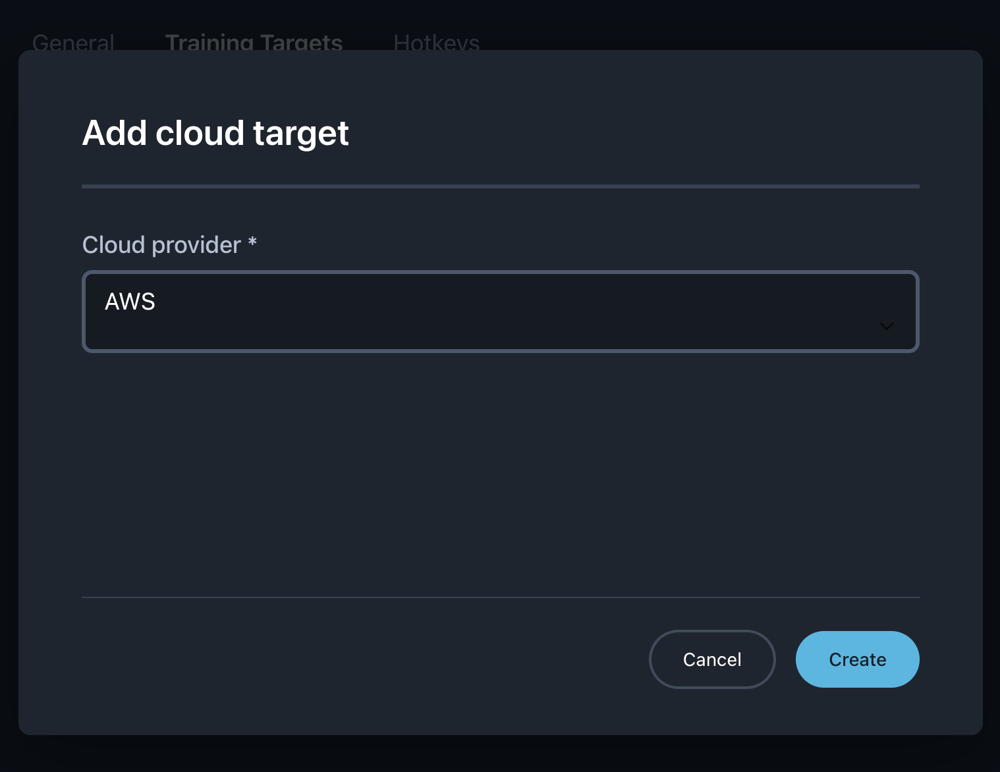

## Summary

AWS Batch as name suggests is used for batch workloads. AWS Batch is a managed service that queues jobs and runs containers on provisioned compute resources. Batch workloads have access to all AWS services.

Studio uploads the recorded dataset to Amazon S3, submits a Batch job, tracks its status, and downloads the trained model. The Batch job runs the existing training logic in a one-off container and exits when training finishes.

## User Experience

A new Cloud Providers tab will manage integrations with cloud providers.

A new Add cloud target form will create a stack, asking to fill in required configuration parameters, based on the cloud provider configuration json schema.

## Physical AI Studio Trainer

### Batch trainer image

The Batch trainer image runs one training job and then exits. Unlike the existing remote trainer, it does not expose an HTTP service or remain available between jobs.

The image is parametrised with the locations of the input, output, trained model, etc.
The one-off image uses the existing training logic with local file system input and output directories.

### AWS Integration

Add a Batch entrypoint that:

1. Downloads the dataset archive from S3 and validates it using the existing
   archive checks.
2. Runs the existing training logic against the extracted dataset.
3. Writes training progress to S3.
4. Uploads the model archive to S3.
5. Stops training when AWS Batch requests job termination.

Each job uses a dedicated S3 folder with a standard layout:

- `dataset.zip`: training input written by Studio.
- `status.json`: progress written by the trainer.
- `artifact.zip`: trained model written by the trainer.

The training logic remains independent of AWS and S3.

### AWS Trainer Authentication

Trainer authentication and authorization are outside the application. The
CloudFormation deployment assigns an IAM job role to the container with access
to the job's S3 objects.

## Physical AI Studio

### AWS Batch backend

Add an AWS Batch implementation of the existing training backend interface.

For each training job, the backend:

1. Creates the dataset archive and uploads it to the job's S3 prefix.
2. Submits a job using a configured AWS Batch job queue and job definition.
3. Passes the job's S3 object locations to the trainer container.
4. Reports Batch lifecycle state and trainer progress through Studio's existing
   progress interface.
5. Terminates the Batch job when Studio requests cancellation.
6. Downloads and extracts `artifact.zip` into the training output directory
   after the Batch job succeeds.
7. Reports a training failure when the Batch job fails or its output is
   unavailable.

The CloudFormation deployment provisions all required AWS resources: the job definition, job queue, and
compute resources, the trainer image, and IAM role.

### AWS Studio Authentication

Studio uses the standard AWS SDK credential provider chain. It does not implement or depend on a specific authentication flow.

For non production use cases, an operator can sign in interactively through the AWS CLI. Studio then uses that operator’s credentials to call S3 and AWS Batch on their behalf. The SDK can refresh temporary credentials while the login session remains valid; once that session expires, the operator must sign in again before Studio can make further calls. A Batch job already submitted continues independently of Studio’s login session.

For production robots, robots identity with short-lived cloud credentials is the recommended approach. A certificate authority (CA) issues each robot its own identity certificate. A cloud provider trusts the CA. Then robots exchange a valid robot identity for temporary credentials.
