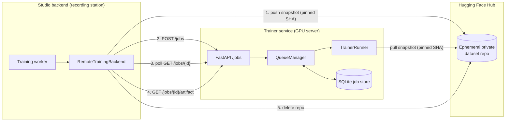
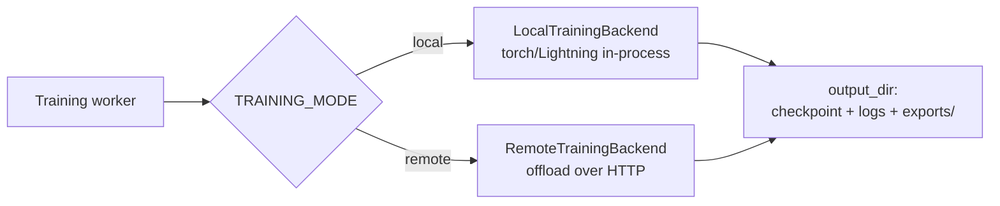
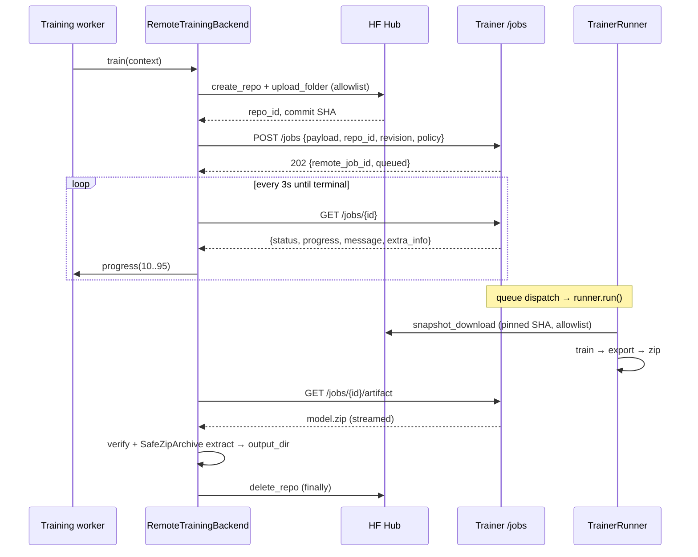

# Design: Remote Training

## Summary

Remote training offloads GPU-heavy policy training from a recording station to a dedicated GPU server (the **trainer service**), so recording machines stay lightweight. The Studio backend transfers the dataset snapshot through an ephemeral private Hugging Face dataset repo, submits a job over HTTP, mirrors remote progress into its own job record, downloads the trained model archive, and imports it. To the user, the Models screen looks identical to local training.

## Goals

- Run training on a separate GPU machine without changing the user-facing workflow.
- Keep recording-only installs free of `torch`/`physicalai` (This will require additional work, lerobot already includes pytorch).
- Serve several recording stations from one GPU server with a persistent, restart-safe queue.
- Mirror remote progress and support cancellation.

## Architecture

Two independently deployable services:

- **Studio backend** (`application/backend/`, `physicalai` *not* required in remote mode) — orchestrates the job, owns the user-facing job record.
- **Trainer service** (`application/trainer/`, `trainer` package) — a standalone FastAPI app that queues and runs training with `physicalai` + Lightning.

The dataset moves through Hugging Face Hub; everything else moves over HTTP.



## Backend integration

The training worker is backend-agnostic. `get_training_backend()` (`services/training_backends/__init__.py`) returns a `LocalTrainingBackend` or `RemoteTrainingBackend` based on `settings.training_mode`. Both satisfy the `TrainingBackend` protocol:

```python
async def train(self, context: TrainingContext) -> None: ...
```

`TrainingContext` (`services/training_backends/base.py`) carries everything a backend needs: the `Job`, `Model`, `Snapshot`, `TrainJobPayload`, optional `base_model`, an `output_dir`, a `progress` reporter, and a `should_stop` callback. A backend must leave a fully populated model directory at `output_dir` (checkpoint, logger output, `exports/`), report progress, and stop promptly when `should_stop()` returns `True`. This contract is the seam that makes local and remote interchangeable.

Heavy imports are deferred so `TRAINING_MODE=remote` never pulls in `torch`. `RemoteTrainingBackend` (`services/training_backends/remote.py`) imports `huggingface_hub` lazily and never imports `physicalai`.

## Local training (default)

Local training is the default and stays unchanged. With `TRAINING_MODE=local` (the default), `get_training_backend()` returns `LocalTrainingBackend` (`services/training_backends/local.py`), which trains in the worker process using `torch`/Lightning. This requires the `[train]` extra installed on the recording station. No trainer service, Hugging Face transfer, or `TRAINER_URL` is involved.

Because both backends satisfy the same protocol and fill `output_dir` identically, the training worker, job record, API, and Models screen are agnostic to which one ran. The only differences in local mode: progress runs the full 0–99 range (no 0–10 upload or 95–100 download windows are reserved), cancellation is checked directly inside the Lightning callback rather than across an HTTP boundary, and the device comes from the payload.



## End-to-end flow (remote)

`RemoteTrainingBackend.train()` runs three sub-steps within a single local progress bar (0–100%):

1. **Push snapshot (0–10%)** — `_push_snapshot()` creates a private dataset repo named `pais-snapshot-<uuid>` under `TRAINER_HF_NAMESPACE`, uploads the snapshot folder with an allowlist (`*.safetensors`, `*.json`, `*.txt`, `*.md`, `*.parquet`, `*.mp4`, `*.png`, `*.jpg`), and captures the concrete commit SHA. A missing SHA fails the job.
2. **Submit and wait (10–95%)** — `_submit_job()` POSTs `{payload, repo_id, revision, policy}` to `/jobs` and gets a `remote_job_id`. `_wait_for_completion()` polls `GET /jobs/{id}` every 3 s, maps the trainer's raw 0–100 into the local 10–95 window, and mirrors `message` and `extra_info` (e.g. step loss) into the local job.
3. **Download and import (95–100%)** — `_download_and_extract()` streams `GET /jobs/{id}/artifact` to a temp zip, verifies the byte count against `Content-Length`, validates the archive with `SafeZipArchive` (zip-bomb and path-traversal guards), and extracts into `output_dir`.

A `finally` block deletes the ephemeral repo regardless of outcome (best effort).



## Trainer service

### HTTP API (`trainer/api.py`)

| Method | Path | Purpose |
|--------|------|---------|
| `POST` | `/jobs` | Enqueue a job; returns `remote_job_id` + `queued` (HTTP 202). |
| `GET` | `/jobs/{id}` | Current `JobState`. |
| `GET` | `/jobs/{id}/events` | SSE stream of state changes until terminal. |
| `GET` | `/jobs/{id}/artifact` | Download the model zip (409 until completed). |
| `POST` | `/jobs/{id}/cancel` | Cooperative cancel; returns the resolved status. |
| `GET` | `/health` | Liveness probe. |

The backend currently polls `GET /jobs/{id}` rather than consuming the SSE stream; the events endpoint exists for diagnostics and future use.

### Schemas (`trainer/schemas.py`)

`SubmitJobRequest` validates untrusted input at the edge: `repo_id` against a conservative regex, `revision` as a 40-char hex SHA (branch names and `main` rejected — pulls are always pinned), and `policy` against an allowlist (`act`, `pi0`, `pi05`, `smolvla`). `TrainerJobStatus` is `queued | running | completed | failed | canceled`.

### Queue and dispatch (`trainer/queue_worker.py`)

`QueueManager` owns the `JobStore` and a single asyncio `_dispatch_loop`. The loop pulls the oldest queued job, acquires a semaphore capped at `TRAINER_MAX_CONCURRENT_JOBS` (default 1), marks the job `running`, and runs it in a worker thread (training is blocking). Cancellation is cooperative via an in-memory `_cancel_requested` set checked by the runner's `should_stop`. On startup, `reset_orphans()` marks any job left `running` by a crashed process as `failed`.

### Persistence (`trainer/store.py`)

A single SQLite `jobs` table (`id`, `status`, `progress`, `message`, `extra_info`, `request`, `artifact`, `created_at`) makes the queue survive restarts. Access is serialized with a lock — the store is small and write-light, so a lock beats a connection pool.

### Execution (`trainer/runner.py`)

`TrainerRunner.run()`:

1. `_pull_snapshot()` — `snapshot_download()` with the pinned revision and the same format allowlist.
2. `_train()` — builds a `LeRobotDataModule` from the snapshot and a `physicalai` Lightning `Trainer`, instantiates the policy via `_setup_policy()`, and trains. A `ModelCheckpoint` keeps the best `val/loss`; a progress callback reports `global_step / max_steps` and step loss, and trips `trainer.should_stop` on cancellation. `_resolve_device()` picks `xpu`, `cuda`, or `cpu`.
3. `_export_policy()` — exports to every backend the policy supports; a missing optional dependency or one failing backend is logged, not fatal.
4. `_archive_model()` — zips the model directory (checkpoint, logs, `exports/`) for download.

## Progress mapping

The trainer reports raw 0–100 over the training phase. The backend reserves the ends of its own bar for transfer work and maps the remote value once:

```text
local 0–10   snapshot upload
local 10–95  remote training   = min(95, 10 + round(remote * 0.85))
local 95–100 model download + import
```

## Cancellation

Cancellation propagates through both services cooperatively:

- The backend's poll loop checks `context.should_stop()`. On stop it POSTs `/jobs/{id}/cancel` and raises `TrainingCanceledError`.
- The trainer adds the id to `_cancel_requested`. A queued job flips straight to `canceled`; a running job stops at the next safe point (the Lightning callback sets `trainer.should_stop`, and the runner re-checks after `fit`).
- A canceled job is logged at info level and never dumps an error traceback, distinguishing it from a genuine failure.

## Configuration

| Studio backend (`application/backend/.env`) | Trainer service (`application/trainer/.env`) |
|---------------------------------------------|----------------------------------------------|
| `TRAINING_MODE=remote` | — |
| `TRAINER_URL` → trainer address | `HOST` / `PORT` (default `0.0.0.0:8001`) |
| `TRAINER_HF_NAMESPACE` (snapshot target) | `HF_TOKEN` with **read** access |
| `HF_TOKEN` with **write** access | `STORAGE_DIR`, `TRAINER_MAX_CONCURRENT_JOBS`, `TRAINER_DEVICE` |

`Settings.validate_remote_training_config` fails fast at startup: `TRAINING_MODE=remote` without `TRAINER_URL` raises.

## Related docs

- [Remote Training Server](../08-remote-training-server.md) — operator setup guide.
- [Training Policies](../06-training-policies.md) — enable remote mode on the backend.
- [Hugging Face Integration](../../backend/docs/huggingface_integration.md) — required token permissions.
