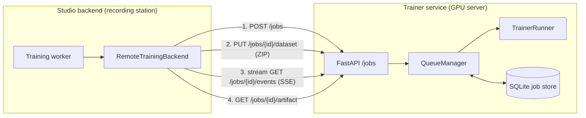
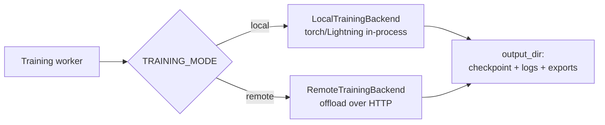
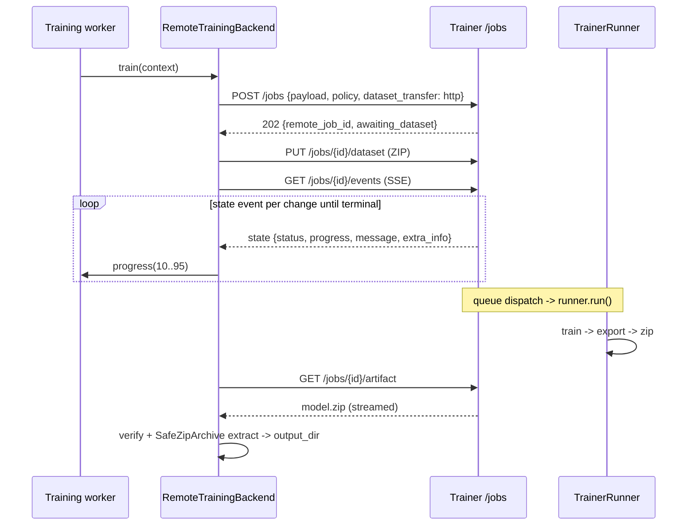

# Design: Remote Training

## Summary

Remote training moves GPU-heavy policy training from a recording station to a dedicated GPU server (the **trainer service**). That keeps recording machines lightweight. The Studio backend submits a job and streams a dataset snapshot to the trainer over HTTP by default, mirrors remote progress into its own job record, downloads the trained model archive, and imports it. `TRAINER_DATASET_TRANSFER=hf` optionally transfers snapshots through an ephemeral private Hugging Face dataset repo. In the UI, the Models screen behaves the same as local training.

## Goals

- Run training on a separate GPU machine without changing the user workflow.
- Keep recording-only installs free of `torch`/`physicalai`.
- Serve multiple recording stations from one GPU server with a persistent, restart-safe queue.
- Mirror remote progress and support cancellation.

## Non-goals

- **Authenticated or multi-tenant trainer access.** The trainer trusts callers on its network. It has no per-station auth, authorization, or request signing. Deploy it on a private network; do not expose it publicly.
- **Resumable transfers or jobs.** If snapshot upload, job submission, or artifact download fails, the job fails and the user retrains. There is no checkpoint-level resume across the HTTP boundary.
- **Additional dataset-transfer protocols.** The supported modes are direct resumable HTTP upload (the default) and an ephemeral HF dataset repo (`TRAINER_DATASET_TRANSFER=hf`).

## Architecture

Two services deploy independently:

- **Studio backend** (`application/backend/`) - orchestrates the job and owns the user-facing job record.
- **Trainer service** (`application/trainer/`) - standalone FastAPI app that queues and runs training with `physicalai` + Lightning. Only deployed in remote training mode.

The default HTTP mode moves the dataset and model archive directly between the Studio backend and trainer. The optional HF mode moves only the dataset snapshot through Hugging Face Hub; everything else moves over HTTP.



## Backend integration

The training worker is backend-agnostic. `get_training_backend()` returns `LocalTrainingBackend` or `RemoteTrainingBackend` based on `settings.training_mode`. Both implement the `TrainingBackend` protocol:

```text
async def train(self, context: TrainingContext) -> None: ...
```

`TrainingContext` includes the `Job`, `Model`, `Snapshot`, `TrainJobPayload`, optional `base_model`, an `output_dir`, a `progress` reporter, and a `should_stop` callback. Backends must leave a fully populated model directory at `output_dir` (checkpoint, logger output, `exports/`), report progress, and stop quickly when `should_stop()` returns `True`. This contract is the interchange point between local and remote.

Heavy imports are deferred so `TRAINING_MODE=remote` never imports `torch`. `RemoteTrainingBackend` lazily imports `huggingface_hub` and never imports `physicalai`.

## Local training (default)

Local training remains the default and is unchanged. With `TRAINING_MODE=local`, `get_training_backend()` returns `LocalTrainingBackend`, which trains in the worker process with `torch`/Lightning. This requires the `[train]` extra on the recording station. No trainer service, Hugging Face transfer, or `TRAINER_URL` is involved.

Because both backends satisfy the same protocol and produce the same `output_dir` layout, the training worker, job record, API, and Models screen are agnostic to backend choice. In local mode, progress uses the full 0-100 range, cancellation is checked directly inside the Lightning callback instead of over HTTP, and the device comes from the payload.



## End-to-end flow (remote)

With the default HTTP transfer, `RemoteTrainingBackend.train()` runs three steps in one local progress bar (0-100%):

1. **Submit and upload snapshot (0-10%)** - `_submit_job()` POSTs `{payload, policy, dataset_transfer: "http"}` to `/jobs`, receives `remote_job_id`, and streams a ZIP snapshot to `PUT /jobs/{id}/dataset`. The upload resumes after an interruption by checking `HEAD /jobs/{id}/dataset` for its offset.
2. **Wait (10-95%)** - `_wait_for_completion()` consumes trainer SSE from `GET /jobs/{id}/events`, maps trainer raw 0-100 into local 10-95, and mirrors `message` and `extra_info` (for example, step loss) into the local job. The trainer emits a `state` event on each change and closes the stream on terminal state. If the stream drops before terminal state (idle timeout or network blip), the backend reconnects with backoff, and the trainer re-emits current state on the new connection. If reconnects continue without receiving any event, the backend aborts the job instead of looping forever.
3. **Download and import (95-100%)** - `_download_and_extract()` streams `GET /jobs/{id}/artifact` to a temp zip, verifies byte count against `Content-Length`, validates the archive with `SafeZipArchive` (zip-bomb and path-traversal guards), and extracts into `output_dir`.

For `TRAINER_DATASET_TRANSFER=hf`, the backend instead creates a private dataset repo named `pais-snapshot-<uuid>`, uploads the snapshot with an allowlist (`*.safetensors`, `*.json`, `*.txt`, `*.md`, `*.parquet`, `*.mp4`, `*.png`, `*.jpg`), and submits its pinned commit SHA. A `finally` block deletes that ephemeral repo regardless of outcome (best effort).



## Trainer service

### HTTP API

| Method | Path                  | Purpose                                                                                    |
|--------|-----------------------|--------------------------------------------------------------------------------------------|
| `POST` | `/jobs`               | Create a job; returns `awaiting_dataset` for HTTP transfer or `queued` for HF transfer. |
| `PUT` | `/jobs/{id}/dataset` | Upload a ZIP snapshot for HTTP transfer; returns the job once the upload is complete. |
| `HEAD` | `/jobs/{id}/dataset` | Return the resumable HTTP-upload offset. |
| `GET` | `/jobs/{id}`          | Current `JobState` (one-off query).                                                        |
| `GET` | `/jobs/{id}/events`   | SSE stream of state changes until terminal. Primary progress channel the backend consumes. |
| `GET` | `/jobs/{id}/artifact` | Download the model zip.                                                                    |
| `POST` | `/jobs/{id}/cancel`   | Cancel the job.                                                                            |
| `GET` | `/health`             | Liveness probe.                                                                            |

### Schemas

`SubmitJobRequest` validates untrusted input at the edge: `dataset_transfer` is `http | hf`; for `hf`, `repo_id` must match a conservative regex and `revision` must be a 40-char hex SHA; `http` rejects both fields. `policy` is allowlisted (`act`, `pi0`, `pi05`, `smolvla`). `TrainerJobStatus` is `awaiting_dataset | queued | running | completed | failed | canceled`.

### Queue and dispatch

`QueueManager` owns `JobStore` and one asyncio `_dispatch_loop`. The loop takes the oldest queued job, marks it `running`, and runs it in a worker thread (training is blocking). Cancellation is cooperative through an in-memory `_cancel_requested` set checked by runner `should_stop`. On startup, `reset_orphans()` marks any job left `running` by a crashed process as `failed`.

### Persistence

One SQLite `jobs` table (`id`, `status`, `progress`, `message`, `extra_info`, `request`, `artifact`, `created_at`) makes the queue restart-safe. Access is serialized with a lock.

### Execution

`TrainerRunner.run()`:

1. `_resolve_snapshot()` - uses the validated ZIP extracted by `PUT /jobs/{id}/dataset` for HTTP transfer, or `_pull_snapshot()` with pinned revision and the format allowlist for HF transfer.
2. `_train()` - builds `LeRobotDataModule` from the snapshot and a `physicalai` Lightning `Trainer`, instantiates policy via `_setup_policy()`, and trains. A `ModelCheckpoint` keeps best `val/loss`; a progress callback reports `global_step / max_steps` and step loss, and sets `trainer.should_stop` on cancellation. `_resolve_device()` selects `xpu`, `cuda`, or `cpu`.
3. `_export_policy()` - exports to each backend the policy supports; missing optional dependencies or one failing backend are logged and are not fatal.
4. `_archive_model()` - zips the model directory (checkpoint, logs, `exports/`) for download.

## Progress mapping

The trainer reports raw 0-100 during training. The backend reserves both ends of its bar for transfer work and maps the remote value once:

```text
local 0–10   snapshot upload
local 10–95  remote training   = min(95, 10 + round(remote * 0.85))
local 95–100 model download + import
```

## Cancellation

Cancellation is cooperative across both services:

- The backend event loop checks `context.should_stop()` between SSE events (on each idle timeout and reconnect). On stop, it POSTs `/jobs/{id}/cancel` and raises `TrainingCanceledError`.
- The trainer adds the id to `_cancel_requested`. A queued job flips directly to `canceled`; a running job stops at the next safe point (Lightning callback sets `trainer.should_stop`, and the runner checks again after `fit`).
- Canceled jobs are logged at info level and do not dump error tracebacks, which keeps cancellation distinct from true failures.

## Configuration

| Studio backend (`application/backend/.env`) | Trainer service (`application/trainer/.env`) |
|---------------------------------------------|----------------------------------------------|
| `TRAINING_MODE=remote` | - |
| `TRAINER_URL` -> trainer address | `HOST` / `PORT` (default `0.0.0.0:8001`) |
| `TRAINER_DATASET_TRANSFER=http` (default) | `STORAGE_DIR`, `TRAINER_MAX_CONCURRENT_JOBS` |
| `TRAINER_DATASET_TRANSFER=hf`, `TRAINER_HF_NAMESPACE` (snapshot target) | `HF_TOKEN` with **read** access |
| `HF_TOKEN` with **write** access for HF transfer | `TRAINER_MAX_UNCOMPRESSED_BYTES`, `TRAINER_MIN_FREE_BYTES` |

`Settings.validate_remote_training_config` fails fast at startup: `TRAINING_MODE=remote` without `TRAINER_URL` raises.

## Related docs

- [Remote Training Server](../08-remote-training-server.md) - operator setup guide.
- [Training Policies](../06-training-policies.md) - enable remote mode on the backend.
- [Hugging Face Integration](../../backend/docs/huggingface_integration.md) - required token permissions.
