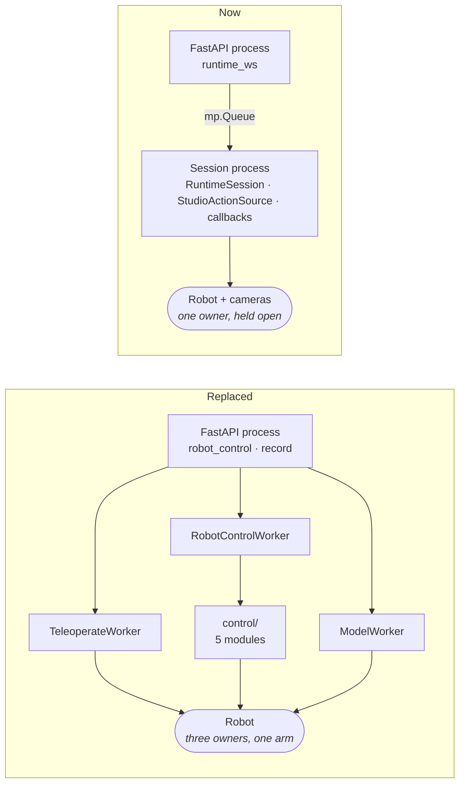
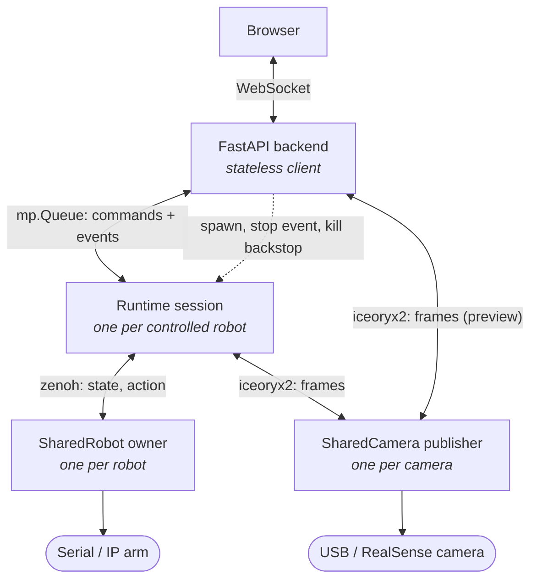
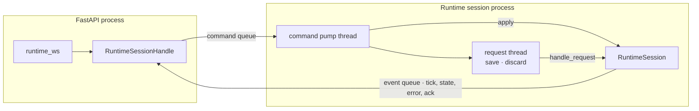
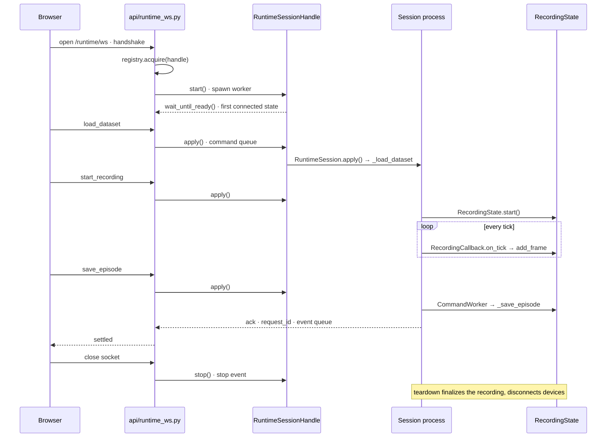
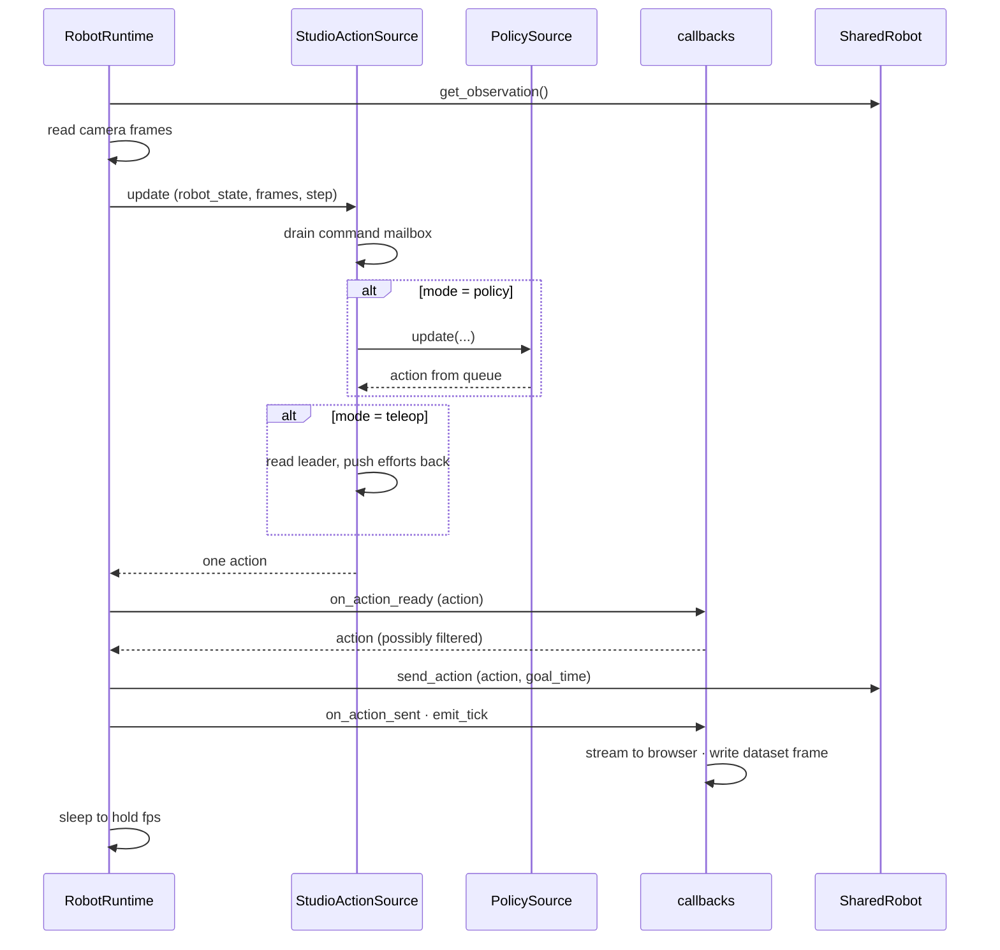
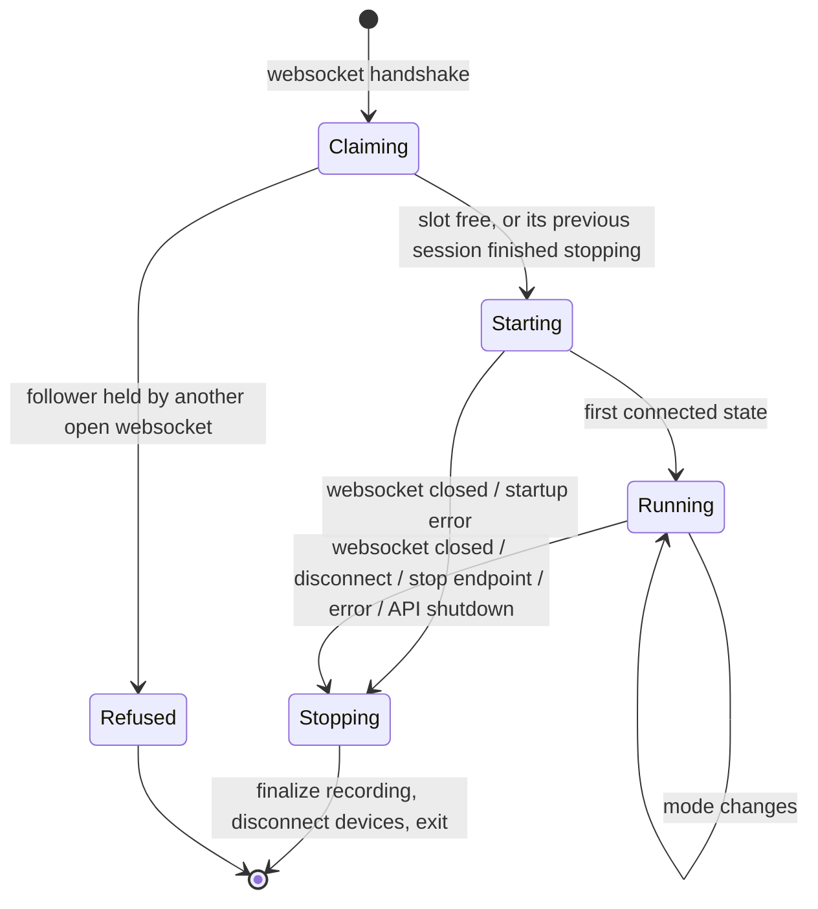

# Runtime Session Architecture

Studio drives a physical robot four ways: teleoperation by hand, running a trained policy, recording a dataset, and exporting a model that reproduces the run elsewhere. All four run on one session, a worker process that owns the robot and its cameras for as long as the page driving it keeps its websocket open. Each capability arrives as a command sent to that session.

This replaced two hand-written control loops (`TeleoperateWorker`, `RobotControlWorker`) and a separate model-worker process pool. Studio no longer owns loop machinery, timing, or teardown ordering. It owns three things: which action to send, what to stream to the browser, and what to write to a dataset. `physicalai.runtime.RobotRuntime` runs the loop.

This document covers the decisions and constraints you cannot read off the code, especially the traps. For what the code does, read `backend/src/runtime/`.

## Contents

- [The shape](#the-shape)
- [One request, end to end](#one-request-end-to-end)
- [One tick](#one-tick)
- [Modes](#modes)
- [Session lifecycle and ownership](#session-lifecycle-and-ownership)
- [One session per follower](#one-session-per-follower)
- [Exclusivity](#exclusivity)
- [Export](#export)
- [Traps](#traps)
- [Constraints](#constraints)

## The shape

### Why one session

Every capability used to get its own worker process, and each one opened the robot itself.



Three processes wanting the same arm means handing the hardware back and forth, with none of them able to see what the others are doing. A crash in any one of them took the API process down too, since they ran as threads inside it.

One session holding the robot for the length of the work removes both problems. Teleoperation, inference and recording became modes and commands on a process that already has the hardware open.

### Layered ownership

Each layer owns exactly one class of resource, and the edges name their transport.



Two things to read off this diagram. Hardware I/O already lives in its own processes: `SharedRobot` spawns an owner that holds the serial port, and `SharedCamera` spawns a publisher that holds the device. Studio inherited that when it adopted SharedRobot. The API also reaches camera frames directly without them passing through the session, so frames never cross the session boundary.

### Transport

The session runs in its own OS process, a `BaseProcessWorker` child of the API process (`runtime/worker.py`). The parent side is `RuntimeSessionHandle` (`runtime/handle.py`). They talk over two `multiprocessing` queues; frames do not cross them.



Every command goes down the same queue. `save_episode` and `discard_episode` are the two that must not be lost silently: the worker runs them on a separate thread, because they can block for the whole recording timeout, and answers each with an `AckEvent` carrying its `request_id` on the event queue.

| Fire-and-forget | Answered with an ack |
| --- | --- |
| `set_follower_source`, `load_model`, `load_dataset`, `start_task`, `stop_task`, `start_recording` | `save_episode`, `discard_episode` |

The event queue is bounded. Observations are `put_nowait` and dropped when it is full, so a slow websocket degrades to a lower frame rate instead of stalling the control loop. State, errors and acks block briefly instead. A failure that ends the session travels as a `WorkerFatal` on the same queue.

### Session names

A session is named `rt-<follower-uuid>` (`runtime/ids.py`). The name is only a key: the `RuntimeSessionRegistry` holds at most one session per name, and the sessions API takes it as the handle for a stop. The `rt-` prefix keeps it visibly distinct from the follower's own `SharedRobot` name.

## One request, end to end

Recording one episode is the clearest single path through the architecture, because it touches every layer: the socket, the spawn, the wire, the control loop, and the dataset.



1. The browser opens the runtime socket. The handshake names the follower, the leader, and the
   camera ids; the API resolves each against the project before anything is spawned.
2. The websocket claims the follower in `RuntimeSessionRegistry`. See
   [One session per follower](#one-session-per-follower).
3. `RuntimeSessionHandle.start()` spawns `RuntimeSessionWorker`. The session is ready when its
   first connected `StateEvent` arrives on the event queue; a `WorkerFatal` or the worker dying
   first is reported to the browser instead.
4. `load_dataset` reaches `handle_incoming`, which validates the payload and puts it on the
   command queue. The worker's pump thread hands it to `RuntimeSession.apply()`, which opens the
   dataset in `_load_dataset`.
5. `start_recording` arms recording. `StudioActionSource` handles it rather than the session
   directly, because recording has to line up with the control loop.
6. Every tick, `RecordingCallback.on_tick` appends one observation-and-action pair through
   `RecordingState.add_frame`.
7. `save_episode` comes back as an ack carrying its `request_id`, so the browser learns whether the
   write succeeded. `load_dataset` and `start_recording` above are fire-and-forget.
8. The write itself runs on `CommandWorker`, off the control thread, because it encodes video.
9. Closing the socket stops the session. Teardown drains the command worker, copies the recording
   cache back into the dataset, and disconnects the devices.

## One tick

The upstream loop calls into Studio's code at three points.



Two consequences. Commands drain at the top of `update()` before the action is decided, so a mode change takes effect on the tick it arrives. The recording callback also sees `TickEvent`, which carries the observation and the action that was sent, so recording never reads the robot separately.

## Modes

Teleoperation and policy execution are modes of one session. `StudioActionSource` implements the upstream `ActionSource` protocol and picks between them.

| Mode | Action sent |
| --- | --- |
| `hold` | a target latched when the mode was entered |
| `teleop` | leader joint positions, plus efforts to the leader |
| `policy` | next action from `PolicySource` |

`hold` exists because `ActionSource.update()` must return an action every tick. The protocol has no way to send nothing.

**`hold` latches its target on entry and resends that same value.** Sending the freshly measured position each tick makes the arm sag. Measured position trails the commanded target by the servo's steady-state error, so feeding it back integrates that error downward under gravity. The latch is copied once, returned as a copy each tick, and cleared on a mode change.

**A policy failure drops to `hold` with a fresh latch** instead of stopping the loop. The arm holds where it is and the session stays alive to report the error.

### Modes rather than session types

The delegates are live simultaneously, and the mode selects whose output wins:

```python
policy_action = self._policy.update(...) if self._policy else None
leader_action = self._read_leader(robot_state) if self._leader else None
return self._arbitrate(mode, policy_action, leader_action, robot_state)
```

The alternative forecloses human-in-the-loop by leaving the policy idle and its queue stale:

```python
match mode:
    case "teleop": return self._leader_action(robot_state)
    case "policy": return self._policy.update(...)
```

Human-in-the-loop puts a person and a policy in control during the same episode, which two session types cannot express. Committing to modes now makes HIL an arbitration change later instead of a restructuring. Nothing implements it yet, and `FollowerSource` is `hold | teleop | policy`. Adding it would not change the shape.

Both delegates are optional. Dataset recording runs with no model loaded, so `policy_action is None` happens routinely.

## Session lifecycle and ownership

### The session owns devices; the runtime is a view

The runtime's `robot`, `cameras`, `fps` and `callbacks` are fixed at construction. That does not block reconfiguration, because of two properties:

- `run()` returning does **not** disconnect devices. Device teardown lives in `RobotRuntime.disconnect()`, reachable only through `__exit__` or an explicit call.
- Every `connect()` in the chain is idempotent. `RobotRuntime.connect()` guards on its own flag; `SharedRobot.connect()` and `SharedCamera.connect()` return early when already connected.

The session therefore holds the device objects and treats the runtime as disposable:

```text
RuntimeSession  (long-lived)
├── owns    SharedRobot, dict[name, SharedCamera]     survive rebuilds
├── owns    StudioActionSource, callbacks
└── holds   current RobotRuntime                      rebuilt on rig change
```

Swapping a camera means: stop the run, mutate the device dict, construct a new `RobotRuntime` over it, run again. Surviving devices are never disconnected, so no owner process restarts and the follower never drops torque.

Devices **preconnect in parallel** during setup, one thread per device, because serial and camera opens are independent and each costs real wall time.

### Work that must not run on the control loop

Three things run off the control thread, each for a different reason:

| What | Where | Why |
| --- | --- | --- |
| `save_episode`, `discard_episode`, dataset copy-back | `CommandWorker`, one serialized thread | They write parquet and encode video. Serialized because ordering matters: a save then a discard must not interleave. |
| Model loading | `PolicyLoader`, its own thread | So a dataset copy cannot sit in front of a model load. Handover is by generation number, and a load that finishes too late is dropped. |
| Per-frame image writes | lerobot's own writer threads | Already threaded upstream. `RecordingCallback` stays synchronous so it keeps ordering against save and discard. |

The control loop itself does the frame copy and appends to the episode buffer. Video encoding happens at `save_episode`, in a process pool.

### Start and stop



**A session lives exactly as long as its websocket.** There is no reattach: a page refresh closes the socket, which stops the session, and the new socket starts a fresh one. `RuntimeSessionRegistry.acquire` waits for a session that is already stopping instead of reporting the robot busy, so a refresh does not race its own teardown.

**Every stop goes through the stop signal.** `RobotRuntime.run()` polls a `StopSignal` once per tick. The worker passes one that reads `BaseProcessWorker.should_stop()`, which is set by any of:

1. **The worker's own stop event.** `RuntimeSessionHandle.stop()` sets it when the websocket closes, on an explicit `disconnect`, or from the sessions stop endpoint.
2. **The application stop event.** The scheduler's `mp_stop_event`, set on API shutdown. The lifespan also calls `RuntimeSessionRegistry.stop_all()` before the scheduler shuts down, so sessions get their full teardown.
3. **Parent death.** If the API process dies without cleaning up, the worker notices its parent is gone and stops itself.

`run()` returning leads to `teardown()`, which finalizes the recording and disconnects cameras, then the leader, then the follower. The parent waits up to `STOP_TIMEOUT_S`, the recording copy-back timeout plus a margin, before escalating to SIGTERM and then SIGKILL. While it waits it keeps draining the event queue, because a child cannot exit while its queue feeder is blocked on a full pipe.

Sessions never outlive the API process: they are its children, and nothing about them is persisted.

On shutdown, leave follower torque enabled. SO101 holds position rather than dropping under gravity.

## One session per follower

`RuntimeSessionRegistry` (`runtime/registry.py`) lives on `app.state` and maps `rt-<follower-uuid>` to its `RuntimeSessionHandle`. A websocket asking for a follower gets one of three answers:

1. **The slot is free: start.**
2. **The holder is stopping or already dead: wait for it, then start.** This is a page refresh or a restart.
3. **Another open websocket holds it: refuse** with `423 Busy`, naming the holder. A second tab must never take an arm over.

Since there is no reattach, the running session's hardware recipe and cameras never have to be compared with what a new client wants: every client gets a session built from its own handshake.

## Exclusivity

Two resources, two different answers.

**The robot is exclusive.** Two sessions must not command one follower. Both would attach as subscribers to the same owner, whose action channel is latest-wins, so their command streams would interleave on one arm. The registry enforces it: only one session can hold a given name, so a second session for the same follower cannot come into existence.

**Cameras are shared, but their settings are not.** One publisher per physical camera serves many subscribers by design. The conflict is configuration. A session connecting with `overwrite_settings=True` and a different resolution reconfigures the publisher, and every other subscriber's frames change underneath it. `validate_on_connect` checks only at connect, not continuously.

The fix is a **camera claim registry** keyed by fingerprint. The first claimant pins the settings, and a later session asking for different settings is rejected with an error naming the conflicting project. Recording holds a claim like anything else, without a separate mechanism.

Sessions connect to cameras strictly, with `overwrite_settings=False` and `validate_on_connect=True`. A session never reconfigures another session's publisher. If a camera delivers a resolution the environment did not declare, the session fails instead of reading the wrong size, because wrong pixel dimensions look fine and give a wrong answer.

### Both guards are in memory

| Guard | Storage |
| --- | --- |
| Camera claims | `CameraClaimRegistry`, per API process |
| Robot holder | `RuntimeSessionRegistry`, per API process |

Both can be in memory because sessions are children of the API process and end with it; nothing can be driving an arm across a restart. Deleting a robot, camera, or environment that is in use is rejected with the holder named. The websocket releases the camera claims and the follower slot only after the worker has stopped.

## Export

One builder, two consumers. Studio builds its own session from the same document it exports, so the two cannot drift.

```text
        build_runtime_config(environment, model?, device?, task?, fps)
                              │
        ┌─────────────────────┴─────────────────────┐
   export bundle                              Studio session
   action_source:                             action_source: StudioActionSource{
     PolicySource{model, execution, task}       policy = PolicySource{same fragment},
     or                                     leader = same leader fragment }
     TeleopSource{leader}
   robot / cameras / fps ──── identical fragments ──── robot / cameras / fps
```

Only the wrapper differs. The robot recipe, calibration, camera recipes, fps, model path, device, execution strategy and task are all shared, so none of them can drift. The export leaves out the multiplexer, since `hold` and mode switching have no meaning in a headless run.

The builder reads Studio's database, never a live runtime, so reconfiguration needs no special handling. Swap a camera and both the export and the rebuilt session read the same updated environment. It assembles plain data instead of calling `to_config()` on a live runtime, because `InferenceModel.__init__` loads weights and `StudioActionSource` is not config-exportable.

### Bundle

```text
studio-runtime-<name>-<timestamp>.zip
├── runtime.yaml        self-contained config, relative model path
├── exports/<backend>/  model artifacts
└── README.md           the exact physicalai run command, and the CHANGE_ME list
```

Self-contained: **SO101 calibration travels inside the YAML.** `SO101Calibration.to_config_value()` emits the LeRobot calibration mapping as a plain dict, and `SO101.__init__` accepts it inline. Nothing depends on machine-local paths under `~/.local/share`. Same for fps, role, unit, baudrate, camera dimensions and frame rate.

Machine-specific, and flagged with `CHANGE_ME` in the emitted file:

- **`SO101.port`.** Studio stores pyserial's `port.device`, something like `/dev/ttyACM0`, which depends on enumeration order and shifts across reboots. The builder resolves a `/dev/serial/by-id/...` path where possible and falls back to the raw port with a marker.
- **Camera `device`.** Same treatment, using `/dev/v4l/by-id/...`.
- **`SharedRobot.name`.** Portable, but it derives the Zenoh port, so two bundles sharing a name collide on one host. That collision is the intended lock behaviour and belongs in the README.

## Traps

Each of these has cost someone time.

- **Never use `with runtime:`.** `__exit__` disconnects devices, which is what a rebuild must avoid. Call `connect()` explicitly and tear devices down at the session level.
- **`StudioActionSource.disconnect()` must not disconnect the leader.** The session owns it. Upstream's `TeleopSource.disconnect()` does disconnect its leader, so read that class for reference and do not subclass it.
- **Treat `stop()` then `run()` as a session boundary.** Every `run()` ends by calling `_bus.close()`, which closes every callback. Stateful callbacks do not survive a second run: `JsonlCallback` writes to a closed file and logs a traceback every tick, while `AsyncCallback` joins its worker with no restart path and loses telemetry silently.
- **`hold` must latch.** Resending the measured position sags the arm. See [Modes](#modes).
- **Camera feature keys must match the dataset the model was trained on**, which is not always the current environment's camera names. They diverge the moment someone renames a camera between recording and inference. `InferenceModel._prepare_inputs` raises `KeyError` on a missing input, so inference stops at the first tick. The error names the missing key and leaves you to work out why.
- **Model input collapses to a bare `images` key when there is exactly one camera**, discarding the name. With two or more it emits `images.<name>`. Single-camera setups are therefore insensitive to naming, and multi-camera setups are not.
- **The browser addresses camera panels by `camera.id`, not by feature key.** Any stream payload carrying per-camera values needs a name-to-UUID mapping alongside it.
- **Fingerprints must be canonicalized consistently.** The runtime config strips the legacy `/dev/video0:0` suffix to `/dev/video0` before opening the device. Anything keyed on a fingerprint, claims especially, must use the same canonical form. Otherwise one physical device gets two keys and the lock stops holding.

### Dataset frames are RGB end to end

This is invisible in the code and easy to break by "fixing" it. The path is RGB at every step: `SharedCamera(color_mode=ColorMode.RGB)`, no conversion on the recording path, lerobot's `RGBEncoderConfig` and `rgb24` decode, and no channel swap anywhere in `physicalai.data` or `physicalai.policies`. `PolicySource._to_model_input` performs no swap either.

The backend does one RGB→BGR conversion, in the episode thumbnail immediately before `cv2.imencode`. That one is correct because the stored frame is RGB. Thumbnails are the check: if stored frames were BGR they would come out double-swapped and visibly wrong.

## Constraints

- **One follower per session.** `RobotRuntime` takes a single robot. Bimanual arms are a single robot type, so this is not a limitation today. Two independent arms in one environment would need two sessions.
- **fps is 30** (`RUNTIME_FPS`). Dataset metadata records it, so an exported config emits the same value recording used.
- **No database access in the session.** `RobotCatalogRegistry` holds builder, probe and resolver callables, pydantic classes generated by `create_model`, and a `TypeAdapter`. None of that pickles under `spawn`. The API resolves rows and sends plain data; the session builds its own factory during setup and touches only the filesystem for the dataset. This mirrors `SharedRobot.from_config`, which ships a recipe and lets the owner rebuild the driver.
- **A session process pays spawn plus imports before its first tick.** The old `ModelWorkerRegistry` pre-spawned, which only hid process creation. `load_inference_model` still ran on demand inside it, and that is the multi-second part. If the median time from `load_model` to first policy action exceeds **10 seconds**, build a warm session-process pool. Otherwise accept it.
- **HIL sessions have no headless equivalent.** `physicalai run` takes one action source and there is no operator in it. An exported HIL session describes the policy alone. That is the right output, though it means no round-trip fidelity.
