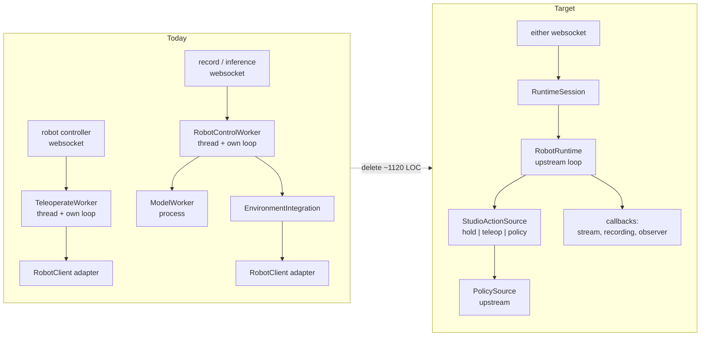
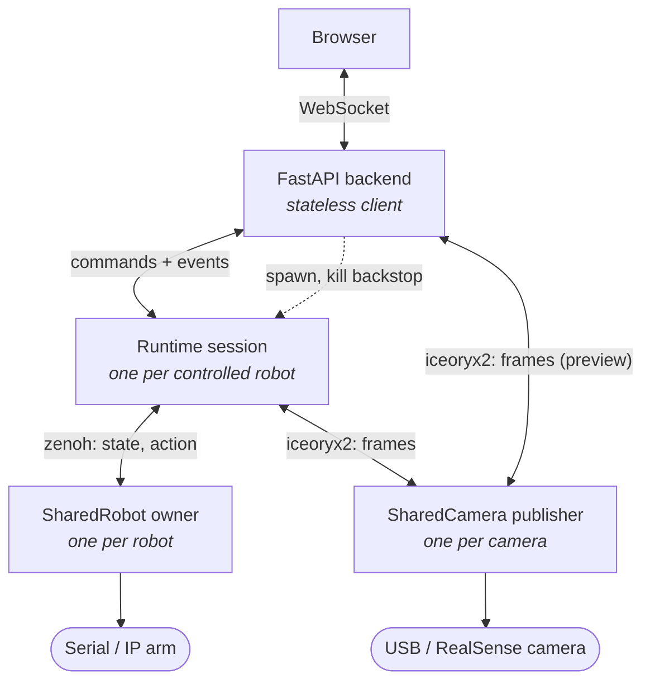
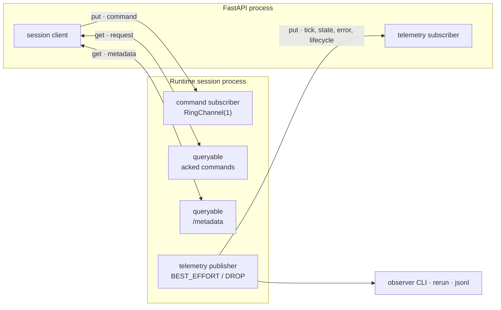
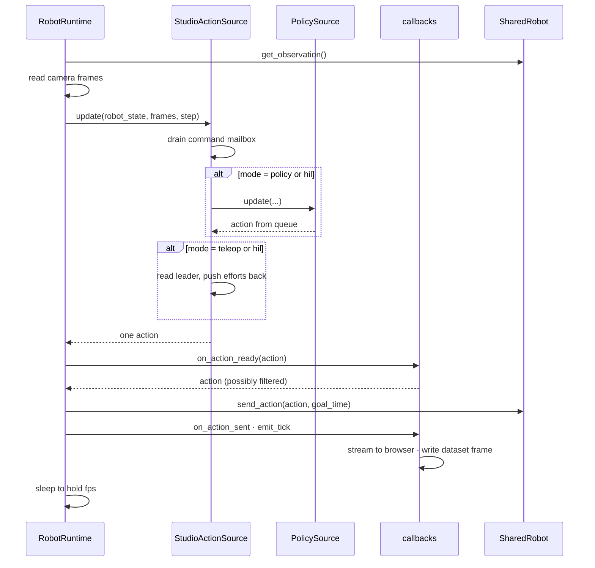
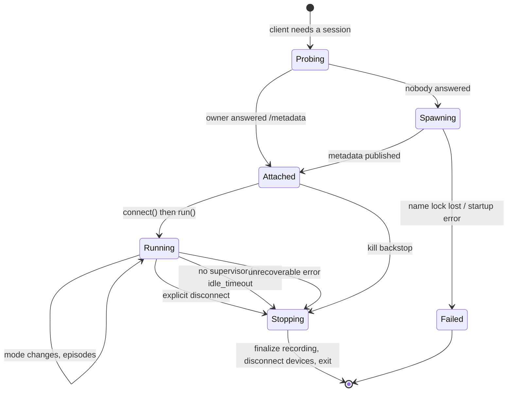

# Runtime Migration Design

Studio runs robots through two hand-written control loops: one for the robot controller page, one for recording and inference. Both manage their own threads, processes, timing, and teardown. This design replaces both with `physicalai.runtime.RobotRuntime`, so Studio stops owning loop machinery and starts owning only the parts that are actually Studio's: which action to send, what to stream to the browser, and what to write to a dataset.

The second goal is export. A user should be able to download a model plus a configuration file and reproduce a Studio session with `physicalai run`. That only holds if Studio and the exported file describe the same thing, so this design makes them share one builder.

This document is the durable one. It owns every decision that spans more than one phase. The phase documents describe steps and link here rather than restating.

## Contents

- [Architecture at a glance](#architecture-at-a-glance)
- [What replaces what](#what-replaces-what)
- [Core decisions](#core-decisions)
- [Lifecycle](#lifecycle)
- [Exclusivity](#exclusivity)
- [Export](#export)
- [Verified facts about today's system](#verified-facts-about-todays-system)
- [Phases](#phases)

## Architecture at a glance

### Today, and where it lands

Two loops that duplicate each other collapse into one session with selectable modes.



Everything on the left that manages timing, retries, teardown ordering, or inference scheduling has an upstream equivalent. What survives is the three things only Studio can know.

### Layered ownership

Each layer owns exactly one class of resource, and the edges name their transport.



Two things to read off this diagram. First, hardware I/O already lives in its own processes — `SharedRobot` spawns an owner that holds the serial port, `SharedCamera` spawns a publisher that holds the device. Studio inherited that when it adopted SharedRobot. Second, the API reaches camera frames directly, without them passing through the session. That is why frames never cross the session boundary.

### Zenoh event architecture

Phase B moves the session into its own process. Control and telemetry go over Zenoh; frames do not.



The split mirrors what physicalai already does for robots. Idempotent commands that set desired state go out as best-effort publications, because re-sending them is harmless and only the newest matters. Commands that are edge-triggered and cannot be lost — `save_episode`, `discard_episode` — go through a queryable and get a reply. A `/metadata` queryable answers "is there a session for this robot, and what is it doing", which is what makes discovery and reattach work.

Telemetry is best-effort with drop-on-congestion, so a slow consumer degrades to a lower frame rate instead of stalling the control loop. Because it is a publication rather than a pipe, the observer CLI and a Rerun viewer can attach to a live session without the session knowing.

Every key is prefixed `studio/rt/<session>/`, where `<session>` is `rt-<follower uuid>`.

**The `rt-` prefix is required, not cosmetic.** The bare UUID is already `SharedRobot`'s own name — `shared_robot_name(robot.id)` returns `str(robot_id)`, and that is what Studio passes to `SharedRobot.from_config(name=...)`. Upstream keys two things on that string with no per-caller namespacing:

- the host-local name lock, whose path is `sha256(f"name:{identity}")`
- the deterministic rendezvous port, derived from `physicalai/robot/{name}`

A session sharing the string would take the lock its own robot owner needs, and listen on the port that owner must bind. The owner would fail startup with `name_lock_contention` and the session would wait for a robot that never comes up. `validate_name` accepts letters, digits, `_` and `-`, so `rt-` is legal.

The full scheme and its quality-of-service settings live in [phase-b-runtime.md](phase-b-runtime.md#topic-scheme).

### One tick

Where Studio's code sits inside the upstream loop.



Two consequences of this shape. Commands are drained at the top of `update()`, before the action is decided, so a mode change takes effect on the tick it arrives. And the recording callback sees `TickEvent`, which carries the observation and the action that was actually sent — so recording needs no separate read of the robot.

### Session lifecycle



`Probing` before `Spawning` is what gives reattach: a page refresh finds the existing session instead of fighting it. The idle path is a safety property, not cleanup — an abandoned session in hold mode keeps commanding a latched target with torque on and nobody watching.

## What replaces what

| Studio code today                                  | Upstream replacement                                     |
| -------------------------------------------------- | -------------------------------------------------------- |
| `TeleoperateWorker` loop, timing, teardown         | `RobotRuntime.run()`                                     |
| `RobotControlWorker` loop, timing, teardown        | `RobotRuntime.run()`                                     |
| `ModelWorker` + `ModelWorkerRegistry` process pool | `AsyncExecution` inside the session process              |
| `InferencePoller` single-in-flight discipline      | `AsyncExecution` observation slot                        |
| `QueueMixer` chunk blending                        | `ChunkedActionQueue` + `LerpSmoother`                    |
| `SyncMixedModelIntegration` wiring                 | `PolicySource`                                           |
| `EnvironmentIntegration` observation assembly      | `RobotRuntime` read path + `TickEvent`                   |
| `PhysicalAIRobotAdapter` on the control path       | `SharedRobot` directly — it satisfies the Robot protocol |
| Hand-rolled leader forwarding                      | `StudioActionSource` teleop mode                         |

`QueueMixer.add` and `LerpSmoother.merge` compute the same blend. The upstream version derives the chunk offset from the queue's exact pop count rather than estimating it from measured latency times fps, so it is strictly more accurate.

`PhysicalAIRobotAdapter` survives for the paths that are not the control loop: the SO101 calibration wizard, the identify jog, and hardware probes. Only the runtime path drops it.

### Deletion inventory

Removed across phase B, each in the pull request that orphans it:

| File                                      | Lines |
| ----------------------------------------- | ----- |
| `workers/robot_control_worker.py`         | 358   |
| `control/environment_integration.py`      | 215   |
| `workers/model_worker.py`                 | 101   |
| `workers/model_worker_registry.py`        | 109   |
| `control/queue_mixer.py`                  | 66    |
| `control/sync_mixed_model_integration.py` | 52    |
| `control/inference_poller.py`             | 44    |
| `control/inference_result.py`             | 9     |
| `workers/teleoperate_worker.py` (phase A) | 166   |

About 1120 lines, plus their tests. `ModelRegistryDep` and the registry construction in `core/lifecycle.py` go with them.

Two things inside `environment_integration.py` must survive its deletion:

- `build_lerobot_dataset_features`, which moves to `runtime/dataset_features.py`.
- `sanitize_camera_name`, which defines the camera feature key. See [camera feature keys](#camera-feature-keys).

## Core decisions

### One session type, modes not sessions

Teleoperation and policy execution are **modes of one session**, not separate sessions. `StudioActionSource` implements the upstream `ActionSource` protocol and selects between them.

This is not merely tidier. Human-in-the-loop puts a human and a policy in control during the same episode, so two session types cannot express it. Committing to modes now means HIL is an arbitration change later rather than a restructuring. See [hil-design.md](../hil-design.md).

The delegates are **live simultaneously**, and the mode selects whose output wins:

```python
policy_action = self._policy.update(...) if self._policy else None
leader_action = self._read_leader(robot_state) if self._leader else None
return self._arbitrate(mode, policy_action, leader_action, robot_state)
```

Not this, which forecloses HIL by leaving the policy idle and its queue stale:

```python
match mode:
    case "teleop": return self._leader_action(robot_state)
    case "policy": return self._policy.update(...)
```

Both delegates are optional. Dataset recording runs with no model loaded, so `policy_action is None` is a normal condition, not an error.

### Modes

| Mode     | Action sent                                        |
| -------- | -------------------------------------------------- |
| `hold`   | a target latched when the mode was entered         |
| `teleop` | leader joint positions, plus efforts to the leader |
| `policy` | next action from `PolicySource`                    |
| `hil`    | reserved — see hil-design.md                       |

`hold` must latch its target on entry and resend that same value. Sending the freshly measured position each tick makes the arm sag: measured position trails the commanded target by the servo's steady-state error, so feeding it back integrates that error downward under gravity.

`hold` exists because the upstream protocol has no way to send nothing. `ActionSource.update()` must return an action every tick.

### The session owns devices; the runtime is a view

The runtime's `robot`, `cameras`, `fps` and `callbacks` are fixed at construction. That does not block reconfiguration, because of two verified properties:

- `run()` returning does **not** disconnect devices. `_shutdown()` calls only `action_source.disconnect()`. Device teardown lives in `RobotRuntime.disconnect()`, reachable only through `__exit__` or an explicit call.
- Every `connect()` in the chain is idempotent. `RobotRuntime.connect()` guards on its own flag; `SharedRobot.connect()` and `SharedCamera.connect()` return early when already connected.

So the session holds the device objects and treats the runtime as disposable:

```text
RuntimeSession  (long-lived)
├── owns    SharedRobot, dict[name, SharedCamera]     survive rebuilds
├── owns    StudioActionSource, callbacks
└── holds   current RobotRuntime                      rebuilt on rig change
```

Swapping a camera means: stop the run, mutate the device dict, construct a new `RobotRuntime` over it, run again. Surviving devices are never disconnected, so no owner process restarts and the follower never drops torque.

Two rules follow, and both are easy to get wrong:

- **Never use `with runtime:`.** `__exit__` disconnects devices, which is exactly what a rebuild must avoid. Call `connect()` explicitly and tear devices down at the session level.
- **`StudioActionSource.disconnect()` must not disconnect the leader.** The session owns it. Upstream's `TeleopSource.disconnect()` does disconnect its leader, so treat that class as a reference, not a base class.

A rig change **while recording is rejected**, not handled. Changing the camera set mid-episode corrupts the dataset, which is what the camera lock already exists to prevent.

### Contract first, binding second

The command and event vocabulary is defined once: message names, payloads, which commands are idempotent, and correlation ids for the ones that need a reply. The session exposes `apply(command)` and emits events. It never knows what carries them.

Phase A binds that contract to direct method calls, because a thread in the API process has no boundary to cross. Phase B binds it to Zenoh. The session code does not change between them.

Defining the contract separately also fixes a live weakness in how the UI settles commands (`application/ui/src/components/websockets/use-websocket-with-response.ts`). A request id is generated, but it only keys a client-side map — it never crosses the wire, so the backend cannot correlate a reply to a request. Instead, every inbound message is run through a matcher predicate, and the first match resolves the promise. Two commands whose matchers can be satisfied by the same state broadcast can therefore cross-resolve: `save_episode` and `discard_episode` both wait on `is_recording === false`. The hook supports a timeout, but `robot-control-provider.tsx` never passes one, so an unmatched command waits forever.

A real correlation id on the wire, plus the acked-command reply described below, removes all three problems.

### Command classes

Upstream's rule for robot actions is that best-effort delivery is safe when a message is an idempotent absolute target, because dropping an intermediate one just skips to the newest. Studio's commands split the same way.

| Idempotent — set desired state                                                                                                      | Edge-triggered — needs a reply    |
| ----------------------------------------------------------------------------------------------------------------------------------- | --------------------------------- |
| `load_environment`, `load_model`, `load_dataset`, `set_follower_source`, `start_task`, `stop_task`, `start_recording`, `disconnect` | `save_episode`, `discard_episode` |

Losing a `save_episode` loses an episode a user recorded. Those two go through a queryable. The rest are publications.

### Mode vocabulary

One vocabulary across both websockets: `hold | teleop | policy`, sent as `{"event": "set_follower_source", "data": {"follower_source": "teleop"}}`.

Today the two sockets disagree. The teleop socket sends a bare integer `0 | 1`; the record socket sends `{"follower_source": "teleoperation" | "model" | null}`. Phase A converges the teleop socket. Phase B converges the record socket as that path is rewritten, so no work is done twice on code that is about to be deleted. The two remain inconsistent in between.

### Camera feature keys

A camera's dataset feature key is `sanitize_camera_name(camera.name)` — see `sanitize_camera_name` in `control/environment_integration.py`. It lowercases and replaces anything outside `[a-z0-9 _-]`, because feature keys become dataset paths and single-quoted ffconcat entries during recording, where other characters break ffmpeg parsing.

Four consumers, and they do not all use the same key:

| Consumer                              | Key                                                                |
| ------------------------------------- | ------------------------------------------------------------------ |
| `RobotRuntime(cameras={...})` mapping | `sanitize_camera_name(camera.name)`                                |
| Dataset features and written frames   | `sanitize_camera_name(camera.name)`                                |
| Exported config `cameras:` mapping    | `sanitize_camera_name(camera.name)`                                |
| **Model input** (via `PolicySource`)  | bare `images` for one camera; `images.<sanitized>` for two or more |
| Browser stream payload                | **camera UUID** — the UI keys panels by id                         |

Two exceptions, both deliberate.

The **browser** addresses camera panels by `camera.id`, so any stream payload carrying frames or per-camera values needs a name-to-UUID mapping alongside it.

The **model input** collapses to a bare `images` key when there is exactly one camera, discarding the name entirely (`PolicySource._to_model_input`). With two or more it emits `images.<name>`. Studio's current path does the same by a different route, and ACT's own schema matches, so single-camera setups are insensitive to naming.

Multi-camera setups are not, and the constraint is stronger than "be internally consistent":

> The runtime's camera mapping keys must match the feature keys of the dataset **the model was trained on** — not merely the current environment's camera names.

Those diverge the moment someone renames a camera between recording and inference. `InferenceModel._prepare_inputs` raises `KeyError` on any expected input name it cannot find, so the failure is a hard stop at the first inference rather than a wrong number. That is preferable to silence, but the error names a missing key rather than the cause, so it is worth catching at load time instead. See [phase-b-runtime.md](phase-b-runtime.md#b3--policy-inference).

`sanitize_camera_name` lives in `control/environment_integration.py` today and must move rather than be deleted with it.

### Where inference runs

Phase B puts the whole session in its own process: the loop, `AsyncExecution`, and dataset writing. That preserves the isolation `ModelWorker` provides today, for a reason specific to what is in the process.

`SharedRobot` and `SharedCamera` already push all hardware I/O into separate OS processes. A teleop session therefore does Zenoh pub/sub and shared-memory reads — no serial port, no camera driver, no native crash surface. That is why phase A can safely be a thread. An inference session additionally hosts the OpenVINO or Torch runtime in-process, and _that_ is the crash and memory surface worth isolating.

Accepted cost: a fresh session process pays spawn plus imports before its first tick, where `ModelWorkerRegistry` pre-spawns today. The pre-spawn only hides process creation — `load_inference_model` still runs on demand inside it, and that is the multi-second part. Session setup also already carries a fixed camera warmup.

The threshold for revisiting this is fixed in advance: build a warm session-process pool if the median time from `load_model` to the first policy action exceeds **10 seconds**, and accept the regression otherwise. Deciding the number before anyone has measured keeps the later discussion about data.

## Lifecycle

**Start.** Discovered-or-spawned by name, following `SharedRobot.connect()`: probe `/metadata`, spawn if nobody answers, resolve the spawn race with a name lock and re-probe. Idempotent, and reattach comes free.

**Stop.** Three paths, all required:

1. **Explicit.** The user disconnects. The session stops the run, finalizes recording, disconnects devices, exits.
2. **Idle self-exit.** No supervisor present for `idle_timeout`. Follow the subscriber-presence loop in `physicalai/robot/transport/_owner_worker.py`: read the telemetry publisher's matching status, track `idle_since`, exit past the timeout. This covers an API crash, a closed browser, and a dropped network.
3. **Kill backstop.** The API is also the parent process, so it can terminate a wedged session. Control over Zenoh buys reattach; being the parent buys "die now regardless of internal state". physicalai does both for robot owners.

Two requirements on the idle path, which are design constraints rather than tuning:

- **It must finalize recording.** An idle exit during recording has to run `RecordingMutation.teardown` so saved episodes survive. Otherwise self-exit means data loss.
- **The timeout is bounded on both sides.** Long enough that a page refresh does not kill a recording, short enough that an abandoned session does not hold an arm under torque indefinitely.

**Default: 45 seconds, as a setting rather than a constant.** A websocket reconnect after a page refresh completes well under 5 seconds, so 45 leaves roughly nine times the headroom for a slow reload or a brief network drop. At the other end it bounds an abandoned, torque-holding arm to under a minute. It is deliberately much longer than `SharedRobot`'s 10-second owner default, because that timeout only costs a process respawn while this one can cost a recording session.

It must be a setting: hardware labs on flaky networks will want it longer, and an unattended rig will want it shorter. Whoever tunes it later will not have this document open, so the reasoning belongs next to the default in code.

On shutdown, leave follower torque enabled. SO101 holds position rather than dropping under gravity.

## Exclusivity

Two resources, two different answers.

**The robot is exclusive.** Two sessions must not command one follower. Both attach as subscribers to the same owner, whose action channel is latest-wins, so their command streams interleave on one arm. This is reachable today by opening the robot controller page and the record page on the same robot; nothing prevents it.

Under the runtime-owner model this stops being a guard and becomes structural: only one session can hold a given session name, so a second session for the same follower cannot come into existence rather than being turned away at an API check.

Studio implements that lock itself, on its own `rt-<uuid>` identity. It is the same _mechanism_ as `SharedRobot`'s name lock — a host-local file keyed by a hash of the identity — but deliberately a different identity, for the reason given under [Zenoh event architecture](#zenoh-event-architecture). Studio does not reuse upstream's lock: `_lock.py` is a private module, and sharing the identity is exactly the failure being avoided.

**Cameras are shared, but their settings are not.** One publisher per physical camera serves many subscribers by design. The conflict is configuration: a session connecting with `overwrite_settings=True` and a different resolution reconfigures the publisher, and every other subscriber's frames change underneath it. `validate_on_connect` checks only at connect, not continuously.

The fix is a **camera claim registry** keyed by fingerprint: first claimant pins the settings, a later session requesting different settings is rejected with an error naming the conflicting project. Recording becomes one reason to hold a claim rather than a separate mechanism. This generalizes the existing `recording_locked_camera_fingerprints` set.

**Deletion checks query discovery, not memory.** An in-memory registry forgets everything when the API restarts, so deleting a robot would succeed while a live session is still driving it. Because sessions are name-addressed, the API can ask whether a session holds robot X. Deleting a robot, camera, or environment that is in use is rejected with the holder named, alongside a way to stop it.

Three bugs in this area exist in `main` today and are being fixed separately. See [exclusivity-bugs.md](exclusivity-bugs.md).

## Export

One builder, two consumers. Studio builds its own session from the same document it exports, so the two cannot drift.

```text
        build_runtime_config(environment, model?, device?, task?, fps)
                              │
        ┌─────────────────────┴─────────────────────┐
   export bundle                              Studio session
   action_source:                             action_source: StudioActionSource{
     PolicySource{model, execution, task}       policy = PolicySource{same fragment},
     — or —                                     leader = same leader fragment }
     TeleopSource{leader}
   robot / cameras / fps ──── identical fragments ──── robot / cameras / fps
```

Only the wrapper differs. Everything that could silently diverge — the robot recipe, calibration, camera recipes, fps, model path, device, execution strategy, task — is shared. The multiplexer is correctly absent from the export: `hold` and mode switching have no meaning in a headless run.

The builder reads Studio's database, never a live runtime, so reconfiguration needs no special handling. Swap a camera and both the export and the rebuilt session read the same updated environment. Nothing accumulates in the runtime that is not already in the document; the current mode, task, and recording state are session state, not construction arguments.

The builder assembles plain data rather than calling `to_config()` on a live runtime, for two reasons: `InferenceModel.__init__` loads weights, and `StudioActionSource` is deliberately not config-exportable.

### Portability of an exported bundle

Verified as self-contained:

- **SO101 calibration travels inside the YAML.** `SO101Calibration.to_config_value()` emits the LeRobot calibration mapping as a plain dict, and `SO101.__init__` accepts `SO101Calibration | str | Path | dict`. Studio already passes calibration inline from its database rather than as a file path, so no calibration file belongs in the bundle and nothing depends on machine-local paths under `~/.local/share`.
- fps, role, unit, baudrate, camera dimensions and frame rate, device selection.

Must be made relative: `InferenceModel.export_dir` becomes `./exports/<backend>` relative to the bundle root.

Machine-specific, and must be flagged in the emitted file:

- **`SO101.port`.** Studio stores pyserial's `port.device`, which is `/dev/ttyACM0` — dependent on enumeration order, unstable across reboots. Studio also stores the serial number, so the builder resolves a `/dev/serial/by-id/...` path where possible and falls back to the raw port with a `CHANGE_ME` marker.
- **Camera `device`.** Same treatment, using `/dev/v4l/by-id/...`.
- **`SharedRobot.name`.** Studio uses the robot's UUID. Portable, but it also derives the Zenoh TCP port, so two bundles sharing a name collide on one host. That collision is the intended lock behaviour and belongs in the bundle README.

Bundle layout:

```text
studio-runtime-<name>-<timestamp>.zip
├── runtime.yaml        self-contained config, relative model path
├── exports/<backend>/  model artifacts
└── README.md           the exact physicalai run command, and the CHANGE_ME list
```

The download plumbing already exists — `ModelDownloadService.create_backend_archive` and `services/staged_archive.py` — so the bundle extends an existing endpoint.

## Verified facts about today's system

Written down because "we checked" is unverifiable a month later.

### Dataset frames are RGB end to end

Studio's inference path swaps RGB to BGR before running the model. That is a bug: the policy was trained on RGB.

| Step           | Evidence                                                                                                      |
| -------------- | ------------------------------------------------------------------------------------------------------------- |
| Camera         | `SharedCamera(color_mode=ColorMode.RGB)` in `utils/camera_factory.py`                                         |
| Recording      | `format_observation_for_dataset` only remaps keys — no conversion                                             |
| lerobot encode | config type is `RGBEncoderConfig`; `encode_video_frames` documents "`.png` RGB frames"                        |
| lerobot decode | `frame.to_ndarray(format="rgb24")` in `lerobot/datasets/video_utils.py`                                       |
| Training       | no channel swap anywhere in `physicalai.data` or `physicalai.policies`                                        |
| Corroboration  | Studio's thumbnail converts RGB to BGR before `cv2.imencode`, which is correct only if the stored item is RGB |

`PolicySource._to_model_input` performs no swap, so **the new path is correct with no work**. The old path is deleted rather than fixed.

A free check against existing data: episode thumbnails are the oracle. That path is dataset item, RGB to BGR, PNG. If stored frames were BGR the thumbnails would be double-swapped and visibly wrong.

### The task string is dropped before inference

`format_observation_for_dataset`'s sibling, `format_model_input_observation`, accepts a `task` argument and never uses it. The `Observation` is built with the task line commented out and a TODO. The caller does pass it.

For ACT this is harmless. For Pi0, Pi0.5 and SmolVLA it means Studio's inference runs with **no language conditioning at all** — the policy sees vision and state only, while training had the task. If VLA policies have been underperforming expectation in Studio, this is a likely cause.

`PolicySource` forwards the task and `set_task()` is public, so the new path fixes this by construction. The exported config carries `task:`.

### Upstream reuse closes callbacks

`RobotRuntime` became reusable across `run()` calls, but every `run()` ends by calling `_bus.close()`, which calls `close()` on every callback. Stateful callbacks do not survive a second run:

- `JsonlCallback` opens its file in `__init__` and closes it in `close()`. Run two writes to a closed file, and because tick dispatch isolates exceptions, it logs a traceback every tick instead of failing loudly.
- `AsyncCallback.close()` joins its worker thread with no restart path. Run two enqueues into a deque nobody drains — silent, total telemetry loss.

Consequence for Studio: **do not treat `stop()` then `run()` as an episode boundary.** It is a session boundary. This is one of the arguments for `PolicySource.reset()`; see [phase-0-upstream.md](phase-0-upstream.md).

### Studio's mp workarounds that Zenoh removes

Context for why phase B changes transport rather than keeping `multiprocessing`:

| Workaround                                                                                 | Fate                                       |
| ------------------------------------------------------------------------------------------ | ------------------------------------------ |
| `_cancel_queue_join_threads`                                                               | removed                                    |
| `queue.close()` plus `cancel_join_thread()` plus a 0.5 s sleep "to allow messages through" | removed                                    |
| Parent orchestrating child teardown with a `terminate()` fallback                          | removed                                    |
| Seven `mp.Event` flags standing in for commands                                            | removed                                    |
| Everything must pickle, so `RobotClientFactory` cannot cross a boundary                    | enforced by msgpack rather than remembered |
| Unbounded queue growth carrying base64 frames                                              | removed — best-effort drop is the default  |

The last row has a second fix: frames stop crossing the boundary at all.

### RobotClientFactory cannot cross a process boundary

`RobotCatalogRegistry` holds builder, probe and resolver callables, pydantic classes generated by `create_model`, and a `TypeAdapter`. None of that pickles under `spawn`.

Send plain data instead — the pydantic rows the API already resolved — and let the session build its own factory during setup. This is not a workaround: `get_robot_client_factory` already constructs a fresh registry per request, and it mirrors what Studio does one layer down, where `SharedRobot.from_config` ships a recipe and lets the owner rebuild the driver.

Corollary: no database access in the session. The API resolves rows before sending; the session touches only the filesystem for the dataset and reports episodes back for the API to persist, which is already how it works.

## Phases

| Phase | Content                                                                                       | Document                                   |
| ----- | --------------------------------------------------------------------------------------------- | ------------------------------------------ |
| 0     | Upstream physicalai: `PolicySource.reset()`, public `warmup()`, the `bus.close()` bug         | [phase-0-upstream.md](phase-0-upstream.md) |
| A     | Teleoperation on the runtime, thread host, direct binding, config builder and export endpoint | [phase-a-teleop.md](phase-a-teleop.md)     |
| B     | Zenoh binding, session as runtime owner, inference, recording, export button, deletions       | [phase-b-runtime.md](phase-b-runtime.md)   |

Phase 0 is required before B3, not before A. Phase A needs only `RobotRuntime.stop()`, which is already released.

Deferred: human-in-the-loop ([hil-design.md](../hil-design.md)), the dataset action-provenance column, a configurable `goal_time` horizon, and importing a config back into Studio.

Handled separately: the three exclusivity bugs in [exclusivity-bugs.md](exclusivity-bugs.md).

## Known constraints

- **One follower per session.** `RobotRuntime` takes a single robot, and `EnvironmentIntegration` already reads `environment.robots[0]` with a TODO about multiple. Bimanual arms are a single robot type, so this is not a limitation today. Two independent arms in one environment would need two sessions.
- **`fps` is 30 everywhere.** Hardcoded in `RobotControlWorker` and the default query parameter on the teleop socket. Dataset metadata records it, so the exported config must emit the same value recording used.
- **HIL sessions have no headless equivalent.** `physicalai run` takes one action source and there is no operator in it. An exported HIL session describes the policy alone, which is correct, and should be stated so nobody expects round-trip fidelity there.
