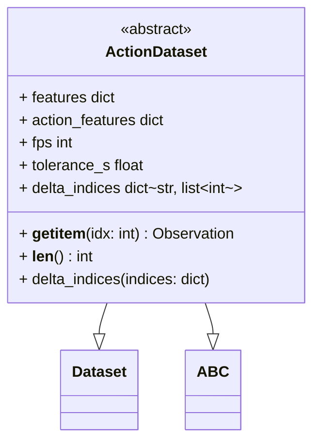

# ActionDataset

The `ActionDataset` represents the

```mermaid
classDiagram
    class Dataset
    class ABC

    class ActionDataset {
        <<abstract>>
        + __getitem__(idx: int) Observation
        + __len__() int
        + features dict
        + action_features dict
        + fps int
        + tolerance_s float
        + delta_indices dict~str, list~int~~
        + delta_indices(indices: dict)
    }

    ActionDataset --|> Dataset
    ActionDataset --|> ABC
```
