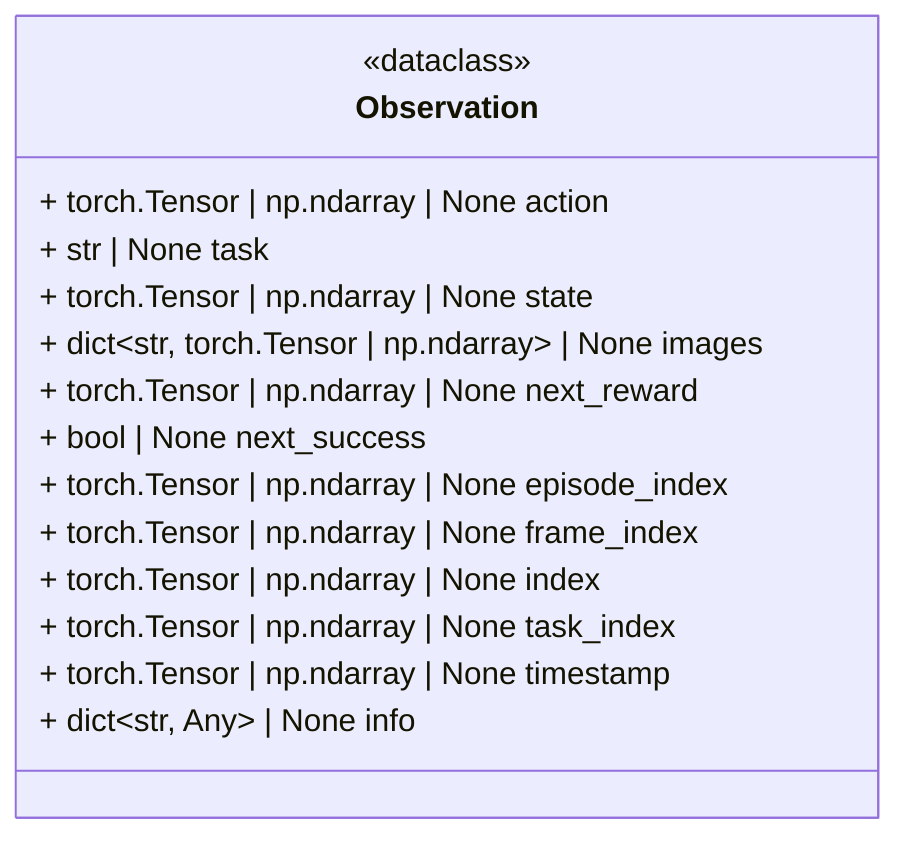

# Observation

The `Observation` dataclass is an internal representation.

In imitation learning and reinforcement learning an observation,
represents the input enviroment a policy must map to perform an action.
It also for imitation learning holds the corresponding ground truth action,
the policy must learn to predict.



Example:

```python
from action_trainer.data import Observation
import torch
obs_1 = Observation(
    action=torch.randn((10,)),
    images={"top": torch.randn((3, 256, 256))}
)
```
