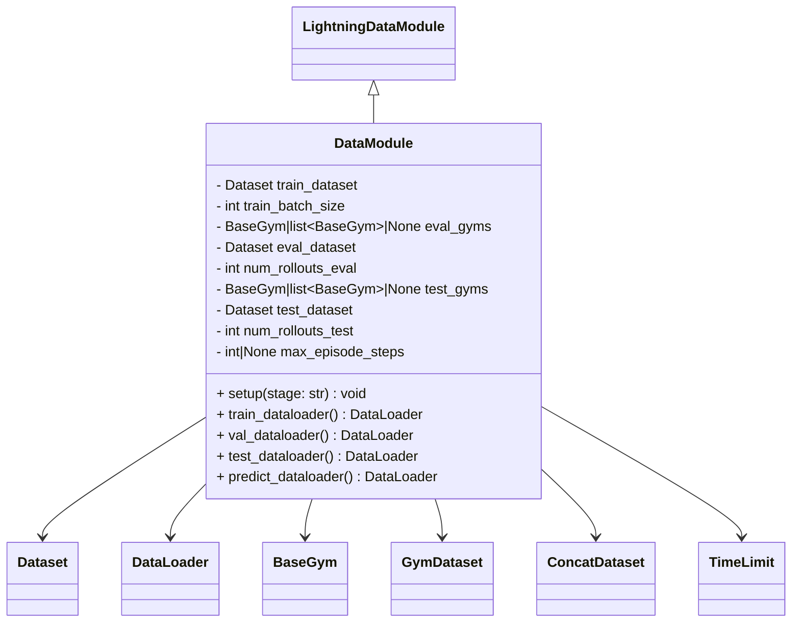

# DataModule

The `DataModue` is a child class of the `LightningDataModule`.

We in the future will support the use of `gymnasium` environments.
For now we allow them as optional args,
with the added feature of wrapping the `gym` with a `TimeLimit`.

