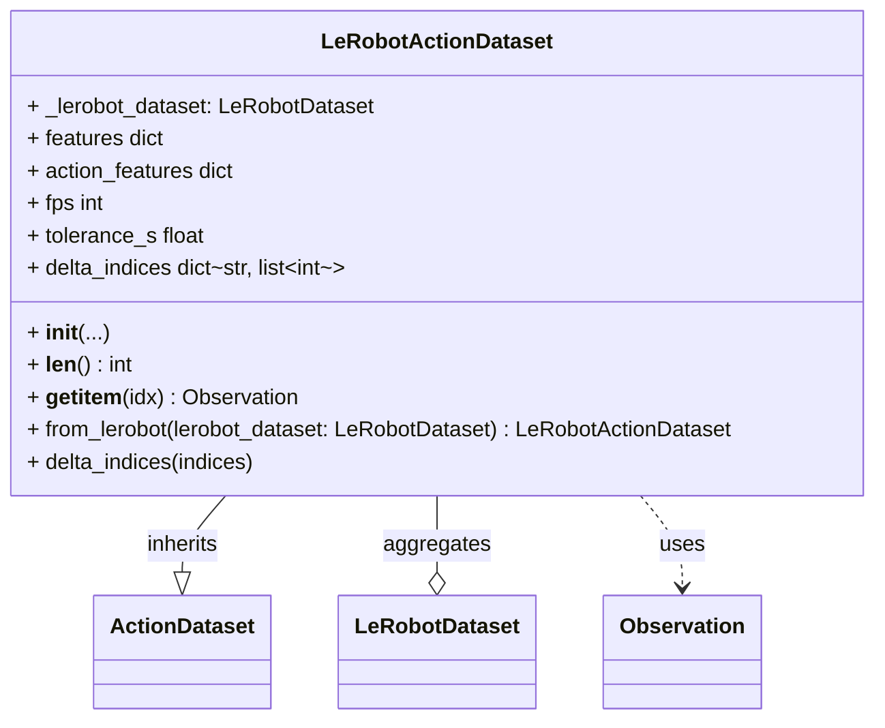
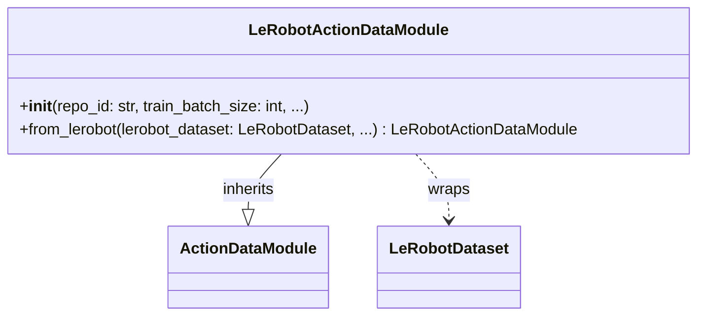

# LeRobot

## LeRobotActionDataset

To support but not re-implement LeRobot data standard have an interface.

The LeRobot dataset format is described in the [lerobot documentation](https://github.com/huggingface/lerobot?tab=readme-ov-file#the-lerobotdataset-format)



Example (these examples will download data onto your disk):

```python
from action_trainer.data import LeRobotActionDataset

pusht_dataset = LeRobotActionDataset("lerobot/pusht")

s0100_dataset = LeRobotActionDataset("lerobot/svla_so100_pickplace")
```

or from `LeRobot` itself:

```python
from lerobot.datasets.lerobot_dataset import LeRobotDataset
from action_trainer.data import LeRobotActionDataset
pusht_lerobot_dataset = LeRobotDataset("lerobot/pusht")
pusht_action_dataset = LeRobotActionDataset.from_lerobot(pusht_lerobot_dataset)
```

## LeRobotActionDataModule

This serves as a wrapper of the `ActionDataModule`,
specifically for ease of use with `LeRobot`.



Example (this will download data to disk if not cached already):

```python
from lerobot.datasets.lerobot_dataset import LeRobotDataset
from action_trainer.data import LeRobotActionDataModule

repo_id = "lerobot/pusht"

# from repo id
datamodule = LeRobotActionDataModule(repo_id=repo_id, train_batch_size=16)

# from lerobot dataset
dataset = LeRobotDataset(repo_id=repo_id)
datamodule = LeRobotActionDataModule.from_lerobot(lerobot_dataset=dataset, train_batch_size=16)

```
