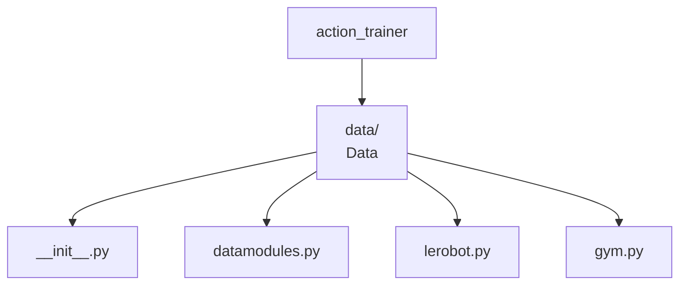

# Data



This section describes the design for the action_trainer.data module.

```bash
action_trainer
├── data/  # Data
│   ├── __init__.py
│   ├── datamodules.py  # Lightning Datamodules
│   ├── lerobot.py  # LeRobot dataset integration, includes PyTorch Dataset
│   ├── gym.py  # Gym environment pytorch dataset integration
```

If we want a LeRobot dataset we do:

```python
from action_trainer.data import LeRobotActionDataset

dataset = LeRobotActionDataset("hf/path/or/normal/path")
```

More generally we want to do something like this:

```python
from action_trainer.data import LeRobotDataModule, LeRobotActionDataset
from action_trainer.gyms import PushTGym
from lerobot.datasets.lerobot_dataset import LeRobotDataset


# you can also do this
hf_pusht_dataset = LeRobotDataset("lerobot/pusht")
pusht_dataset = LeRobotActionDataset.from_lerobot(hf_pusht_dataset)
pusht_datamodule = LeRobotDataModule(
        train_batch_size=4,
        train_dataset=pusht_dataset)
```

and integration with simulation environments for eval/testing with gyms

```python
from action_trainer.data import LeRobotDataModule, LeRobotActionDataset
from action_trainer.gyms import PushTGym
from lerobot.datasets.lerobot_dataset import LeRobotDataset

# you can also do this
hf_pusht_dataset = LeRobotDataset("lerobot/pusht")
pusht_dataset = LeRobotActionDataset.from_lerobot(hf_pusht_dataset)

# second step is to load a gym environment to test in
pusht_gym = PushTGym(max_episode_steps=300)

# last step is to load the datamodule
pusht_datamodule = LeRobotDataModule(
    train_batch_size=4,
    train_dataset=pusht_dataset,
    eval_gyms=pusht_gym,
    num_rollouts_eval=10,  # default is 10
    test_gyms=pusht_gym,
    num_rollouts_test=10)

pusht_datamodule.setup(stage="fit")
train_dataloader = pusht_datamodule.train_dataloader()

val_dataloader = pusht_datamodule.val_dataloader()

# how about with multiple envs...for generalist policies
pusht_gym2 = PushTGym(max_episode_steps=200)
pusht_datamodule = LeRobotDataModule(
    train_batch_size=4,
    train_dataset=pusht_dataset,
    eval_gyms=[pusht_gym, pusht_gym2],
    num_rollouts_eval=10,  # default is 10
    test_gyms=[pusht_gym, pusht_gym2],
    num_rollouts_test=10)

pusht_datamodule.setup(stage="fit")
train_dataloader = pusht_datamodule.train_dataloader()
val_dataloader = pusht_datamodule.val_dataloader()

pusht_datamodule.setup(stage="test")
test_dataloader = pusht_datamodule.test_dataloader()
```
