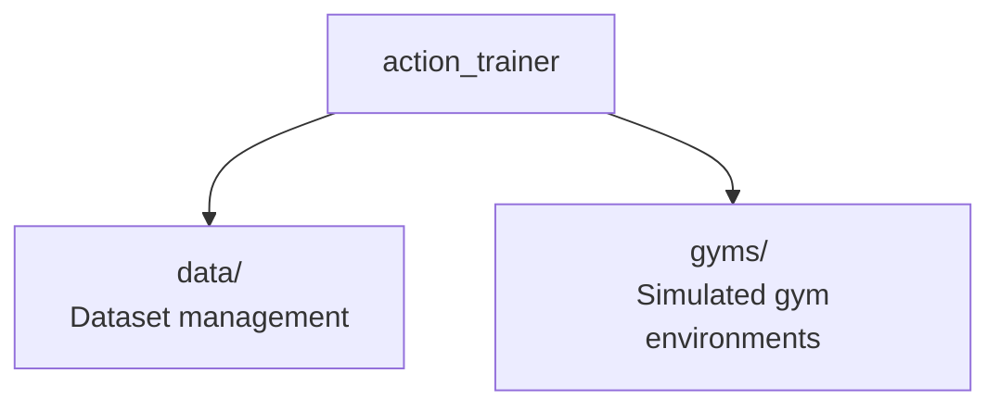

# Geti action trainer design

Welcome to the `action_trianer` package.


```mermaid
graph TD
    A["action_trainer"]
    A --> B["data/ <br/> Dataset management"]
    A --> C["gyms/ <br/> Simulated gym environments"]
```

```bash
action_trainer
├── data/  # Data
├── gyms/  # Simulated gym environments
```
