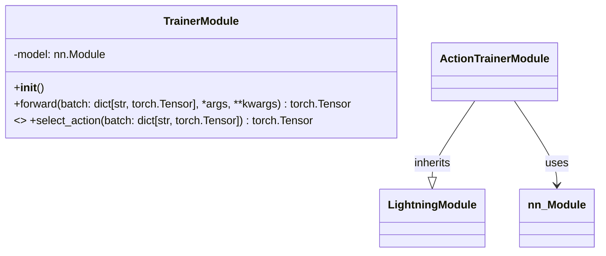

# TrainerModule

Base class for `Lighting Modules`.

```mermaid
classDiagram
    class LightningModule
    class nn_Module

    class TrainerModule {
        +__init__()
        +forward(batch: dict[str, torch.Tensor], *args, **kwargs) torch.Tensor
        <<abstract>> +select_action(batch: dict[str, torch.Tensor]) torch.Tensor
        -model: nn.Module
    }

    ActionTrainerModule --|> LightningModule : inherits
    ActionTrainerModule --> nn_Module : uses

```
