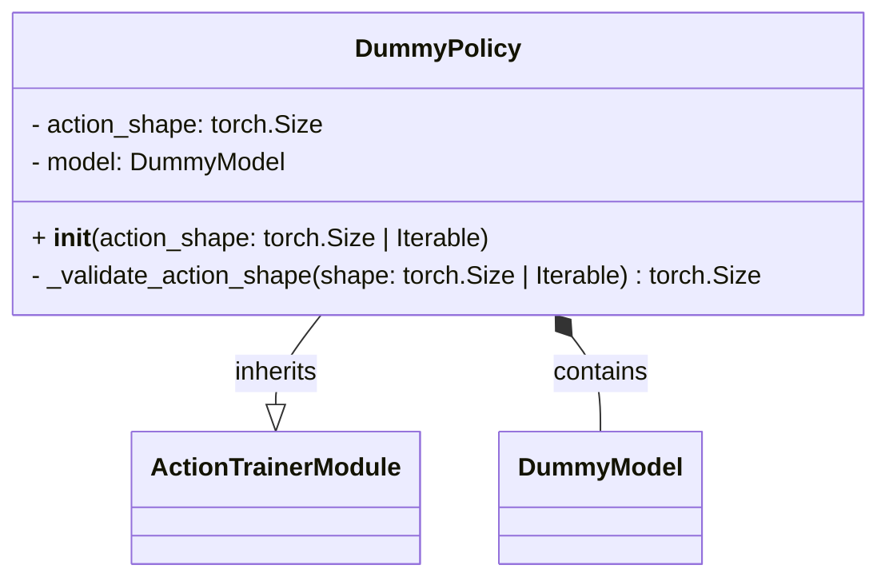
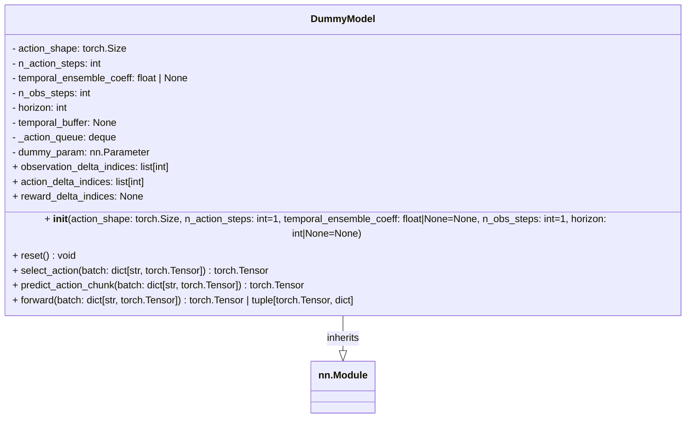

<!-- markdownlint-disable MD013 -->

# Dummy

## Dummy policy

A dummy policy here just takes in what shape the action it should output.

The idea is to use in integration with our `Trainer`.



## Dummy Model

Similarly a dummy model is to ensure we can expose the correct params,
for dataset interaction and also predict fake actions for use in a `Trainer`.



Example:

```python
from action_trainer.data import LeRobotActionDataModule
from action_trainer.policies.dummy import DummyPolicy
action_shape = (2,)
policy = DummyPolicy(action_shape=action_shape)
```

or from a `ActionDataModule`:

```python
from action_trainer.data import LeRobotActionDataModule
from action_trainer.policies.dummy import DummyPolicy
lerobot_action_datamodule = LeRobotActionDataModule(repo_id="lerobot/pusht", train_batch_size=16)
action_shape = lerobot_action_datamodule.train_dataset.action_features["action"]["shape"]
policy = DummyPolicy(action_shape=action_shape)
```
