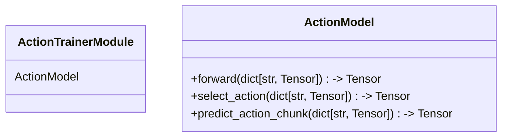

# Policies

In action training framework, polices represent action models and can be used for both training and inference.
Each policy consists of a Lightning module and actual torch model. Torch model ideally should depend only on
torch entities and be easilly extractible from the framework.

