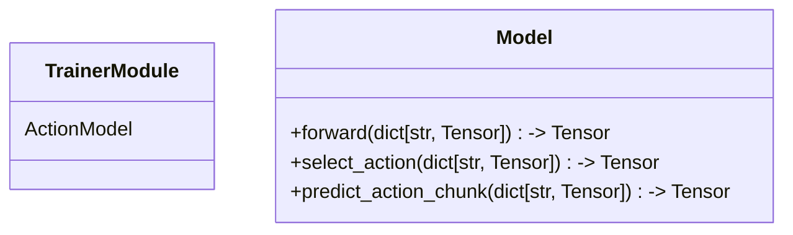

# Policies

In action training framework, polices represent action models.
Each policy consists of a Lightning module and actual torch model.
Torch model ideally should depend only on torch entities,
and be easilly extractible from the framework.



We will lay out each new policy with this tree structure:

```bash
├──policy_name
│   ├── config.py
│   ├── model.py
│   └── policy.py
```
