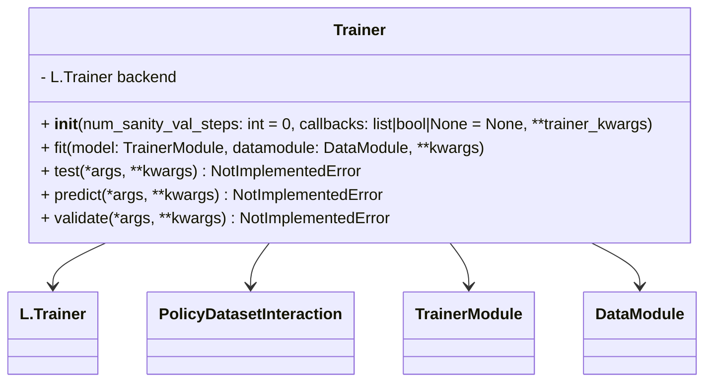

<!-- markdownlint-disable MD013 -->

# Trainer

This is the implemenation of a `Lightning` trainer,
with a callback for policy / datamodule interaction:

```mermaid
classDiagram
    class L.Trainer
    class PolicyDatasetInteraction
    class TrainerModule
    class DataModule

    class Trainer {
        - L.Trainer backend
        + __init__(num_sanity_val_steps: int = 0, callbacks: list|bool|None = None, **trainer_kwargs)
        + fit(model: TrainerModule, datamodule: DataModule, **kwargs)
        + test(*args, **kwargs) NotImplementedError
        + predict(*args, **kwargs) NotImplementedError
        + validate(*args, **kwargs) NotImplementedError
    }

    Trainer --> L.Trainer
    Trainer --> PolicyDatasetInteraction
    Trainer --> TrainerModule
    Trainer --> DataModule
```
