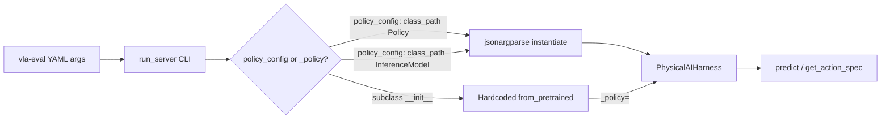

# Benchmark Proposal

## Motivation

To fairly and systematically evaluate the implementation of models we should provide some easy ways to benchmark.

There are several benchmarks on the market, [LIBERO](https://libero-project.github.io/main.html), [Robosuite](https://github.com/ARISE-Initiative/robosuite), [Meta-world](https://meta-world.github.io/), [VLABench](https://github.com/OpenMOSS/VLABench), [MolmoSpaces](https://github.com/allenai/molmospaces) and more being added all the time.

The pain point of testing our models on these benchmarks are: - Different API for each simulator - Package clashes, out of date python envs etc - Outdated OS requirements

For the above reasons the community has turned to using model / benchmark servers and using Docker to

Top examples: - [allenai vla-eval](https://github.com/allenai/vla-evaluation-harness) - [robodojo](https://robodojo-benchmark.com/doc/)

We should provide examples / working benchmark code to show re-implementation has been sucessful and also in the future that compressed / quantized can still provide valuable insight.

A lot of these benchmarks also provide significant speedups, allenai boasts 47x speedup.

## Integration

### Overview

I believe we should support more than just one benchmark suite i.e we can support allenai/vla-eval and robodojo quite simply. Both of these packages require just a model server, from alllenai/vla-eval the integration is as simple as:

```python
class MyModelServer(PredictModelServer):
    def __init__(self, checkpoint: str, **kwargs: Any) -> None:
        super().__init__(**kwargs)
        self.checkpoint = checkpoint

        import torch
        # Load model here...
        self._model = ...

    def predict(self, obs: Observation, ctx: SessionContext) -> Action:
        """Single-observation inference. Blocking call.

        Args:
            obs: {"images": {"cam_name": np.ndarray HWC uint8},
                  "task_description": str,
                  "state": np.ndarray (optional)}
            ctx: Session context (session_id, episode_id, step, is_first)

        Returns:
            {"actions": np.ndarray} with shape:
              - (action_dim,) for single actions
              - (chunk_size, action_dim) for action chunks
        """
        # Extract image and task description
        images = obs.get("images", {})
        img_array = next(iter(images.values()))
        pil_image = PILImage.fromarray(img_array).convert("RGB")
        text = obs.get("task_description", "")
        # Run inference...
        actions = ...
        return {"actions": np.array(actions, dtype=np.float32)}

    def get_action_spec(self) -> dict[str, DimSpec]:
        # Declare the action format this server produces.
        # The orchestrator compares this against the benchmark's spec
        # and warns on mismatches before wasting GPU hours.
        ...

    def get_observation_spec(self) -> dict[str, DimSpec]:
        # Declare what observations this server expects.
        ...


if __name__ == "__main__":
    from vla_eval.model_servers.serve import run_server

    run_server(MyModelServer)
```

Source - https://github.com/allenai/vla-evaluation-harness/blob/main/.claude/skills/add-model-server/SKILL.md

The issue arises in whether to support these benchmark suites in package or just simply provide useful code to run it.

I believe we should create a folder within the lbrary but not make it part of the package:

```bash
library/
├── benchmarks
│   ├── robodojo
│   ├── [some-other-benchmark-suite]
│   └── vla-evaluation-harness
├── configs
├── docs
├── notebooks
├── scripts
├── src
└── tests
```

My intuition is that these benchmark suites will come and go, they may be maintained but others may become more popular and there is no need to rely on them.

I also believe that we can support 1st party benchmarks in `physicalai.benchmarks` if we find it really useful later.

We will provide for each benchmark suite our model server / integration with their framework along with some example `.yaml` files that constructs our models using CLI.

To start with we can integrate `allenai/vla-evaluation-harness`.

## VLA-Eval Integration Strategy

This integration lets vla-eval run any Physical AI Studio policy as a model server
without giving up the jsonargparse `class_path`/`init_args` pattern the `physicalai` CLI
already uses for `fit`/`validate`/`test`. The same config that trains a policy can load it
for evaluation, and a `Policy` subclass or an exported `InferenceModel` are admitted by the
same loader with no branching, because `jsonargparse.add_subclass_arguments` accepts a
tuple of base classes.

One class handles every policy. Config alone covers most benchmarks; a subclass is only
needed when a checkpoint is run often enough that a dedicated CLI surface (and hardcoded
defaults) is worth the extra file.

## Documentation Structure

1. **[Base Server](#1-base-server-physicalaiharness)** — jsonargparse loading, image/state mapping
2. **[Benchmark Subclass](#2-benchmark-subclass-pi05liberoserver)** — hardcoded, benchmark-tuned entry point
3. **[The Three Modes](#the-three-modes)** — when to use each
4. **[YAML Configs](#yaml-configs)** — example configs per mode

## Key Features

- **Reuses training configs**: `policy_config` accepts the same `class_path`/`init_args` YAML `physicalai fit --config` consumes — no separate eval-only config format
- **One loader, two policy kinds**: a `Policy` subclass and an exported `InferenceModel` are both admitted by `add_subclass_arguments((Policy, InferenceModel), ...)` — no `if checkpoint / elif policy_class_path` branching in the harness
- **Config-only by default**: `image_keys`/`state_key`/`chunk_size` live in YAML `args`, so a new checkpoint or camera layout rarely needs a new Python file
- **Escape hatch for frequently-run checkpoints**: a subclass builds the policy itself and hands it to the base via the underscore-prefixed `_policy` kwarg, so `run_server`'s argparse auto-discovery never exposes it as a CLI flag
- **No duplicated predict/spec logic**: subclasses only override _how the policy gets built_ — `predict`, `get_action_spec`, `get_observation_spec` stay on the base class

## Architecture Diagram



`run_server()` auto-generates the CLI from whichever `__init__` you point it at. The base
class handles both generic policy kinds through one loader; a subclass like
`Pi05LiberoServer` handles the hardcoded case by resolving its own policy and handing it
to the base via `_policy=`.

---

## 1. Base Server: `PhysicalAIHarness`

Handles **jsonargparse loading** (`policy_config`) and **image/state observation
mapping**. An internal `_policy` param lets subclasses skip resolution entirely and hand
over an already-built policy.

```python
# src/vla_eval/model_servers/physicalai_harness.py
"""vla-eval bridge for Physical AI Studio policies.

Config-driven: one class handles any Physical AI Studio policy or exported
InferenceModel via a jsonargparse-style policy config (class_path / init_args).
No per-benchmark subclass is required — point policy_config at a YAML that
instantiates the policy the same way `physicalai fit --config` does.
"""

from __future__ import annotations

import logging
from typing import TYPE_CHECKING, Any

import numpy as np
from vla_eval.model_servers.predict import PredictModelServer
from vla_eval.specs import RAW, DimSpec

if TYPE_CHECKING:
    from vla_eval.model_servers.base import SessionContext
    from vla_eval.types import Action, Observation
    from physicalai.data import Observation as PhysicalAIObservation
    from physicalai.inference import InferenceModel
    from physicalai.policies import Policy

logger = logging.getLogger(__name__)


def load_policy_from_config(policy_config: str) -> Policy | InferenceModel:
    """Instantiate a policy from a jsonargparse-style YAML config.

    Both a `physicalai.policies.Policy` subclass and a
    `physicalai.inference.InferenceModel` are admitted, because
    add_subclass_arguments accepts a tuple of base classes. Accepts both a
    flat (class_path at top level) and nested (policy: {class_path, ...})
    layout.
    """
    from jsonargparse import ArgumentParser
    from physicalai.inference import InferenceModel
    from physicalai.policies.base import Policy
    import yaml

    parser = ArgumentParser()
    parser.add_subclass_arguments((Policy, InferenceModel), "policy", required=True)

    with open(policy_config, encoding="utf-8") as f:
        raw = yaml.safe_load(f)
    if isinstance(raw, dict) and "class_path" in raw:
        raw = {"policy": raw}
    cfg = parser.parse_object(raw)
    init = parser.instantiate_classes(cfg)
    return init.policy


class PhysicalAIHarness(PredictModelServer):
    """Bridge from a Physical AI Studio policy to a vla-eval model server.

    CLI path: `policy_config` is a path to a policy-only YAML.
    Python API path: pass an already-built `_policy` and skip
    `policy_config` entirely — underscore-prefixed so run_server's argparse
    auto-discovery skips it. Worth confirming run_server actually filters
    underscore-prefixed params before relying on this.
    """

    def __init__(
        self,
        policy_config: str | None = None,
        image_keys: dict[str, str] | None = None,
        state_key: str | None = "state",
        action_key: str = "action",
        device: str | None = None,
        *,
        chunk_size: int | None = None,
        action_ensemble: str = "newest",
        _policy: Policy | InferenceModel | None = None,
        **vla_eval_kwargs: Any,
    ) -> None:
        if (policy_config is None) == (_policy is None):
            raise ValueError("Pass exactly one of `policy_config` or `_policy`.")

        self.image_keys = image_keys
        self.state_key = None if state_key in {None, "None", "none"} else state_key
        self.action_key = action_key
        self.device = device
        self._logged_image_map = False

        if _policy is not None:
            self._policy = _policy
        else:
            logger.info("Loading policy from %s", policy_config)
            self._policy = load_policy_from_config(policy_config)

        # Policy subclasses (LightningModules) are moved and set to eval.
        # InferenceModel manages its own device via init_args and has
        # neither .to() nor .eval().
        if device and hasattr(self._policy, "to"):
            self._policy = self._policy.to(device)
        if hasattr(self._policy, "eval"):
            self._policy.eval()

        if chunk_size is None:
            chunk_size = getattr(self._policy, "chunk_size", None)

        super().__init__(chunk_size=chunk_size, action_ensemble=action_ensemble, **vla_eval_kwargs)
        self._expected_image_keys = list(getattr(self._policy, "image_keys", None) or [])

    def _resolve_image_map(self, images: dict[str, np.ndarray]) -> dict[str, str]:
        # image_keys explicit, else positional (sorted) fallback — same
        # pattern as the LeRobot bridge this harness was modeled on.
        ...

    def _build_policy_observation(self, obs: Observation) -> PhysicalAIObservation:
        # images/state/task -> physicalai.data.Observation, via image_keys /
        # state_key mapping.
        ...

    def predict(self, obs: Observation, ctx: SessionContext) -> Action:
        # InferenceModel: predict_action_chunk() on a plain numpy dict.
        # Policy subclass: predict_action_chunk() on a torch Observation,
        # moved to the policy's device first.
        ...

    def get_observation_params(self) -> dict[str, Any]: ...
    def get_action_spec(self) -> dict[str, DimSpec]:
        return {"actions": RAW}
    def get_observation_spec(self) -> dict[str, DimSpec]:
        spec = {"image": RAW, "language": RAW}
        if self.state_key:
            spec["state"] = RAW
        return spec


if __name__ == "__main__":
    from vla_eval.model_servers.serve import run_server

    run_server(PhysicalAIHarness)
```

---

## 2. Benchmark Subclass: `Pi05LiberoServer`

A benchmark-specific convenience wrapper. Same `predict`/spec logic as the base class —
only the policy construction and default image/state mapping change.

```python
# src/vla_eval/model_servers/pi05_libero.py
"""Pi0.5 model server for LIBERO — Python API entry point.

Subclasses PhysicalAIHarness with Pi0.5 + LIBERO defaults baked in and
constructs the policy directly (no jsonargparse policy_config file).
"""

from __future__ import annotations

import logging
from typing import Any

from model_servers.physicalai_harness import PhysicalAIHarness

logger = logging.getLogger(__name__)

# pi05_libero_finetuned declares two image features: image (base/agentview),
# image2 (wrist). chunk_size=10 matches LeRobot / OpenPI LIBERO protocol.
_LIBERO_IMAGE_KEYS = {"agentview": "image", "wrist": "image2"}
_LIBERO_STATE_KEY = "observation.state"
_LIBERO_CHUNK_SIZE = 10
_DEFAULT_CHECKPOINT = "lerobot/pi05_libero_finetuned_v044"


class Pi05LiberoServer(PhysicalAIHarness):
    """Pi0.5 model server pre-configured for LIBERO, no policy_config needed."""

    def __init__(
        self,
        pretrained_name_or_path: str = _DEFAULT_CHECKPOINT,
        device: str = "cuda",
        *,
        image_keys: dict[str, str] | None = None,
        state_key: str | None = _LIBERO_STATE_KEY,
        chunk_size: int | None = _LIBERO_CHUNK_SIZE,
        action_ensemble: str = "newest",
        **vla_eval_kwargs: Any,
    ) -> None:
        from physicalai.policies.pi05 import Pi05

        logger.info("Loading Pi0.5 from: %s", pretrained_name_or_path)
        policy = Pi05(pretrained_name_or_path=pretrained_name_or_path)

        super().__init__(
            _policy=policy,
            image_keys=image_keys or dict(_LIBERO_IMAGE_KEYS),
            state_key=state_key,
            device=device,
            chunk_size=chunk_size,
            action_ensemble=action_ensemble,
            **vla_eval_kwargs,
        )
        self.pretrained_name_or_path = pretrained_name_or_path


if __name__ == "__main__":
    from vla_eval.model_servers.serve import run_server

    run_server(Pi05LiberoServer)
```

Because `run_server` builds the CLI from `Pi05LiberoServer.__init__`'s own signature —
not the base class's — every field maps cleanly to auto-discovery, and this file also
runs standalone (`python model_servers/pi05_libero.py --port 8000`) with no YAML at all.

---

## The Three Modes

| Mode                    | Entry point                                               | Who resolves the policy                                                                           | When to use                                                                                                                                        |
| ----------------------- | --------------------------------------------------------- | ------------------------------------------------------------------------------------------------- | -------------------------------------------------------------------------------------------------------------------------------------------------- |
| **Exported checkpoint** | `PhysicalAIHarness`                                       | `policy_config` → `class_path: physicalai.inference.InferenceModel`                               | You already ran `physicalai export`                                                                                                                |
| **Direct jsonargparse** | `PhysicalAIHarness`                                       | `policy_config` → `class_path: physicalai.policies.<Policy subclass>` (same loader, no branching) | Reusing a training YAML, or an arbitrary `Policy` subclass without a dedicated server file                                                         |
| **Hardcoded subclass**  | `Pi05LiberoServer` (or similar per-checkpoint subclasses) | Built directly in `__init__`, passed to base via `_policy=`                                       | A specific, frequently-run checkpoint where you want a clean CLI surface and no `class_path` typos, or a standalone `python <file>.py` entry point |

Adding a new benchmark-tuned server later (e.g. `Pi05AlohaServer`, a GR00T variant)
follows the same shape: new `__init__`, own defaults, `_policy=` handoff to the shared
base. No `predict`/spec logic gets duplicated.

---

## YAML Configs

All of these are run with `vla-eval serve -c <config>.yaml`.

**Mode 1 — exported checkpoint:**

```yaml
# configs/policies/inference_model.yaml
class_path: physicalai.inference.InferenceModel
init_args:
  export_dir: /path/to/exported/model
  device: cuda
```

```yaml
# configs/pi05_libero.yaml
script: "model_servers/physicalai_harness.py"
args:
  policy_config: "configs/policies/inference_model.yaml"
  image_keys:
    agentview: "image"
    wrist: "image2"
  state_key: "observation.state"
  chunk_size: 10
  port: 8000
```

**Mode 2 — direct policy, reusing a training config:**

```yaml
# configs/policies/pi05_policy.yaml
class_path: physicalai.policies.pi05.Pi05
init_args:
  pretrained_name_or_path: lerobot/pi05_libero_finetuned_v044
```

```yaml
# configs/pi05_libero_policy.yaml
script: "model_servers/physicalai_harness.py"
args:
  policy_config: "configs/policies/pi05_policy.yaml"
  image_keys:
    agentview: "image"
    wrist: "image2"
  state_key: "observation.state"
  chunk_size: 10
  device: "cuda" # top-level, not init_args — Policy subclasses are .to()'d
  port: 8000 # by the harness itself; InferenceModel ignores this field
```

**Mode 3 — hardcoded subclass:**

```yaml
# configs/pi05_libero_direct.yaml
script: "model_servers/pi05_libero.py"
args:
  port: 8000
  # pretrained_name_or_path, device, chunk_size, image_keys all default
  # to LIBERO settings baked into Pi05LiberoServer; override individually
  # if a run needs a different checkpoint or camera mapping.
```

or with no YAML at all:

```bash
python model_servers/pi05_libero.py --port 8000
```

## Questions

- `physical-ai-studio/library/benchmarks`
  - would you prefer this to be in package?
  - is the position of the benchmark folder okay? or should we go up one level?
- for Mode 1/2, `device` behaves differently depending on policy kind (top-level arg for `Policy` subclasses, `init_args.device` for `InferenceModel`) — is that asymmetry acceptable, or should we normalize it?
- where do we manage benchmark results? on a spreadsheet? on the repo?
- should we fork each benchmark-suite? do we have licensing issues?
- if we have a CI machine with big enough compute, should we run integration benchmarks?
