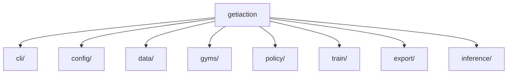

# Design Documentation

Architecture and implementation details for GetiAction.

## Modules

**[CLI](cli/overview.md)** - Command-line interface using PyTorch Lightning CLI

**[Config](config/overview.md)** - Configuration system (dataclasses, Pydantic, YAML)

**[Data](data/overview.md)** - Dataset management and data loading

**[Gyms](gyms/overview.md)** - Simulation environments for training

**[Policy](policy/overview.md)** - Policy implementations and base classes

**[Train](trainer/overview.md)** - Training infrastructure and metrics

**[Export](export/overview.md)** - Model export (OpenVINO, ONNX, Torch Export)

**[Inference](inference/overview.md)** - Production deployment

## Architecture

