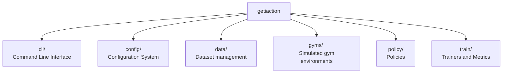

# Geti action trainer design

Welcome to the `action_trainer` package.

## Core Modules

### CLI

Command-line interface built on PyTorch Lightning CLI and jsonargparse.
Provides flexible training configuration through YAML files and CLI
arguments.

[📖 CLI Documentation](cli/overview.md)

### Config

Configuration system supporting multiple patterns: dataclasses, Pydantic
models, and dynamic class instantiation. Enables type-safe, validated
configuration loading.

[📖 Config Documentation](config/overview.md)

### Data

Dataset management and data loading infrastructure for robot learning tasks.

[📖 Data Documentation](data/overview.md)

### Gyms

Simulated gym environments for policy training and evaluation.

[📖 Gyms Documentation](gyms/overview.md)

### Policy

Policy implementations and base classes for robot learning algorithms.

[📖 Policy Documentation](policy/overview.md)

### Train

Training infrastructure, metrics, and logging.

[📖 Train Documentation](trainer/overview.md)
