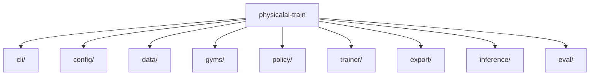

# Library Design Documentation

Architecture and implementation designs for the `physicalai-train` library — the training-side package for Physical AI Studio.

## Module Designs

| Module | Entry Point | Description |
| --- | --- | --- |
| [CLI](cli/overview.md) | [Overview](cli/overview.md) | Command-line interface using PyTorch Lightning CLI |
| [Config](config/overview.md) | [Overview](config/overview.md) | Configuration system (dataclasses, Pydantic, YAML). Design docs: [system design](config/system-design.md), [config options](config/config-options.md), [nested config flat access](config/nested-config-flat-access.md) |
| [Data](data/overview.md) | [Overview](data/overview.md) | Dataset management and data loading |
| [Gyms](gyms/overview.md) | [Overview](gyms/overview.md) | Simulation environments for training |
| [Policy](policy/overview.md) | [Overview](policy/overview.md) | Policy implementations and base classes |
| [Trainer](trainer/overview.md) | [Overview](trainer/overview.md) | Training infrastructure and metrics |
| [Export](export/overview.md) | [Overview](export/overview.md) | Model export (OpenVINO, ONNX, Torch Export) |
| [Inference](inference/overview.md) | [Overview](inference/overview.md) | Production deployment inference |
| [Evaluation](eval/rollout_metric.md) | [Rollout Metric](eval/rollout_metric.md) | Rollout evaluation metrics |
| [Execution](execution/phases.md) | [Phases](execution/phases.md) | Execution phases |

## Component Interface Designs

Runtime-side abstractions defined by the library. See [`components/`](components/) for individual docs.

| Component | Document | Description |
| --- | --- | --- |
| Robot Interface | [Robot Interface](components/robot-interface.md) | Robot ABC, leader/follower wrappers, SDK integration |
| Camera Interface | [Camera Interface](components/camera-interface.md) | `physicalai.capture` camera classes and sharing |
| Benchmarking | [Benchmarking API](components/benchmarking.md) | NumPy-only benchmark protocols, runner, latency metrics |
| Teleoperation | [Teleoperation API](components/teleoperation.md) | Leader/follower semantics, session lifecycle, safety |
| Data Collection | [Data Collection API](components/data-collection.md) | DatasetWriter, episode management, HF Hub upload |

## Model Enablement Guidelines

Per-model process for selecting, integrating, validating, optimizing, and maintaining robot-learning policies. See [`model-guidelines/`](model-guidelines/).

| Document | Description |
| --- | --- |
| [Model Enablement Guidelines](model-guidelines/model-implementation-guidelines.md) | Per-model process for Studio training and Runtime deployment |
| [Model Enablement Reference](model-guidelines/model-implementation-guidelines-reference.md) | Implementation checklists and reference details |
| [Intel Hardware Enablement](model-guidelines/intel-enablement-strategy.md) | Cross-team platform & upstream enablement work |
| [Slides](model-guidelines/model-implementation-guidelines-slides.md) | Slide deck companion |

## Policy Plugin Architecture

Design proposal for the policy extension mechanism and model enablement strategy. See [`policy-plugin/`](policy-plugin/).

| Document | Description |
| --- | --- |
| [Policy Plugin and Model Enablement Strategy](policy-plugin/plugin-options.md) | Proposal making an installed `Policy` subclass the unit of extension; covers discovery, capabilities, deployment enablement, and migration |

## Architecture

```mermaid
graph TD
    A["physicalai-train"] --> B["cli/"]
    A --> C["config/"]
    A --> D["data/"]
    A --> E["gyms/"]
    A --> F["policy/"]
    A --> G["trainer/"]
    A --> H["export/"]
    A --> I["inference/"]
    A --> J["eval/"]
```

Cross-cutting strategy, deployment, and team-plan designs live in [`docs/design/`](../../../docs/design/README.md).