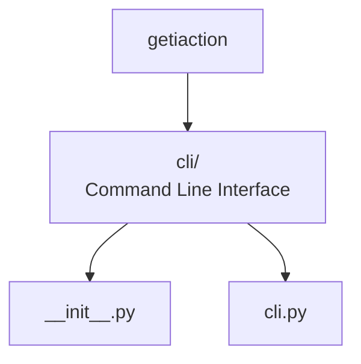
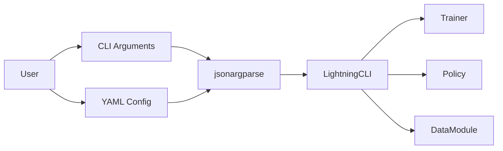

# CLI



This section describes the design for the `getiaction.cli` module,
which provides a command-line interface for training and evaluating policies.

## Overview

The CLI module leverages **PyTorch Lightning CLI** and **jsonargparse** to
provide a flexible, configuration-driven interface for training. It supports
multiple configuration patterns and seamlessly integrates with the Lightning
ecosystem.

## Key Components

- **`cli.py`**: Main CLI entry point using `LightningCLI`
- **Configuration Support**: YAML/JSON files, CLI arguments, type validation
- **Dynamic Instantiation**: `class_path` pattern for flexible component loading

## Design Philosophy

1. **Convention over Configuration**: Sensible defaults with override capability
2. **Type Safety**: Automatic validation from type hints
3. **Flexibility**: Multiple configuration patterns supported
4. **Integration**: Native Lightning ecosystem support

## Usage Pattern

```bash
# Train with config file
getiaction fit --config configs/train.yaml

# Override parameters
getiaction fit --config configs/train.yaml --trainer.max_epochs 200

# Generate config template
getiaction fit --print_config
```

## Architecture



The CLI acts as an orchestration layer, parsing configurations and
instantiating components for training.
