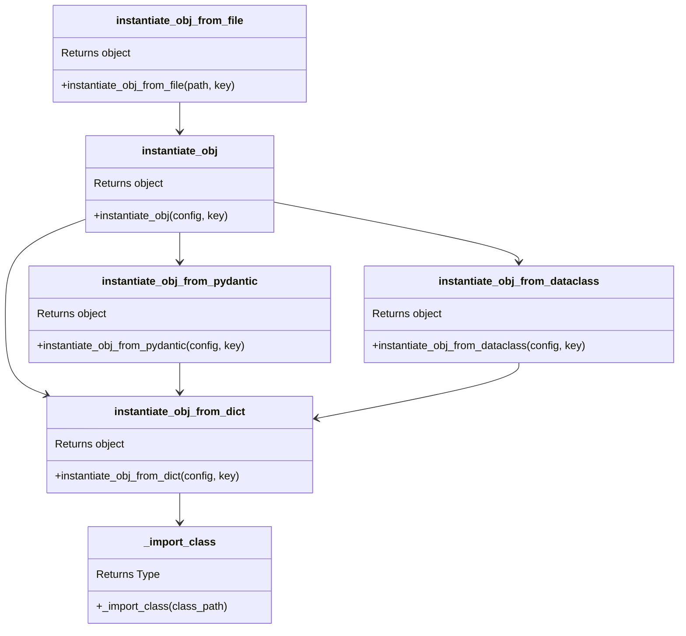
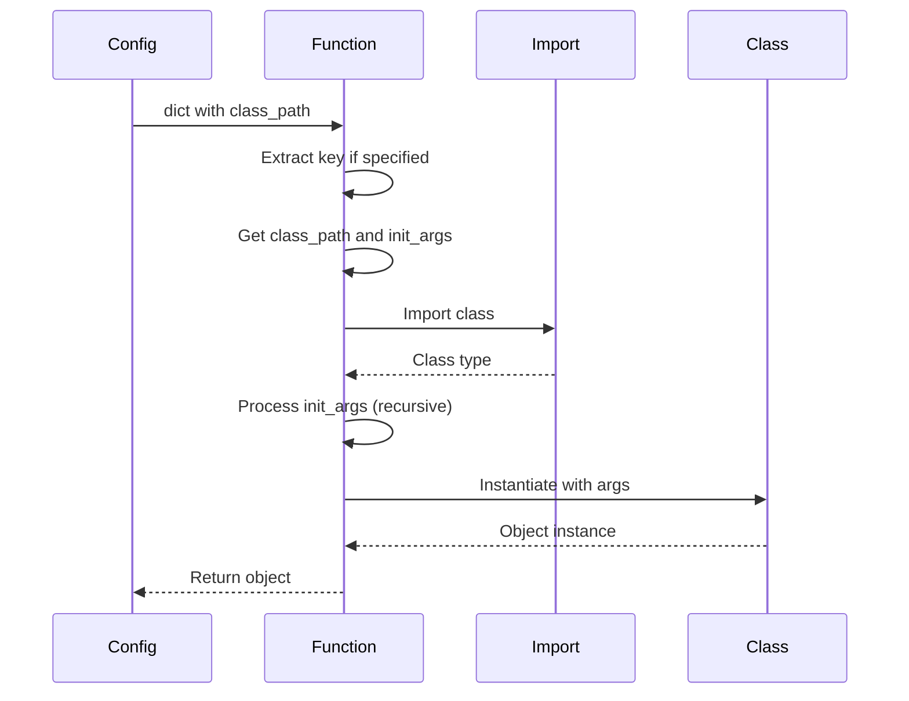
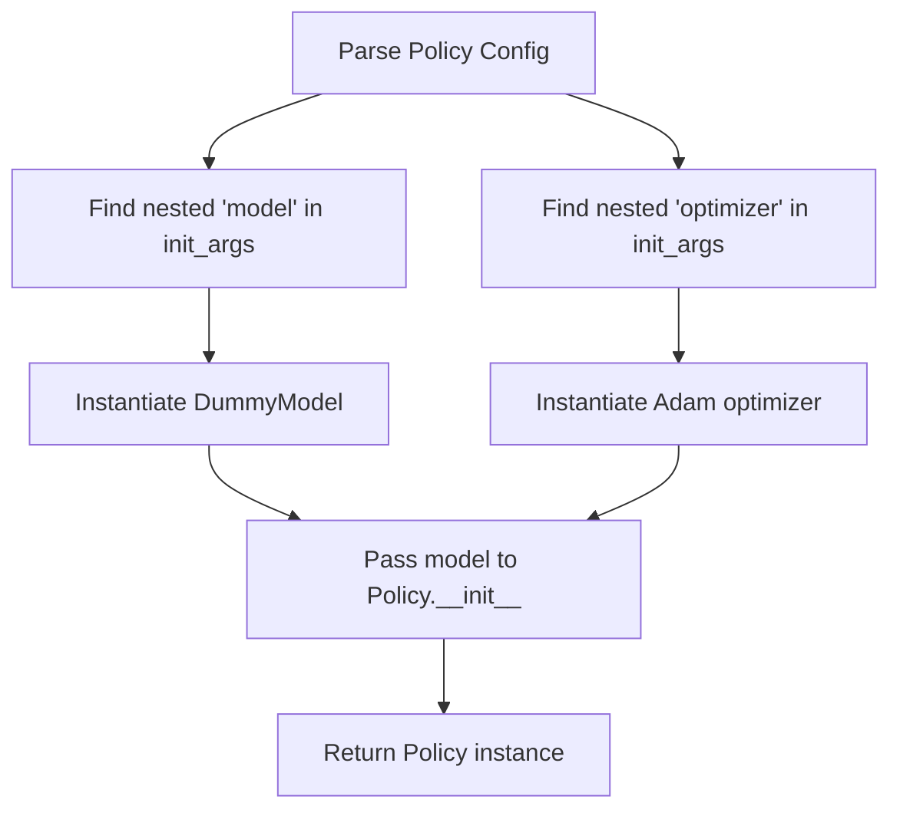

# Instantiation System

The `instantiate.py` module provides the core functionality for creating
objects from configurations.

## Class Diagram



## Core Functions

### `_import_class(class_path: str) -> type`

Internal function that imports a class from a dotted path string.

```python
# Example
cls = _import_class("torch.optim.Adam")
# Returns: <class 'torch.optim.Adam'>
```

**Error Handling:**

- Raises `ImportError` if module or class doesn't exist
- Provides clear error messages with the failing import path

### `instantiate_obj_from_dict(config: dict, key: str | None = None) -> object`

Creates objects from dictionary configurations using the `class_path` pattern.

```python
config = {
    "class_path": "torch.optim.Adam",
    "init_args": {
        "lr": 0.001,
        "betas": [0.9, 0.999]
    }
}
optimizer = instantiate_obj_from_dict(config)
```

**Key Features:**

1. **Nested Instantiation**: Recursively instantiates nested objects
2. **Key Extraction**: Can extract specific keys from config
3. **Validation**: Checks for required `class_path` key

**Flow Diagram:**



### `instantiate_obj_from_pydantic(config: BaseModel, key: str | None = None`

Creates objects from Pydantic model configurations.

```python
class OptimizerConfig(BaseModel):
    learning_rate: float = Field(gt=0.0)
    weight_decay: float = Field(ge=0.0)

config = OptimizerConfig(learning_rate=0.001)
# Converts to dict and uses instantiate_obj_from_dict
```

**Process:**

1. Validates config using Pydantic validators
2. Converts to dictionary using `model_dump()`
3. Delegates to `instantiate_obj_from_dict()`

### `instantiate_obj_from_dataclass(config: object, key: str | None = None) -> object`

Creates objects from dataclass configurations.

```python
@dataclass
class OptimizerConfig:
    learning_rate: float = 0.001
    weight_decay: float = 0.0

config = OptimizerConfig(learning_rate=0.001)
# Converts to dict and uses instantiate_obj_from_dict
```

**Process:**

1. Validates config is a dataclass instance
2. Converts to dictionary using `dataclasses.asdict()`
3. Delegates to `instantiate_obj_from_dict()`

### `instantiate_obj_from_file(path: str | Path, key: str | None = None) -> object`

Creates objects directly from YAML or JSON files.

```python
# From YAML file
policy = instantiate_obj_from_file("configs/policy.yaml")

# Extract specific key
model = instantiate_obj_from_file("configs/train.yaml", key="model")
```

**Supported Formats:**

- `.yaml`, `.yml` - YAML files
- `.json` - JSON files

### `instantiate_obj(config: dict | BaseModel | object, key: str | None = None)`

Universal instantiation function that auto-detects config type.

```python
# Works with any config type
obj = instantiate_obj(dict_config)
obj = instantiate_obj(pydantic_config)
obj = instantiate_obj(dataclass_config)
```

**Detection Logic:**

1. If dict → `instantiate_obj_from_dict()`
2. If Pydantic BaseModel → `instantiate_obj_from_pydantic()`
3. If dataclass instance → `instantiate_obj_from_dataclass()`
4. Else → raise `TypeError`

## Nested Configuration Example

The system handles complex nested configurations automatically:

```yaml
model:
  class_path: getiaction.policies.dummy.policy.Dummy
  init_args:
    model:
      class_path: getiaction.policies.dummy.model.Dummy
      init_args:
        action_shape: [7]
        n_action_steps: 4
    optimizer:
      class_path: torch.optim.Adam
      init_args:
        lr: 0.001
        params: null # Will be set by policy
```

**Instantiation Steps:**



## Type Validation

The instantiation system validates types when possible:

```python
class Model:
    def __init__(self, hidden_size: int):
        if not isinstance(hidden_size, int):
            raise TypeError(f"Expected int, got {type(hidden_size)}")
```

When combined with Pydantic:

```python
class ModelConfig(BaseModel):
    hidden_size: int  # Pydantic validates this

config = ModelConfig(hidden_size="128")  # ❌ ValidationError
```

## Error Messages

The system provides clear error messages:

```python
# Missing class_path
config = {"init_args": {"lr": 0.001}}
# Error: Configuration must contain 'class_path' key for instantiation.
#        Got keys: ['init_args']

# Invalid import
config = {"class_path": "invalid.Module"}
# Error: Cannot import 'invalid.Module': No module named 'invalid'

# Wrong config type
config = "not a dict"
# Error: Expected dataclass instance, got <class 'str'>
```

## Performance Considerations

1. **Lazy Import**: Classes are imported only when needed
2. **Caching**: Python's import system caches modules
3. **Recursive Depth**: Deep nesting may impact performance
4. **Validation**: Pydantic validation adds overhead (but catches errors early)

## Best Practices

1. **Use class_path for Flexibility**: Easy to swap components
2. **Add Type Hints**: Enables better validation
3. **Provide Defaults**: Use `init_args` with sensible defaults
4. **Validate Early**: Use Pydantic for user-provided configs
5. **Document Required Args**: Make it clear what's needed
6. **Handle Optional Args**: Use `None` defaults for optional parameters

## Integration with jsonargparse

When used with Lightning CLI, jsonargparse handles the instantiation:

```bash
# jsonargparse uses this system internally
getiaction fit \
    --model.class_path getiaction.policies.dummy.policy.Dummy \
    --model.init_args.model.class_path getiaction.policies.dummy.model.Dummy
```

The CLI automatically calls the appropriate instantiation functions based
on the configuration.
