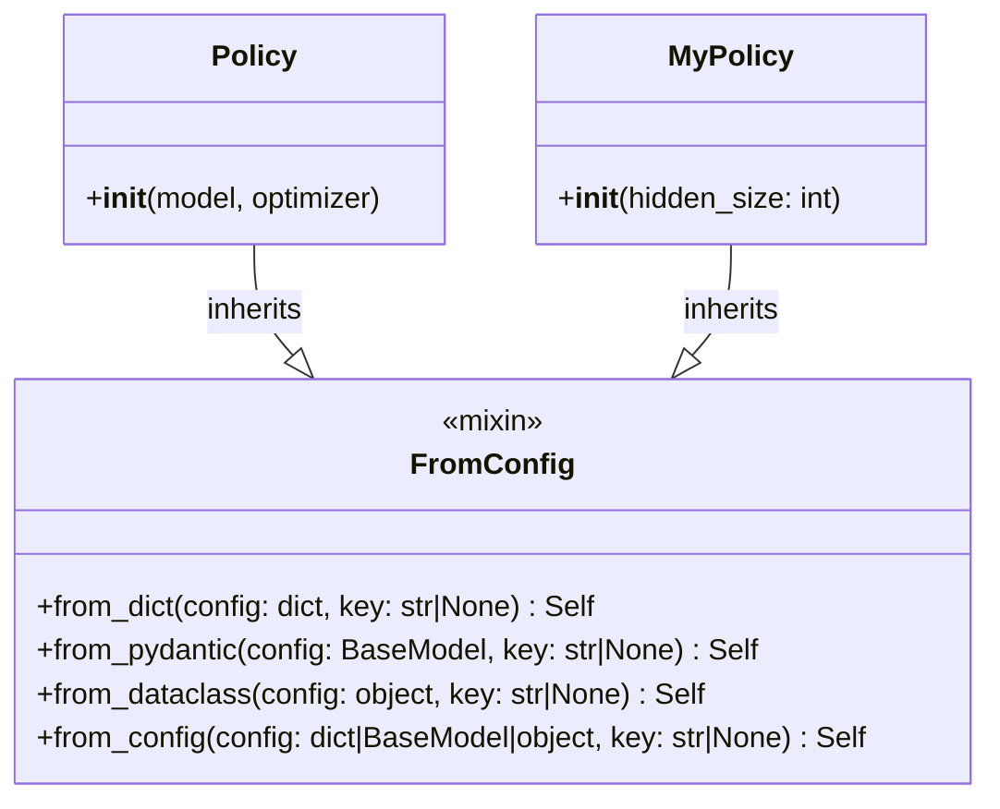
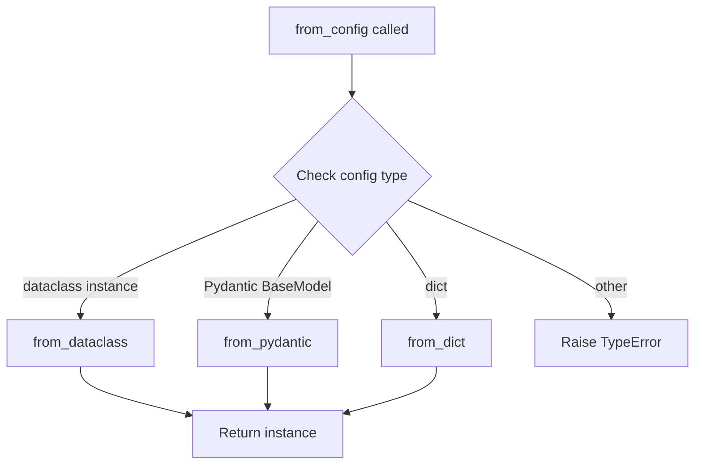

# FromConfig Mixin

The `FromConfig` mixin class provides a standardized way to add
configuration loading capabilities to any class.

## Class Structure



## Design Pattern

The `FromConfig` mixin implements the **Factory Method** pattern,
providing multiple factory methods for different configuration sources.

```python
class MyModel(nn.Module, FromConfig):
    def __init__(self, hidden_size: int, num_layers: int = 3):
        super().__init__()
        self.hidden_size = hidden_size
        self.num_layers = num_layers

# Now MyModel supports all configuration patterns
model = MyModel.from_dict({"hidden_size": 256})
model = MyModel.from_pydantic(PydanticConfig(...))
model = MyModel.from_dataclass(DataclassConfig(...))
model = MyModel.from_config(any_config)  # Auto-detects
```

## Methods

### `from_dict(config: dict, *, key: str | None = None) -> Self`

Creates an instance from a dictionary configuration.

```python
class MyPolicy(Policy, FromConfig):
    def __init__(self, hidden_size: int):
        super().__init__()
        self.hidden_size = hidden_size

config = {
    "hidden_size": 256,
    "num_layers": 3
}
policy = MyPolicy.from_dict(config)
```

**With Key Extraction:**

```python
config = {
    "model": {
        "hidden_size": 256,
        "num_layers": 3
    }
}
policy = MyPolicy.from_dict(config, key="model")
```

**With class_path:**

```python
config = {
    "class_path": "getiaction.policies.dummy.policy.Dummy",
    "init_args": {
        "model": {
            "class_path": "getiaction.policies.dummy.model.Dummy",
            "init_args": {"action_shape": [7]}
        }
    }
}
policy = Policy.from_dict(config)  # Instantiates Dummy policy
```

### `from_pydantic(config: BaseModel, *, key: str | None = None) -> Self`

Creates an instance from a Pydantic model with validation.

```python
class MyPolicyConfig(BaseModel):
    hidden_size: int = Field(ge=1, le=1024)
    num_layers: int = Field(ge=1, le=100)

    @field_validator("hidden_size")
    @classmethod
    def validate_power_of_2(cls, v: int) -> int:
        if v & (v - 1) != 0:
            raise ValueError("hidden_size must be power of 2")
        return v

# Validation happens automatically
config = MyPolicyConfig(hidden_size=256, num_layers=3)  # ✅
policy = MyPolicy.from_pydantic(config)

# Invalid config caught by Pydantic
config = MyPolicyConfig(hidden_size=200, num_layers=3)  # ❌ ValidationError
```

**Benefits:**

- Runtime validation before instantiation
- Clear error messages from Pydantic
- Custom validators for complex constraints
- JSON schema generation for documentation

### `from_dataclass(config: object, *, key: str | None = None) -> Self`

Creates an instance from a dataclass configuration.

```python
@dataclass
class MyPolicyConfig:
    hidden_size: int = 256
    num_layers: int = 3
    activation: str = "relu"

config = MyPolicyConfig(hidden_size=512)
policy = MyPolicy.from_dataclass(config)
```

**Benefits:**

- Type safety at definition time
- IDE autocomplete and type checking
- No external dependencies (standard library)
- Frozen dataclasses for immutability

**Example with Frozen Dataclass:**

```python
@dataclass(frozen=True)
class MyPolicyConfig:
    hidden_size: int = 256

config = MyPolicyConfig(hidden_size=512)
config.hidden_size = 1024  # ❌ FrozenInstanceError
policy = MyPolicy.from_dataclass(config)  # ✅ Works
```

### `from_config(config: dict | BaseModel | object, *, key: str | None = None)`

Universal configuration loader that auto-detects the config type.

```python
# Works with any config type
policy = MyPolicy.from_config(dict_config)
policy = MyPolicy.from_config(pydantic_config)
policy = MyPolicy.from_config(dataclass_config)
```

**Detection Logic:**



## Usage Examples

### Simple Usage

```python
class SimpleMLP(nn.Module, FromConfig):
    def __init__(self, input_size: int, hidden_size: int, output_size: int):
        super().__init__()
        self.fc1 = nn.Linear(input_size, hidden_size)
        self.fc2 = nn.Linear(hidden_size, output_size)

# From dict
model = SimpleMLP.from_dict({
    "input_size": 784,
    "hidden_size": 256,
    "output_size": 10
})
```

### With Nested Configuration

```python
class DummyPolicy(Policy, FromConfig):
    def __init__(self, model: nn.Module, optimizer: torch.optim.Optimizer):
        super().__init__()
        self.model = model
        self.optimizer = optimizer

config = {
    "model": {
        "class_path": "getiaction.policies.dummy.model.Dummy",
        "init_args": {"action_shape": [7]}
    },
    "optimizer": {
        "class_path": "torch.optim.Adam",
        "init_args": {"lr": 0.001}
    }
}

# FromConfig handles nested instantiation
policy = DummyPolicy.from_dict(config)
# Automatically creates model and optimizer before passing to __init__
```

### With Pydantic Validation

```python
class RobotConfig(BaseModel):
    action_dim: int = Field(ge=1, le=50, description="Action space dimension")
    observation_dim: int = Field(ge=1, le=1000)
    max_episode_steps: int = Field(ge=1)

    @field_validator("action_dim", "observation_dim")
    @classmethod
    def validate_dimensions(cls, v: int) -> int:
        if v % 2 != 0:
            raise ValueError("Dimensions must be even numbers")
        return v

class RobotPolicy(Policy, FromConfig):
    def __init__(self, action_dim: int, observation_dim: int):
        super().__init__()
        self.action_dim = action_dim
        self.observation_dim = observation_dim

# Validation happens before instantiation
config = RobotConfig(action_dim=8, observation_dim=100)  # ✅
policy = RobotPolicy.from_pydantic(config)

# Invalid config caught early
config = RobotConfig(action_dim=7, observation_dim=100)  # ❌ Must be even
```

### Composition Pattern

```python
@dataclass(frozen=True)
class ModelConfig:
    hidden_size: int = 256
    num_layers: int = 3

@dataclass(frozen=True)
class OptimizerConfig:
    lr: float = 0.001
    weight_decay: float = 0.0

@dataclass(frozen=True)
class PolicyConfig:
    model: ModelConfig
    optimizer: OptimizerConfig

class MyPolicy(Policy, FromConfig):
    @classmethod
    def from_dataclass(cls, config: PolicyConfig, *, key: str | None = None):
        # Custom instantiation logic
        model = MyModel(**dataclasses.asdict(config.model))
        optimizer = torch.optim.Adam(
            model.parameters(),
            lr=config.optimizer.lr,
            weight_decay=config.optimizer.weight_decay
        )
        return cls(model=model, optimizer=optimizer)

# Use composed config
config = PolicyConfig(
    model=ModelConfig(hidden_size=512),
    optimizer=OptimizerConfig(lr=0.001)
)
policy = MyPolicy.from_dataclass(config)
```

## Integration with Policy Base Class

The `Policy` base class inherits from `FromConfig`, making all policies
automatically support multiple configuration patterns:

```python
class Policy(LightningModule, FromConfig):
    """Base class for all policies."""
    pass

class DummyPolicy(Policy):
    """Dummy policy automatically inherits FromConfig."""
    pass

# All these work automatically
policy = DummyPolicy.from_dict(dict_config)
policy = DummyPolicy.from_pydantic(pydantic_config)
policy = DummyPolicy.from_dataclass(dataclass_config)
```

## Best Practices

### 1. Override When Needed

Override factory methods for custom instantiation logic:

```python
class CustomPolicy(Policy):
    @classmethod
    def from_config(cls, config, *, key=None):
        # Custom logic before instantiation
        processed_config = preprocess(config)
        return super().from_config(processed_config, key=key)
```

### 2. Use Type Hints

Provide type hints for automatic validation:

```python
class MyPolicy(Policy, FromConfig):
    def __init__(
        self,
        hidden_size: int,  # Type hint enables validation
        dropout: float = 0.1,
        activation: str = "relu"
    ):
        ...
```

### 3. Document Configuration

Use docstrings to document configuration structure:

```python
class MyPolicy(Policy, FromConfig):
    """My custom policy.

    Configuration:
        hidden_size (int): Hidden layer size (must be > 0)
        num_layers (int): Number of layers (default: 3)
        activation (str): Activation function (default: "relu")

    Example:
        >>> config = {"hidden_size": 256, "num_layers": 4}
        >>> policy = MyPolicy.from_dict(config)
    """
```

### 4. Validate in **init**

Add validation in `__init__` for runtime checks:

```python
class MyPolicy(Policy, FromConfig):
    def __init__(self, hidden_size: int):
        if hidden_size <= 0:
            raise ValueError(f"hidden_size must be > 0, got {hidden_size}")
        super().__init__()
        self.hidden_size = hidden_size
```

## Error Handling

The mixin provides clear error messages:

```python
# Wrong config type
config = "not a valid config"
policy = MyPolicy.from_config(config)
# TypeError: Config must be dict, Pydantic model, or dataclass

# Missing required parameter
config = {}  # Missing hidden_size
policy = MyPolicy.from_dict(config)
# TypeError: __init__() missing required argument: 'hidden_size'

# Invalid dataclass
config = MyPolicyConfig  # Class instead of instance
policy = MyPolicy.from_dataclass(config)
# TypeError: Expected dataclass instance, got <class 'MyPolicyConfig'>
```

This mixin design provides a consistent, flexible interface for
configuration loading across the entire GetiAction codebase.
