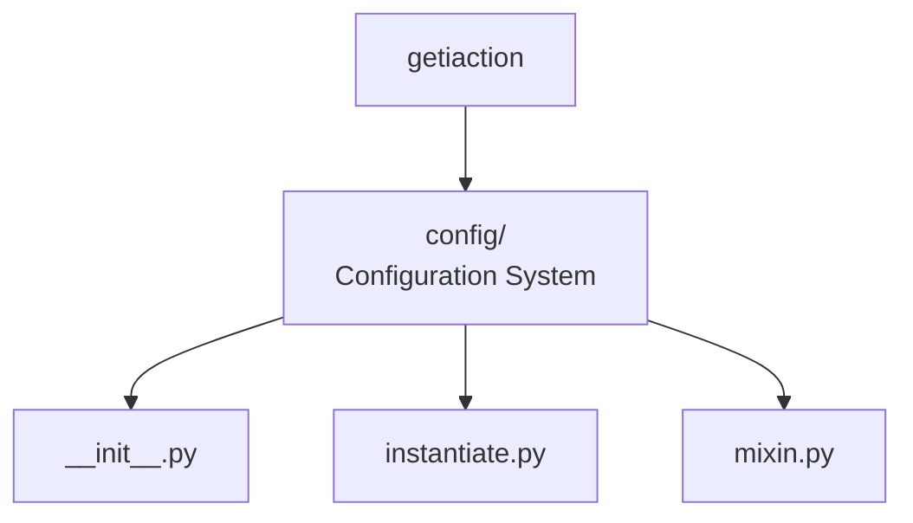
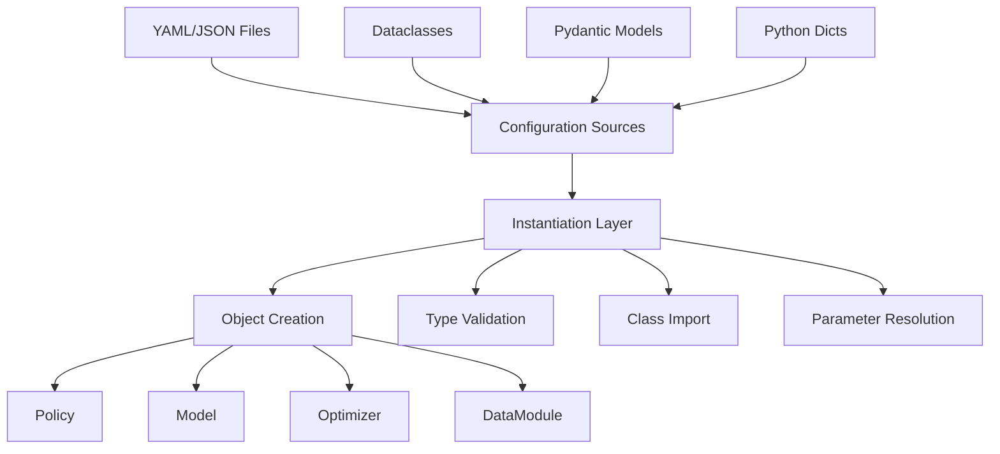

# Configuration System



This section describes the design for the `getiaction.config` module,
which provides flexible configuration loading and object instantiation.

## Overview

The configuration system enables multiple patterns for defining and loading configurations:

1. **Dataclasses** - Type-safe, compile-time validation
2. **Pydantic Models** - Runtime validation with custom validators
3. **Dictionaries/YAML** - Dynamic configuration with `class_path` pattern

## Design Goals

- **Flexibility**: Support multiple configuration patterns
- **Type Safety**: Leverage Python type hints for validation
- **Validation**: Runtime validation with clear error messages
- **Backward Compatibility**: Work with existing config-based code
- **jsonargparse Integration**: Seamless CLI integration

## Key Components

### instantiate.py

Provides functions for object instantiation from various config sources:

```python
instantiate_obj(config)                    # Universal instantiator
instantiate_obj_from_dict(config)          # From dict/YAML
instantiate_obj_from_pydantic(config)      # From Pydantic models
instantiate_obj_from_dataclass(config)     # From dataclasses
instantiate_obj_from_file(path)            # From YAML/JSON files
```

### mixin.py

Provides `FromConfig` mixin class for adding configuration loading to any class:

```python
class MyModel(nn.Module, FromConfig):
    pass

# Multiple loading methods
model = MyModel.from_config(config)        # Universal
model = MyModel.from_pydantic(config)      # From Pydantic
model = MyModel.from_dataclass(config)     # From dataclass
model = MyModel.from_dict(config)          # From dict
```

## Architecture



## Configuration Patterns

### Pattern 1: Dataclass (Type-Safe)

```python
@dataclass
class ModelConfig:
    hidden_size: int = 128
    num_layers: int = 3

config = ModelConfig(hidden_size=256)
model = Model.from_dataclass(config)
```

**Benefits:**

- IDE autocomplete
- Type checking at definition time
- No external dependencies
- Simple and clean

### Pattern 2: Pydantic (Validated)

```python
class ModelConfig(BaseModel):
    hidden_size: int = Field(ge=1, le=1024)
    num_layers: int = Field(ge=1)

    @field_validator("hidden_size")
    @classmethod
    def validate_power_of_2(cls, v):
        if v & (v - 1) != 0:
            raise ValueError("Must be power of 2")
        return v

config = ModelConfig(hidden_size=256)  # Validates
model = Model.from_pydantic(config)
```

**Benefits:**

- Runtime validation
- Custom validators
- Clear error messages
- JSON schema generation

### Pattern 3: class_path (Dynamic)

```yaml
model:
  class_path: getiaction.policies.dummy.policy.Dummy
  init_args:
    model:
      class_path: getiaction.policies.dummy.model.Dummy
      init_args:
        hidden_size: 256
```

**Benefits:**

- No code changes to swap components
- Configuration-driven experiments
- Works with any class
- Standard in ML ecosystem (Lightning, Hydra, etc.)

## Usage Examples

### Basic Usage

```python
# From dict with class_path
config = {
    "class_path": "getiaction.policies.dummy.policy.Dummy",
    "init_args": {"hidden_size": 256}
}
policy = instantiate_obj_from_dict(config)

# From YAML file
policy = instantiate_obj_from_file("configs/policy.yaml")

# Using mixin
class MyPolicy(Policy, FromConfig):
    pass

policy = MyPolicy.from_config(config)  # Works with any pattern
```

### Nested Configurations

```yaml
model:
  class_path: getiaction.policies.dummy.policy.Dummy
  init_args:
    model:
      class_path: getiaction.policies.dummy.model.Dummy
      init_args:
        action_shape: [7]
    optimizer:
      class_path: torch.optim.Adam
      init_args:
        lr: 0.001
```

The system automatically handles nested instantiation, creating the model and
optimizer before passing them to the policy.

### With FromConfig Mixin

```python
class Dummy(Policy, FromConfig):
    def __init__(self, model: nn.Module, optimizer: Optimizer):
        super().__init__()
        self.model = model
        self.optimizer = optimizer

# All these work automatically:
policy = Dummy.from_dict(dict_config)
policy = Dummy.from_pydantic(pydantic_config)
policy = Dummy.from_dataclass(dataclass_config)
policy = Dummy.from_config(any_config)  # Auto-detects type
```

## Type Validation

The system performs automatic type validation:

```python
class Model:
    def __init__(self, hidden_size: int, dropout: float = 0.1):
        pass

# Valid
config = {"class_path": "Model", "init_args": {"hidden_size": 128}}
model = instantiate_obj_from_dict(config)  # ✅

# Invalid - type error
config = {"class_path": "Model", "init_args": {"hidden_size": "128"}}
model = instantiate_obj_from_dict(config)  # ❌ TypeError
```

## Error Handling

Clear error messages for common issues:

```python
# Missing class_path
config = {"init_args": {"hidden_size": 128}}
# Error: Configuration must contain 'class_path' key

# Invalid class path
config = {"class_path": "nonexistent.Module"}
# Error: Cannot import 'nonexistent.Module': No module named 'nonexistent'

# Invalid dataclass
config = "not a dataclass"
# Error: Expected dataclass instance, got <class 'str'>
```

## Integration with CLI

The configuration system integrates seamlessly with the CLI through jsonargparse:

```bash
# jsonargparse automatically uses the config system
getiaction fit --config train.yaml

# Validates types from class signatures
getiaction fit --model.init_args.hidden_size 256  # ✅
getiaction fit --model.init_args.hidden_size abc  # ❌ Type error
```

## Best Practices

1. **Use Dataclasses for Static Configs**: When configuration is known at
   development time
2. **Use Pydantic for User Configs**: When validating user-provided YAML/JSON files
3. **Use class_path for Experiments**: When trying different models/components
4. **Add Type Hints**: Enable automatic validation
5. **Provide Defaults**: Use Field() or dataclass defaults
6. **Document Constraints**: Use Pydantic validators for complex constraints

This design provides flexibility while maintaining type safety and clear
error messages.
