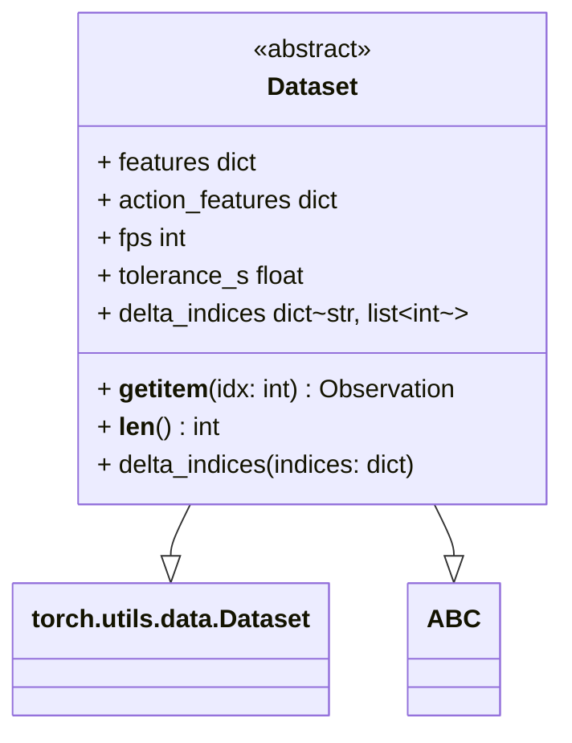

# Dataset

The `Dataset` represents a PyTorch Dataset which should return an Observation.

```mermaid
classDiagram
    class torch.utils.data.Dataset
    class ABC

    class Dataset {
        <<abstract>>
        + __getitem__(idx: int) Observation
        + __len__() int
        + features dict
        + action_features dict
        + fps int
        + tolerance_s float
        + delta_indices dict~str, list~int~~
        + delta_indices(indices: dict)
    }

    Dataset --|> torch.utils.data.Dataset
    Dataset --|> ABC
```
