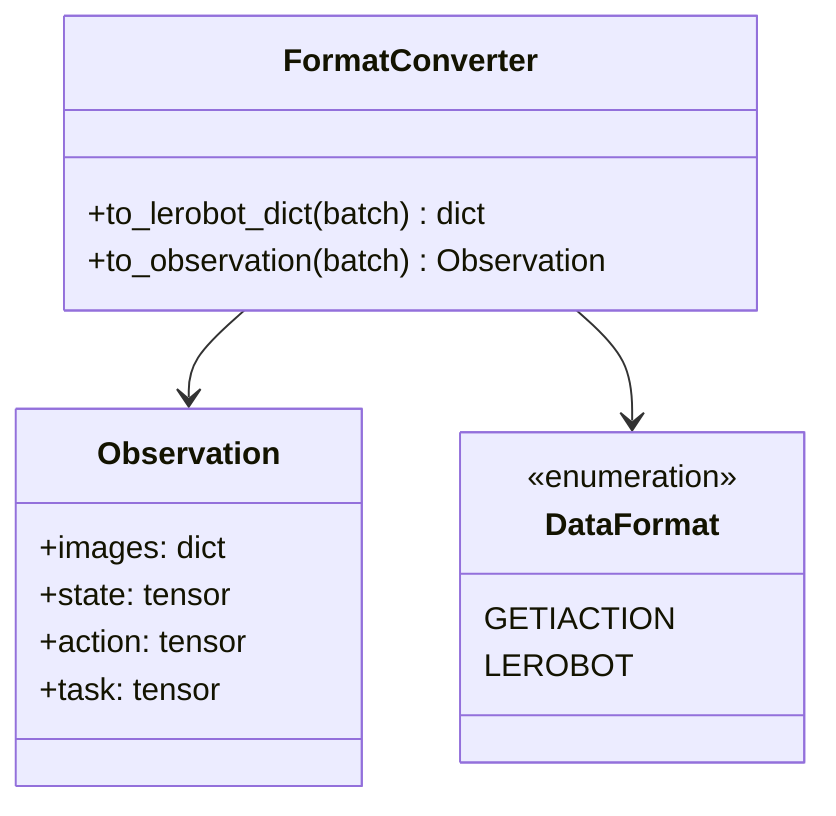
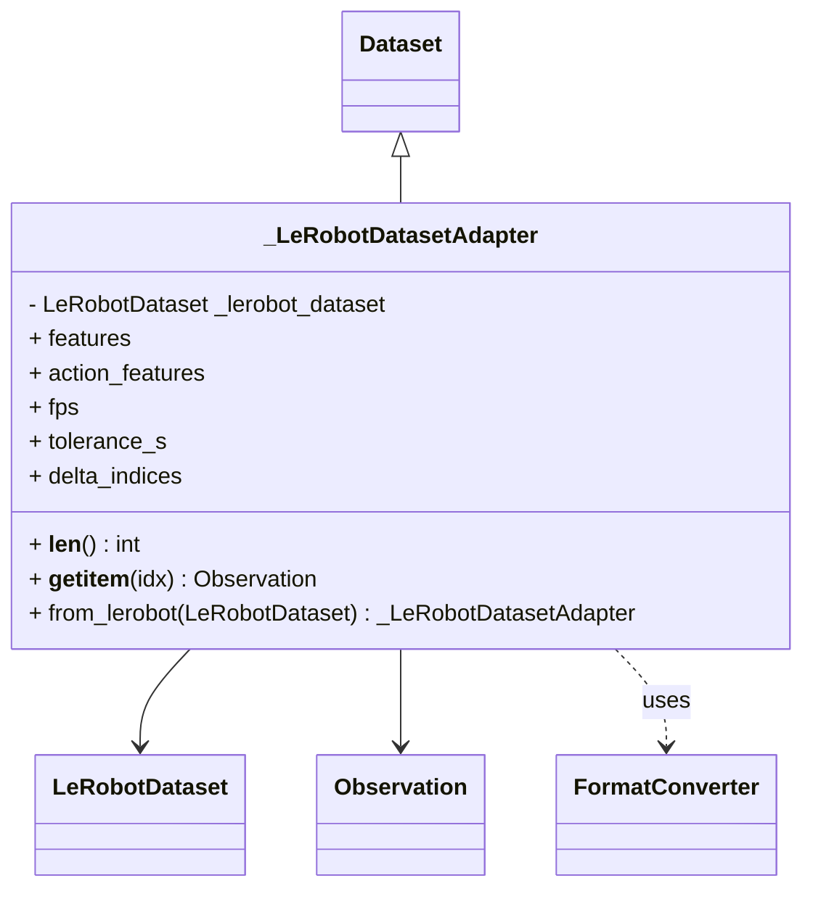
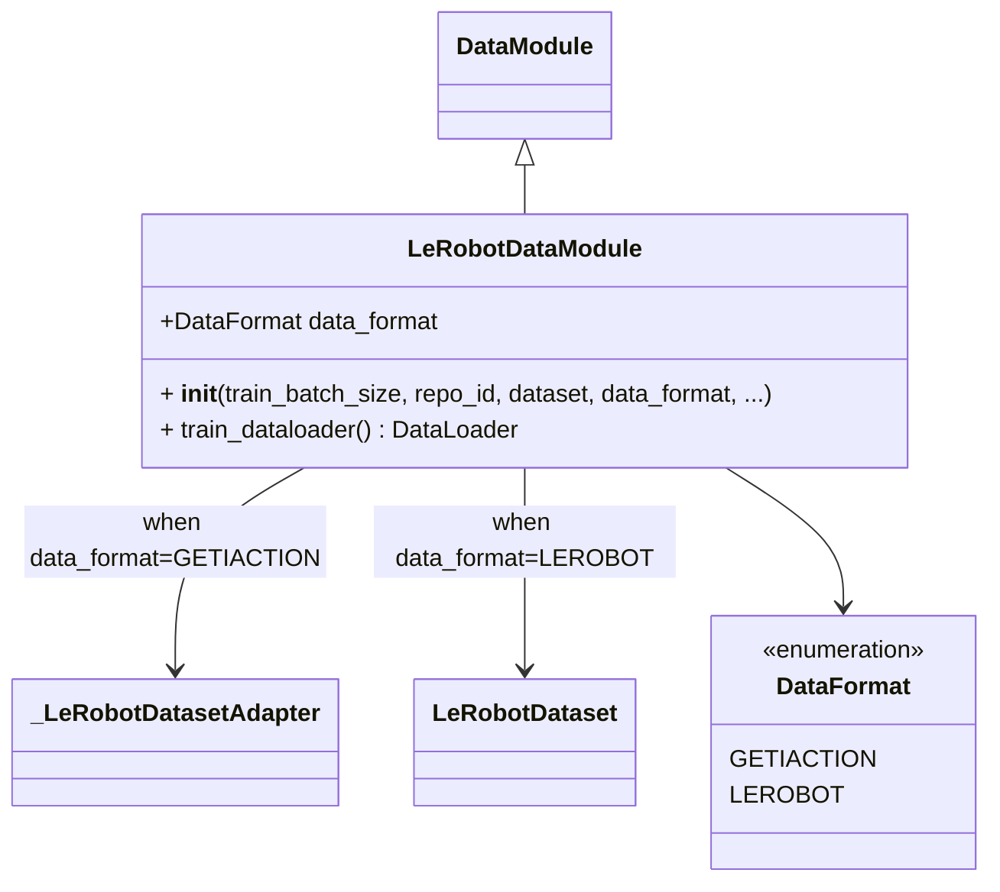

# LeRobot Data Integration

## Architecture Overview

The LeRobot data integration is organized into three focused modules:

```text
getiaction/data/lerobot/
├── converters.py      # Format conversion utilities
├── dataset.py         # Dataset adapter
└── datamodule.py      # Lightning DataModule
```

### Module Responsibilities

- **`converters.py`**: Bidirectional format conversion between
  GetiAction's `Observation` and LeRobot's flattened dict format
- **`dataset.py`**: `_LeRobotDatasetAdapter` wraps `LeRobotDataset`
  for GetiAction compatibility
- **`datamodule.py`**: `LeRobotDataModule` provides PyTorch Lightning
  integration

## Format Conversion

### Two Data Formats

1. **GetiAction Format**: Structured `Observation` dataclass with typed fields

   ```python
   Observation(
       images={"top": tensor, "wrist": tensor},
       state=tensor,
       action=tensor,
       ...
   )
   ```

2. **LeRobot Format**: Flattened dictionary with dot-notation keys

   ```python
   {
       "observation.images.top": tensor,
       "observation.images.wrist": tensor,
       "observation.state": tensor,
       "action": tensor,
       ...
   }
   ```

### FormatConverter

The `FormatConverter` class provides zero-copy bidirectional conversion:



**Usage:**

```python
from getiaction.data.lerobot import FormatConverter

# Convert to LeRobot format
lerobot_dict = FormatConverter.to_lerobot_dict(observation)

# Convert to GetiAction format
observation = FormatConverter.to_observation(lerobot_dict)
```

## LeRobotDatasetAdapter

Internal adapter that makes `LeRobotDataset` compatible with the
`getiaction.data.Dataset` interface.



**Note:** This is an internal class. Users should use `LeRobotDataModule` instead.

Example (these examples will download data onto your disk):

```python
# Internal usage - not recommended for end users
from getiaction.data.lerobot.dataset import _LeRobotDatasetAdapter

pusht_dataset = _LeRobotDatasetAdapter(repo_id="lerobot/pusht")

# Preferred: Use LeRobotDataModule instead
from getiaction.data.lerobot import LeRobotDataModule
datamodule = LeRobotDataModule(repo_id="lerobot/pusht", train_batch_size=32)
```

## LeRobotDataModule

PyTorch Lightning DataModule for LeRobot datasets with configurable output formats.



### Data Format Selection

The `data_format` parameter controls the output format:

- **`"getiaction"`** (default): Returns `Observation` dataclass instances
- **`"lerobot"`**: Returns flattened dict in LeRobot's native format

Example (this will download data to disk if not cached already):

```python
from getiaction.data.lerobot import LeRobotDataModule, DataFormat

repo_id = "lerobot/pusht"

# Option 1: GetiAction format (default)
datamodule = LeRobotDataModule(
    repo_id=repo_id,
    train_batch_size=16
)

# Option 2: LeRobot format (for LeRobot policies)
datamodule = LeRobotDataModule(
    repo_id=repo_id,
    train_batch_size=16,
    data_format="lerobot"  # or DataFormat.LEROBOT
)

# Option 3: From existing LeRobotDataset
from lerobot.datasets.lerobot_dataset import LeRobotDataset
dataset = LeRobotDataset(repo_id=repo_id)
datamodule = LeRobotDataModule(
    dataset=dataset,
    train_batch_size=16,
    data_format="lerobot"
)
```

## Performance Characteristics

### Format Conversion Overhead

The `FormatConverter` is optimized for minimal overhead:

**Benchmark**: ~0.01ms per batch (negligible)

```python
# Case 1: Already in LeRobot format (most common during training)
# Cost: O(k) dict key check where k = number of keys (~10-20)
# Time: ~0.001ms (just checks dict keys, returns immediately)

# Case 2: Conversion from Observation
# Cost: One-time conversion (happens once per batch)
# Time: ~0.01ms (creates flat dict, no tensor operations)

# Case 3: Conversion from nested dict
# Cost: One-time flattening (happens once per batch)
# Time: ~0.01ms (flattens dict structure)
```

**Why it's fast**:

1. **Early return**: Checks `any(key.startswith("observation."))` first
2. **No tensor operations**: Only dict key manipulation
3. **Zero-copy**: No tensor data is copied, only references
4. **Single pass**: Each batch converted at most once

### Performance Optimization

`FormatConverter.to_lerobot_dict()` includes intelligent early-return:

- Checks if batch is already in LeRobot format
- Returns immediately without conversion if already formatted
- Zero computational overhead for pre-converted batches

## Best Practices

### Choosing Data Format

**Use `data_format="getiaction"`** when:

- Working with mixed GetiAction and LeRobot models
- You prefer structured `Observation` dataclass
- Type safety is important for your workflow
- You're using GetiAction's native policies

**Use `data_format="lerobot"`** when:

- Using exclusively LeRobot policies
- Maximum compatibility with LeRobot ecosystem
- Working directly with LeRobot's native format
- Benchmarking against native LeRobot

### Format Conversion Tips

✅ **Do**:

- Let policies/dataloaders handle format conversion automatically
- Use `FormatConverter` if you need manual conversion
- Trust the early-return optimization (calling multiple times is fine)

❌ **Don't**:

- Manually convert batches before passing to policy
- Worry about calling `to_lerobot_dict()` multiple times
- Implement your own format converters

## Related Documentation

- [LeRobot Policy Integration](../policy/lerobot.md) - For policy wrappers and training
- [GetiAction Data Overview](./overview.md) - For general data architecture
