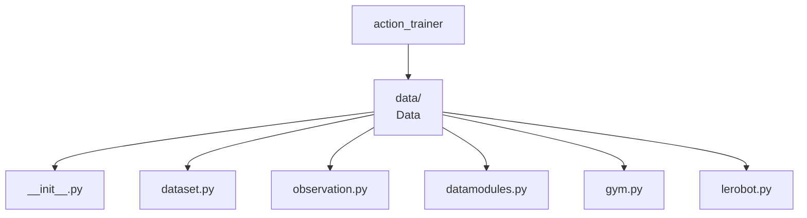

# Data

```mermaid
graph TD
    A["action_trainer"]
    A --> B["data/ <br/> Data"]
    B --> C["__init__.py"]
    B --> D["dataset.py"]
    B --> E["observation.py"]
    B --> F["datamodules.py"]
    B --> G["gym.py"]
    B --> H["lerobot.py"]
```

This section describes the design for the action_trainer.data module.
