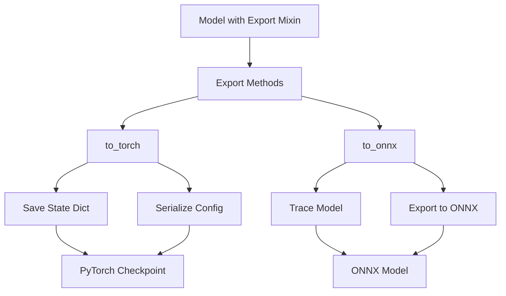

# Export System

This section describes the design for the `getiaction.export` module,
which provides standardized methods for exporting trained models to various formats.

## Overview

The export system provides a consistent interface for:

1. **PyTorch Checkpoints** - Save model state with configuration
2. **ONNX Export** - Convert models to ONNX format for deployment

## Design Goals

- **Consistency**: Unified API across all model types
- **Flexibility**: Support multiple export formats

## Key Components

### Export Mixin

The `Export` mixin class adds export capabilities to policy classes:

```python
from getiaction.export import Export
from getiaction.policies.base import Policy

class MyPolicy(Export, Policy):
    pass

policy = MyPolicy()

# Export to PyTorch checkpoint
policy.to_torch("model.pt")

# Export to ONNX
policy.to_onnx("model.onnx")
```

## Architecture



## Export Formats

### PyTorch Checkpoints

Standard PyTorch checkpoint with embedded configuration:

```python
policy = Dummy(config=DummyConfig(action_shape=(7,)))
policy.to_torch("checkpoint.pt")
```

**Checkpoint Contents:**
- Model state dictionary (weights and biases)
- Model configuration (serialized as YAML)

### ONNX Format

Optimized format for deployment and inference:

```python
policy = Dummy(config=DummyConfig(action_shape=(7,)))
policy.to_onnx("model.onnx")
```

**ONNX Benefits:**
- Cross-platform inference
- Hardware acceleration support
- Runtime optimizations
- Deployment to edge devices

## Configuration Serialization for Torch models

The export system automatically serializes model configurations to preserve reproducibility:

- **Dataclasses** → Serialized to class_path and init_args
- **Nested Configs** → Recursively serialized
- **StrEnum Values** → Converted to strings
- **NumPy Arrays** → Converted to lists
- **Tuples** → Converted to lists

## Integration with Policy Base Class

All policies automatically inherit export capabilities:

```python
class Dummy(Export, Policy):
    """Export is inherited automatically."""
    pass

# All policies support export
policy.to_torch("checkpoint.pt")
policy.to_onnx("model.onnx")
```

## Best Practices

### 1. Implement sample_input Property

For ONNX export, provide a sample input:

```python
class MyModel(nn.Module):
    @property
    def sample_input(self) -> dict[str, torch.Tensor]:
        return {"action": torch.randn(1, *self.action_shape)}
```

### 2. Provide extra_export_args

Customize ONNX export with additional arguments:

```python
class MyModel(nn.Module):
    @property
    def extra_export_args(self) -> dict:
        return {
            "onnx": {
                "output_names": ["action"],
                "dynamic_axes": {"action": {0: "batch_size"}},
            }
        }
```

### 3. Use config Property

Store model configuration for serialization:

```python
class MyModel(nn.Module):
    def __init__(self, config: MyConfig):
        super().__init__()
        self.config = config  # Will be automatically serialized
```

`self.config` should be a dataclass containing integral python datatypes,
or related getiaction entities. Only in that case, serializaiton is guaranteed.

## Usage Examples

### Basic Export

```python
from getiaction.policies import Dummy, DummyConfig

# Create and train model
config = DummyConfig(action_shape=(7,))
policy = Dummy(config=config)
# ... training ...

# Export to PyTorch
policy.to_torch("trained_model.pt")

# Export to ONNX
policy.to_onnx("trained_model.onnx")
```

### Custom ONNX Export

```python
# Export with custom arguments
policy.to_onnx(
    "model.onnx",
    opset_version=14,
    output_names=["predictions"],
)
```

### Providing Input Sample

```python
# Explicit input sample
input_sample = {
    "observation": torch.randn(1, 64),
    "state": torch.randn(1, 8),
}
policy.to_onnx("model.onnx", input_sample=input_sample)
```


## Related Documentation

- [Configuration System](../config/overview.md) - Configuration serialization
- [Policy Base Class](../policy/overview.md) - Policy interface

This design provides a consistent, flexible interface for model export across
the entire GetiAction codebase.
