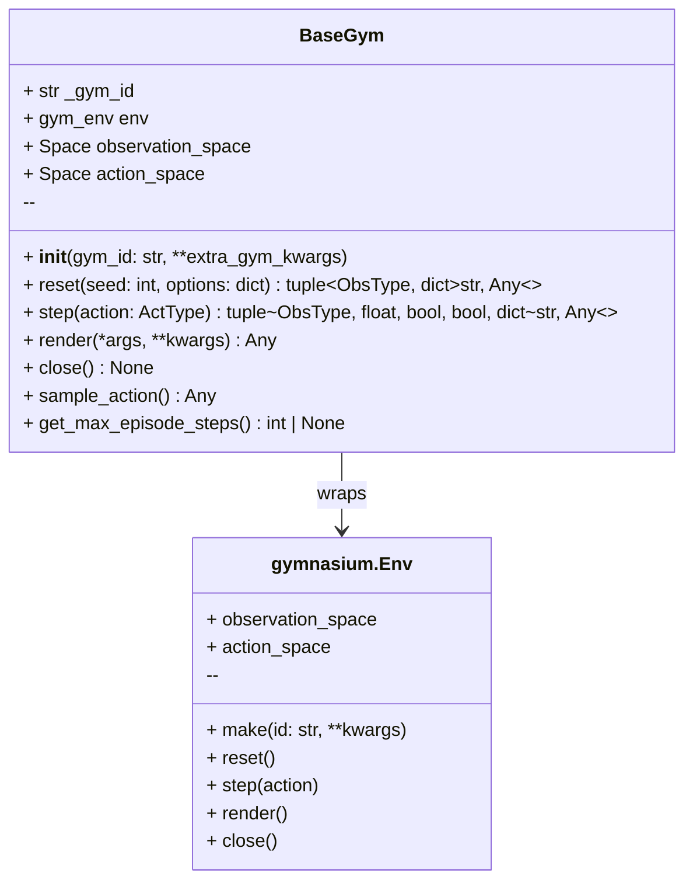

# BaseGym

The `BaseGym` serves as an interface to the gymnasium framework.

At a later date we plan to convert output `ObsType` to our internal representation.

```mermaid
classDiagram
    class BaseGym {
        + str _gym_id
        + gym_env env
        + Space observation_space
        + Space action_space
        --
        + __init__(gym_id: str, **extra_gym_kwargs)
        + reset(seed: int, options: dict) tuple~ObsType, dict~str, Any~~
        + step(action: ActType) tuple~ObsType, float, bool, bool, dict~str, Any~~
        + render(*args, **kwargs) Any
        + close() None
        + sample_action() Any
        + get_max_episode_steps() int | None
    }

    class gymnasium.Env {
        + observation_space
        + action_space
        --
        + make(id: str, **kwargs)
        + reset()
        + step(action)
        + render()
        + close()
    }

    BaseGym --> gymnasium.Env : wraps
```
