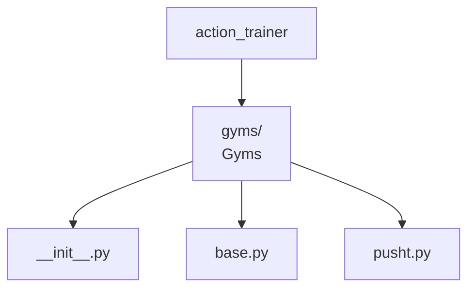

# Gyms

Gym environments play a crucial role in evaluating using simulation data.



This section describes the design for the action_trainer.data module.

```bash
action_trainer
├── gyms/  # Gyms
│   ├── __init__.py
│   ├── base.py
│   ├── pusht.py
```
