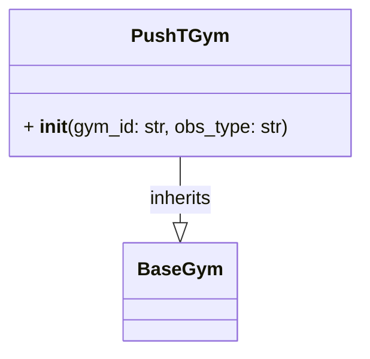

# PushTGym

A child class of the `BaseGym`. We init with default parameters for `PushT`.



Example:

```python
from getiaction.gyms import PushTGym
# init pusht gym
pusht_gym = PushTGym(gym_id="gym_pusht/PushT-v0" obs_type="pixels_agent_pos")
# reset to receive first observation
observation, info = pusht_gym.reset(seed=0)
# sample action from environment
action = pusht_gym.sample_action()
# step through to observation, receive environment conditions and rewards
observation, reward, termination, truncation, info = pusht_gym.step(action=action)
```
