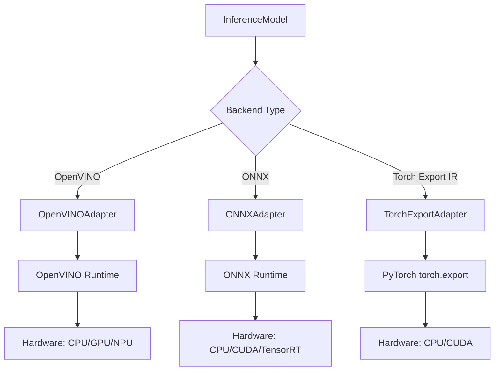
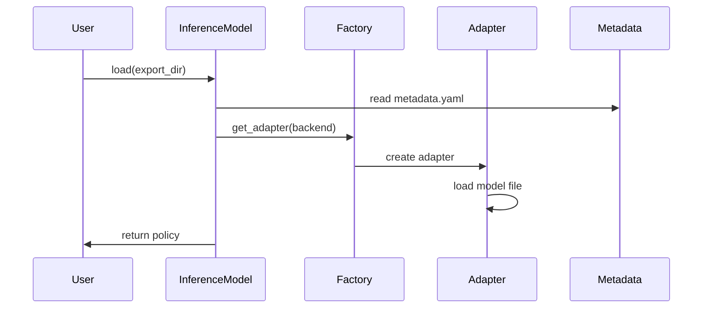
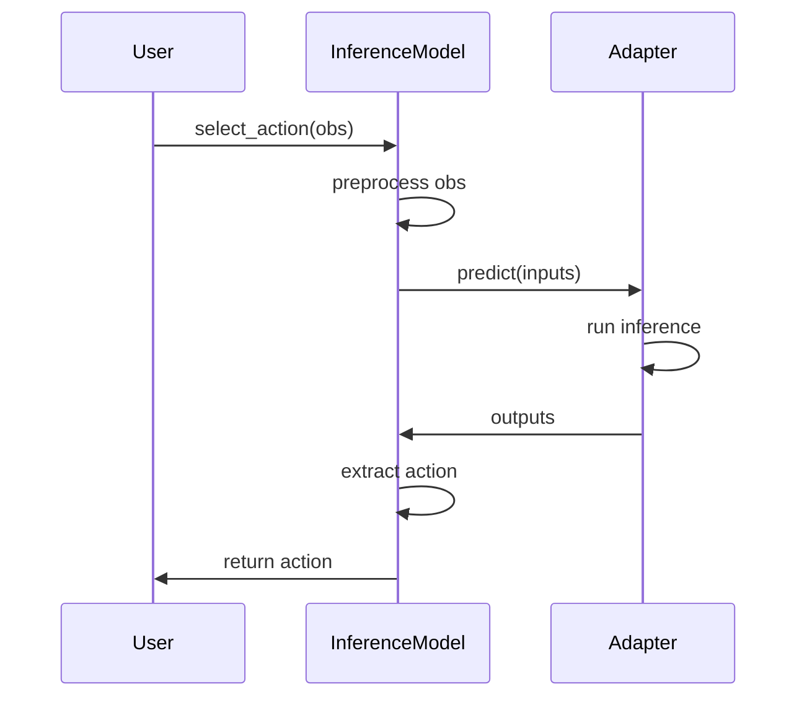
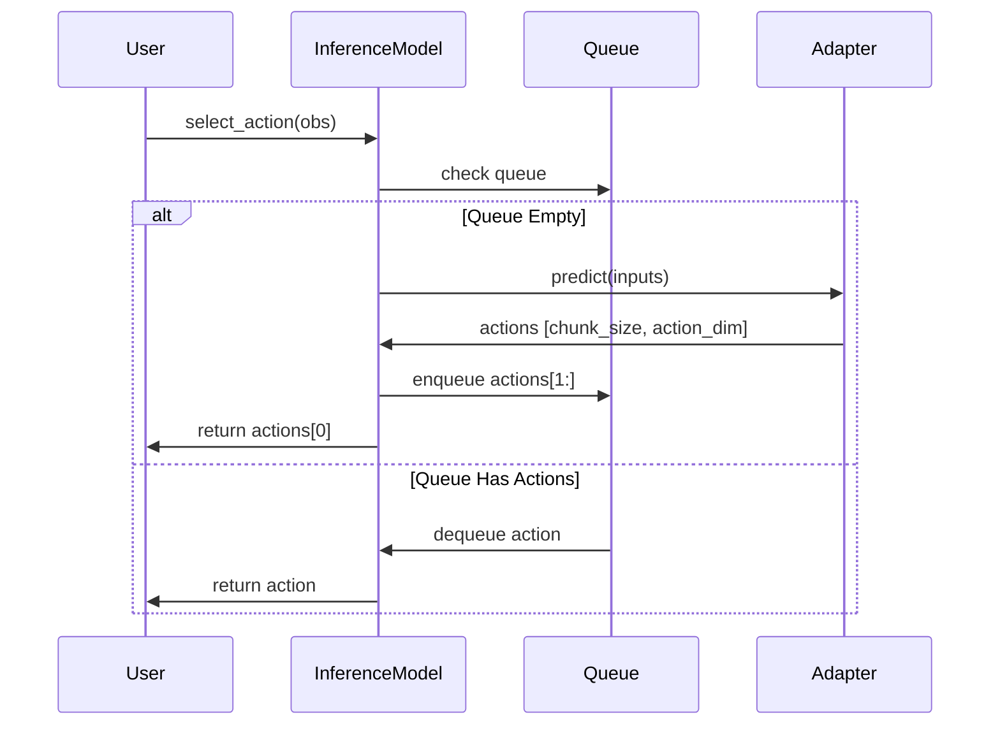

# Inference System

Production inference with multiple backends.

## Features

- Unified API matching training policies
- Multiple backends (OpenVINO, ONNX, Torch Export)
- Auto-detection of backend and device
- Action queuing for chunked policies

## RuntimeAdapter

Common interface for backends:

```python
class RuntimeAdapter(ABC):
    @abstractmethod
    def load(self, model_path: Path) -> None: ...

    @abstractmethod
    def predict(
        self, inputs: dict[str, np.ndarray]
    ) -> dict[str, np.ndarray]: ...
```

## Adapters

| Adapter                | Hardware       | Features                    |
| ---------------------- | -------------- | --------------------------- |
| **OpenVINOAdapter**    | Intel CPU/GPU  | Hardware opts, quantization |
| **ONNXAdapter**        | Cross-platform | CUDA/TensorRT               |
| **TorchExportAdapter** | Edge/mobile    | PyTorch export              |

## InferenceModel

High-level interface:

```python
policy = InferenceModel.load("./exports")  # Auto-detects backend
policy.reset()
action = policy.select_action(observation)
```

## Architecture



### Factory Pattern

```python
from getiaction.inference.adapters import get_adapter

adapter = get_adapter(ExportBackend.OPENVINO)
adapter.load(model_path)
```

### Metadata Configuration

Configuration loaded from `metadata.yaml`:

```yaml
backend: openvino
policy_class: getiaction.policies.act.policy.ACT
chunk_size: 100
use_action_queue: true
input_shapes: { image: [3, 224, 224], state: [14] }
output_shapes: { action: [7] }
```

## Data Flow

### 1. Loading



### 2. Inference (No Queue)



### 3. Inference (With Action Queue)



## Action Queuing

For chunked policies (`chunk_size > 1`), automatically manages action queue:

```python
policy = InferenceModel.load("./exports")  # chunk_size=100
policy.reset()

action_0 = policy.select_action(obs_0)    # Runs model, queues 99 actions
action_1 = policy.select_action(obs_1)    # From queue
# ... 98 more from queue ...
action_100 = policy.select_action(obs_100)  # Runs model again
```

**Benefits:** Reduces inference calls by `chunk_size`, matches training behavior

## Backend & Device Selection

### Auto-Detection

Backend detected from file extensions:

- `.xml` → OpenVINO
- `.onnx` → ONNX
- `.pt2` / `.ptir` → Torch Export IR

### Device Priority

| Backend         | Device Priority       |
| --------------- | --------------------- |
| OpenVINO        | GPU → NPU → CPU       |
| ONNX            | CUDA → TensorRT → CPU |
| Torch Export IR | cuda → cpu            |

## Performance

### Optimization

- Action queuing amortizes cost over `chunk_size`
- Model caching (OpenVINO)
- Execution provider selection (ONNX)
- Batch processing (future)

## Error Handling

Common errors: `ImportError` (backend not installed), `ValueError`
(invalid export), `RuntimeError` (shape mismatch)

## Testing

- **Unit tests**: Each adapter (load, predict, properties)
- **Integration tests**: Train → export → inference pipeline
- **Compatibility tests**: Backend consistency validation

**Testing Plan:**

- OpenVINO, ONNX: Fully tested in PR #2 with ACT policy
- Torch Export IR (ExecuTorch): Implementation complete, full testing in PR#2

## Extension Points

- **Custom Adapters**: Implement `RuntimeAdapter` for new backends
- **Custom Preprocessing**: Override `_preprocess_observation()` in
  `InferenceModel`

## Future Work

- INT8 quantization support
- Batch inference
- Streaming inference
- Model serving (REST/gRPC)

## See Also

- [Export Design](../export/README.md) - How models are exported
- [Policy Design](../policy/overview.md) - Policy architecture
- [Export & Inference Guide](../../guides/export_inference.md) - Usage examples
