# Inference System

Design documentation for the `getiaction.inference` module - production-ready inference with multiple optimized backends.

## Overview

The inference system provides a unified API for deploying trained policies:

- **Runtime Adapters** - Backend abstraction (OpenVINO, ONNX, TorchScript)
- **InferenceModel** - Unified interface matching training policy API
- **Auto-detection** - Automatic backend and device selection
- **Action Queuing** - Manages chunked policy outputs

## Design Goals

- Same interface as training policies for seamless transition
- Support multiple inference backends with single API
- Intelligent auto-detection of backend and device
- Optimized for production performance

## Key Components

### RuntimeAdapter Interface

Common interface for all inference backends:

```python
class RuntimeAdapter(ABC):
    @abstractmethod
    def load(self, model_path: Path) -> None: ...

    @abstractmethod
    def predict(self, inputs: dict[str, np.ndarray]) -> dict[str, np.ndarray]: ...
```

### Concrete Adapters

| Adapter | Hardware | Key Features |
|---------|----------|--------------|
| **OpenVINOAdapter** | Intel CPU/GPU/NPU | Hardware optimizations, model caching, quantization |
| **ONNXAdapter** | Cross-platform | CUDA/TensorRT support, graph optimization |
| **TorchScriptAdapter** | PyTorch ecosystem | JIT compilation, mobile deployment |

**Note:** ExecuTorch (Torch Export IR) is supported for export via `to_torch_export_ir()` but inference adapter is not yet implemented. Planned for future release.

### InferenceModel

High-level interface matching training policy API:

```python
policy = InferenceModel.load("./exports")  # Auto-detect backend
policy.reset()
action = policy.select_action(observation)
```

**Key Features:** Auto-detection, metadata-driven config, action queuing, device selection

## Architecture

```mermaid
graph TD
    A[InferenceModel] --> B{Backend Type}
    B -->|OpenVINO| C[OpenVINOAdapter]
    B -->|ONNX| D[ONNXAdapter]
    B -->|TorchScript| E[TorchScriptAdapter]
    B -.->|Future| F[ExecuTorchAdapter]

    C --> G[OpenVINO Runtime]
    D --> H[ONNX Runtime]
    E --> I[PyTorch JIT]
    F -.-> J[ExecuTorch Runtime]

    G --> K[Hardware: CPU/GPU/NPU]
    H --> L[Hardware: CPU/CUDA/TensorRT]
    I --> M[Hardware: CPU/CUDA]
    J -.-> N[Hardware: Edge/Mobile]

    style F stroke-dasharray: 5 5
    style J stroke-dasharray: 5 5
    style N stroke-dasharray: 5 5
```



### Factory Pattern

```python
from getiaction.inference.adapters import get_adapter

adapter = get_adapter(ExportBackend.OPENVINO)
adapter.load(model_path)
```

### Metadata Configuration

Configuration loaded from `metadata.yaml`:

```yaml
backend: openvino
policy_class: getiaction.policies.act.policy.ACT
chunk_size: 100
use_action_queue: true
input_shapes: {image: [3, 224, 224], state: [14]}
output_shapes: {action: [7]}
```

## Data Flow

### 1. Loading


### 2. Inference (No Queue)


### 3. Inference (With Action Queue)


## Action Queuing

For chunked policies (`chunk_size > 1`), automatically manages action queue:

```python
policy = InferenceModel.load("./exports")  # chunk_size=100
policy.reset()

action_0 = policy.select_action(obs_0)    # Runs model, queues 99 actions
action_1 = policy.select_action(obs_1)    # From queue
# ... 98 more from queue ...
action_100 = policy.select_action(obs_100)  # Runs model again
```

**Benefits:** Reduces inference calls by `chunk_size`, matches training behavior

## Backend & Device Selection

### Auto-Detection

Backend detected from file extensions: `.xml` (OpenVINO), `.onnx` (ONNX), `.pt` (TorchScript)

### Device Priority

| Backend | Device Priority |
|---------|----------------|
| OpenVINO | GPU → NPU → CPU |
| ONNX | CUDA → TensorRT → CPU |
| TorchScript | cuda → cpu |

## Performance

### Typical Latency (ACT, chunk_size=100)

| Backend | Intel CPU | Intel GPU | NVIDIA GPU |
|---------|-----------|-----------|------------|
| OpenVINO | 5-10ms | 3-5ms | 10-15ms |
| ONNX | 10-15ms | 8-12ms | 3-5ms |
| TorchScript | 15-20ms | - | 8-10ms |

### Optimization

- Action queuing amortizes cost over `chunk_size`
- Model caching (OpenVINO)
- Execution provider selection (ONNX)
- Batch processing (future)

## Error Handling

Common errors: `ImportError` (backend not installed), `ValueError` (invalid export), `RuntimeError` (shape mismatch)

## Testing

- **Unit tests**: Each adapter (load, predict, properties)
- **Integration tests**: Train → export → inference pipeline
- **Compatibility tests**: Backend consistency validation

## Extension Points

- **Custom Adapters**: Implement `RuntimeAdapter` for new backends
- **Custom Preprocessing**: Override `_preprocess_observation()` in `InferenceModel`

## Future Work

- **ExecuTorch Adapter**: Inference support for Torch Export IR format (edge/mobile deployment)
- INT8 quantization support
- Batch inference
- Streaming inference
- Model serving (REST/gRPC)

## See Also

- [Export Design](../export/README.md) - How models are exported
- [Policy Design](../policy/overview.md) - Policy architecture
- [Export & Inference Guide](../../guides/export_inference.md) - Usage examples
