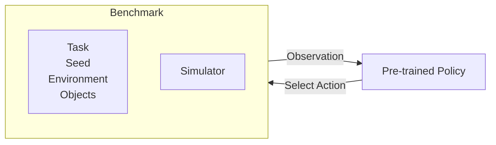
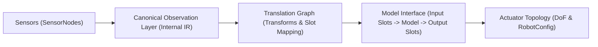

# Roadmap

A living document outlining upcoming features, improvements, architectural changes, and long-term vision for `getiaction`.

## Vision

### Mission

Provide a modular, reproducible toolkit for training imitation and reinforcement learning models and deploying them in real applications.

### Core Principles

- Modularity

  Each module should be useful on its own. Users can pick only the components they need and freely implement their own alternatives.

- Repeatability

  Experiments, configurations and results should be easy to reproduce.

- Scalability

  Workflows should scale smoothly from small prototypes to large datasets, larger models and more demanding training setups.

- Deployability

  Trained models, datasets and experiment outputs should be simple to export and integrate into production systems.

Out of scope:

- Interactions with specific hardware.
- Specific Robot targeting, this should work with everything.

## Module-by-module Roadmap

| Timeline                           | Themes                                   |
| ---------------------------------- | ---------------------------------------- |
| Short-term (0–3 months)            | Immediate fixes and foundational work    |
| Mid-term (3–6 months)              | Feature expansion and ecosystem growth   |
| Long-term (6–12 months and beyond) | Vision-driven development and refinement |

### CLI

#### Short-term

- Foundational stability for train, test and export.

#### Mid-term

- Tools for inspecting data, environments and policies from the command line.

#### Long-term

- Interactive or REPL-style interface for rapid experimentation
  Example:

```bash
$ getiaction-repl
Imitation Learning Workspace
>>> gym.list()
["pick_up_cup_001", "pick_up_cup_002"]

>>> demos.play("pick_up_cup_001")
[simulation window plays demo]

>>> policy.run("pick_up_cup")
Executing policy...
```

### Data

There's lots of data formats for imitation and reinforcement learning - [LeRobot](https://huggingface.co/docs/lerobot/lerobot-dataset-v3), [TED](https://docs.pytorch.org/rl/stable/reference/data.html#ted-format), [RLDS](https://github.com/google-research/rlds)...many more. The goal is to normalize data at entry so all downstream modules share a consistent representation.

#### Short-term

- Initial ingestion utilities and a unified internal representation.

#### Mid-term

- Robust converters for major dataset formats and explicit schema validation.

#### Long-term

- Shared intermediate representation for all training and inference paths.

### Gyms

Users prototype policy architectures in simulation, so integration must be simple and consistent.

We will not compete with the pace of simulator development but will standardize how environments plug in.

Benchmarks require a dataset plus a simulation environment plus an action specification.
These are configured to control training regimes, sample budgets, and termination rules.



Some example benchamrks to look at (as of 05/12/2025):

| Name               | Simulator        | Description (Short)                                                         | Link                                              |
| ------------------ | ---------------- | --------------------------------------------------------------------------- | ------------------------------------------------- |
| LIBERO             | MuJoCo           | Lifelong learning benchmark; transfer of declarative/procedural knowledge.  | https://github.com/Lifelong-Robot-Learning/LIBERO |
| MetaWorld          | MuJoCo           | 50-task meta-RL & multi-task manipulation benchmark.                        | https://github.com/Farama-Foundation/Metaworld    |
| Robomimic          | MuJoCo, others   | Imitation & offline RL with datasets, algorithms, and env wrappers.         | https://robomimic.github.io/                      |
| D3IL               | MuJoCo, PyBullet | 7 manipulation tasks (push, align, stack, insert, etc.) for robot learning. | https://github.com/ALRhub/d3il                    |
| Gymnasium Robotics | MuJoCo           | Standardized manipulation tasks from Farama’s robotics suite.               | https://robotics.farama.org/envs/                 |
| VLABench           | MuJoCo           | 100 task categories, strong randomization, 2000+ objects.                   | https://vlabench.github.io/                       |
| EgoVLA             | IsaacLab         | Bimanual humanoid manipulation tasks with demos.                            | https://rchalyang.github.io/EgoVLA/               |
| CALVIN             | TACTO            | Long-horizon manipulation tasks with rich multimodal sensor setups.         | https://github.com/mees/calvin                    |
| ManiSkill v2/3     | SAPIEN           | Unified manipulation framework with large-scale simulated tasks.            | https://github.com/haosulab/ManiSkill             |
| RLBench            | CoppeliaSim      | Vision-based multi-task manipulation benchmark; few-shot friendly.          | https://github.com/stepjam/RLBench                |

#### Short-term

- A standard API for wrapping external simulation environments.
- A small suite of benchmark environments for consistent evaluation.

```python
from getiaction.policy import load_policy
from getiaction.benchmarks import load_benchmark

policy = load_policy("pick_up_cup_policy_v1")
bench = load_benchmark("pick_up_cup")
```

#### Mid-term

- Interactive mode for debugging, visualization and human-in-the-loop demonstrations.
  - This should work head and headless (Lightweight FastAPI server for remote visualization?)
- Utilities for recording and logging trajectories and environments.

#### Long-term

- Simulation to real workflows with automated large scale pretraining from config.

### Policy

#### Short-term

- Consistent base classes for policies and networks.
- 1st party implementation of 2 or 3 models for package stability testing.

#### Mid-term

- Support for modular architectures with reusable encoders and heads.
- Pretrained 1st party baseline policies published on Hugging Face.

#### Long-term

- Unified policy specification across IL, RL, and VLA-style models.

### Train

#### Short-term

- Improved checkpointing, resumability and experiment tracking.
- Benchmarking utilities for comparing algorithms.

#### Mid-term

- Parameter sweep utilities (local or via external tools like wandb).

```python
from getiaction.train import sweeps

sweep = sweeps.GridSearch(
    params={
        "benchmark": ["metaworld-1", "libero-1"]
        "policy": ["diffusion", "smolva", "groot"]
    },
    train_script="train_bc.py",
)

sweep.run()  # Local or remote
```

- Expanded metrics, evaluation suites
- Standardized reporting

#### Long-term

- A visual or config interface for assembling RL or IL policies.

### Export and Inference

#### Short-term

- Deployment-ready bundles containing weights, configuration and metadata.

```python
export("checkpoints/pickup_bc", formats=["onnx", "torchscript"])
# -> Generates portable bundle: weights + config + metadata
```

- Export paths for ONNX, TorchScript and OpenVINO.

#### Mid-term

- Example microservices for serving models through FastAPI, ROS etc.
- Quantization and edge deployment tools to target specific hardware.
- Benchmarking on different hardware.

#### Long-term

- Optimize export and inference for target hardware.

## Cross Module Initiatives

These ideas are epics that require multi-module manipulation and refactoring.

### Standardizing inputs and outputs

A unified workflow for representing sensing, model inputs and outputs, and robot actuation.

The goal is to remove ad-hoc wiring, reduce ambiguity and make the entire data–model–action pipeline declarative, inspectable and portable across datasets, robots and simulators



Psuedo example:

```python
from getiaction.sensors import SensorNode, SensorLayer
from getiaction.data import Observation
from getiaction.translate import TranslationGraph
from getiaction.policy import PolicyInterface
from getiaction.robot import ActuatorTopology

# 1. Define Sensor Layer (raw inputs from robot/simulator)
sensors = SensorLayer([
    SensorNode(
        name="rgb_front",
        type="rgb",
        shape=(720, 1280, 3),
        rate=30,
        metadata={"intrinsics": camera_K, "pose": cam_pose},
        pre_transforms=lambda x: x.resize((256, 256))
    ),
    SensorNode(
        name="joint_pos",
        type="proprio",
        shape=(7,),
        rate=100,
    ),
])

raw_obs = sensors.read()
# raw_obs = {"rgb_front": np.array(...), "joint_pos": np.array(...)}


# 2. Canonical Observation Layer (normalize + batch + dtype)
canonical = ObservationLayer(schema={
    "rgb_front": {"shape": (256, 256, 3), "dtype": "float32"},
    "joint_pos": {"shape": (7,), "dtype": "float32"},
})

canon_obs = canonical.normalize(raw_obs)
# canon_obs["rgb_front"] -> (256, 256, 3) float32
# canon_obs["joint_pos"] -> (7,) float32


# 3. Translation Graph (mapping + transforms → model slots)
graph = TranslationGraph({
    "vision_input":  ("rgb_front", lambda x: x.transpose(2, 0, 1) / 255.0),
    "state_input":   ("joint_pos", None),
})

model_inputs = graph.to_model_inputs(canon_obs)
# model_inputs["vision_input"] -> (3, 256, 256)
# model_inputs["state_input"]  -> (7,)


# 4. Model Interface (run the model)
policy = PolicyInterface.load("policies/franka_pickup_v2")

model_outputs = policy(model_inputs)
# {"arm_target": ..., "gripper_target": ...}


# 5. Actuator Topology (map model outputs → robot DoF)
actuators = ActuatorTopology.load("robots/franka_panda")
action = actuators.map(model_outputs)
# -> Joint torques or target positions in robot's control format

env.step(action)
```

#### Summary of the Concept

- Sensors (SensorNodes)
  Formal descriptions of input streams such as RGB, depth, proprioception or language.

- Canonical Observation Layer
  Converts flexible user input into a strict internal format that all models can rely on. (B, C, H, W) or text basically.

- Translation Graph
  A declarative mapping from raw observation keys to model input slots, including any required transformations.

- Model Interface
  Models declare their expected input slots and output slots, enabling auto-validation, auto-wiring and transferability across tasks.

- Actuator Topology
  A structured representation of output actions and robot degrees of freedom. For something like PushT it will be simple. For a humanoid robot, it will be complicated.

Why This Matters

- Enables automatic wiring between datasets, models and robots.
- Reduces bespoke code and hidden assumptions.
- Helps inference and deployment with working and useful models.
- Makes the full pipeline easy to inspect, visualize and debug.
- Supports simulator-agnostic workflows.

## Future Ideas

- AutoML-style pipeline for selecting policies and training strategies.
- Self-diagnostic tools for data quality and domain shift detection.
- Safety modules for deployment.
