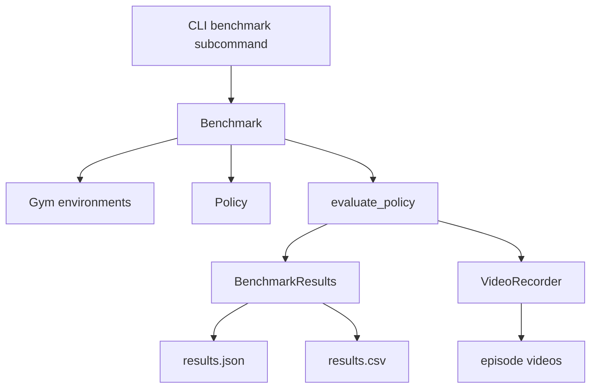

# Benchmark System

The benchmark module provides standardized evaluation for trained policies. A `Benchmark` wraps one or more gym environments and runs a policy through them, collecting success rates, rewards, and optional video recordings. Results export to JSON/CSV for analysis and comparison across experiments.

## Components

```text
src/getiaction/benchmark/
├── benchmark.py      # Benchmark, LiberoBenchmark
├── results.py        # TaskResult, BenchmarkResults
└── video.py          # VideoRecorder
```

## Architecture



## Core Classes

### Benchmark

The main class for the benchmarking. Subclasses implement `create_gyms()` to define which environments to evaluate. The `evaluate()` method runs a policy through each gym, collecting metrics and optionally recording videos.

```python test="skip" reason="interface definition, not executable"
class Benchmark:
    def create_gyms(self) -> list[Gym]: ...
    def evaluate(self, policy: Policy) -> BenchmarkResults: ...
```

### LiberoBenchmark

Concrete implementation for LIBERO task suites. Handles task suite loading, gym creation, and LIBERO-specific configuration. Supports running on a subset of tasks via `task_ids`.

```python test="skip" reason="requires getiaction install and libero"
benchmark = LiberoBenchmark(
    task_suite="libero_10",
    task_ids=[0, 1, 2],      # Optional subset
    num_episodes=20,
    video_dir="./videos",
    record_mode="failures",
)
```

### BenchmarkResults

Collects per-task metrics and provides aggregate statistics. Supports JSON/CSV export for persistence and analysis.

```python test="skip" reason="interface definition, not executable"
@dataclass
class TaskResult:
    task_id: str
    success_rate: float
    mean_reward: float
    std_reward: float
    n_episodes: int

@dataclass
class BenchmarkResults:
    results: list[TaskResult]
    metadata: dict

    def summary(self) -> str: ...
    def to_json(self, path: Path) -> None: ...
    def to_csv(self, path: Path) -> None: ...
```

### VideoRecorder

Captures episodes as MP4 files. The `record_mode` parameter filters which episodes to save—useful for debugging failures without filling disk on successful runs.

```python test="skip" reason="interface example, not executable"
recorder = VideoRecorder(
    output_dir="./videos",
    fps=30,
    record_mode="failures",  # Only save failed episodes
)
```

## CLI Integration

The benchmark subcommand integrates with LightningCLI. Unlike `fit` and other subcommands, it skips model/trainer instantiation and handles policy loading from checkpoint directly.

```python test="skip" reason="interface definition, not executable"
class CLI(LightningCLI):
    @staticmethod
    def subcommands():
        return {
            "fit": {"skip": set()},
            "benchmark": {"skip": {"model", "dataloaders", "datamodule", "trainer"}},
        }
```

Implementation notes:

- `instantiate_classes()` skips automatic instantiation for benchmark
- `_run_benchmark()` loads policy from checkpoint and runs evaluation

## Execution Flow

1. Parse `--benchmark`, `--policy`, `--ckpt_path` arguments
2. Instantiate benchmark via jsonargparse class_path
3. Load policy from checkpoint
4. For each task: create gym → run episodes → collect metrics → optionally record video
5. Aggregate and export results

## Extension Points

Create custom benchmarks by subclassing `Benchmark` and implementing `create_gyms()`:

```python test="skip" reason="interface example, not executable"
class MyBenchmark(Benchmark):
    def __init__(self, env_name: str, num_episodes: int = 10):
        self.env_name = env_name
        super().__init__(num_episodes=num_episodes)

    def create_gyms(self) -> list[Gym]:
        return [MyGym(self.env_name)]
```
