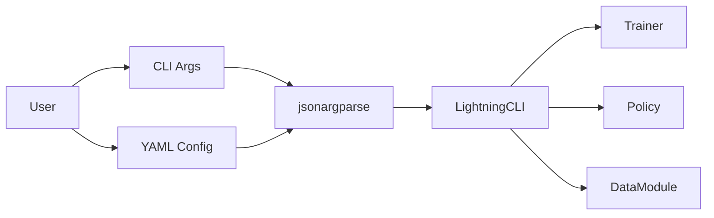

# CLI Design Documentation

Documentation for the GetiAction command-line interface implementation.

## Overview

The CLI module provides a powerful, flexible interface for training
policies using PyTorch Lightning CLI and jsonargparse.

## Documentation Structure

1. **[Overview](overview.md)** - High-level CLI architecture and design
   philosophy
2. **[LightningCLI Integration](lightning_cli.md)** - Details on Lightning
   CLI integration, command support, and configuration flow

## Key Features

- **Multiple Configuration Patterns**: YAML/JSON files, CLI arguments, type validation
- **Dynamic Class Instantiation**: `class_path` pattern for flexible component loading
- **Lightning Ecosystem**: Full integration with callbacks, loggers, and plugins
- **Type Safety**: Automatic validation from type hints
- **Easy to Use**: Simple commands with powerful override capabilities

## Quick Links

- [CLI User Guide](../../guides/cli.md) - User-facing documentation
- [Configuration Examples](../../../../configs/) - Example YAML configurations
- [Config System Design](../config/overview.md) - Configuration system details

## Example Usage

```bash
# Train with config file
getiaction fit --config configs/train.yaml

# Override parameters
getiaction fit --config configs/train.yaml --trainer.max_epochs 200

# Generate config template
getiaction fit --print_config
```

## Architecture Diagram



The CLI acts as a thin orchestration layer, leveraging Lightning and
jsonargparse for configuration management and training execution.
