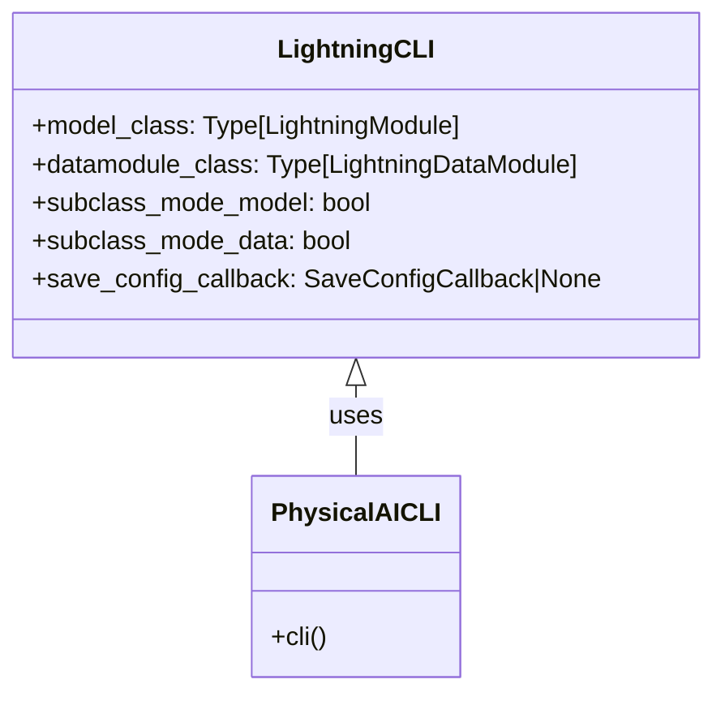
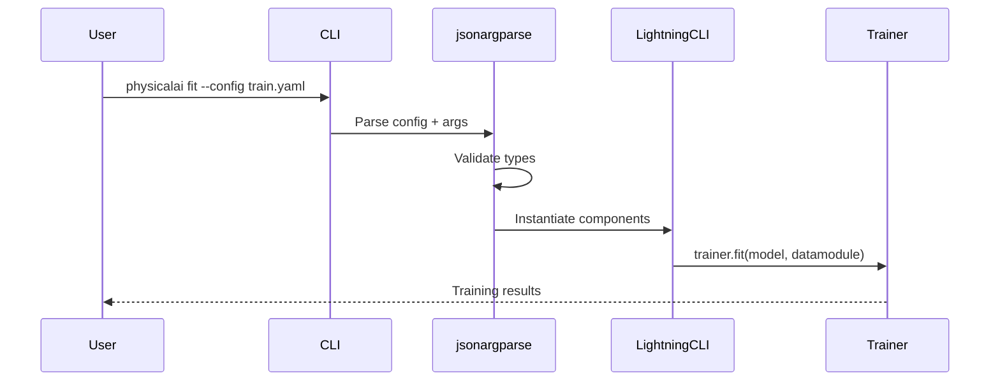

# LightningCLI Integration

The PhysicalAI CLI is built on top of PyTorch Lightning's `LightningCLI`,
which provides robust argument parsing and configuration management through
`jsonargparse`.

## Class Structure



## Implementation

The CLI implementation in `cli.py` is intentionally minimal:

```python
from lightning.pytorch.cli import LightningCLI
from physicalai.data import DataModule
from physicalai.policies.base import Policy

def cli() -> None:
    """Main CLI entry point."""
    LightningCLI(
        model_class=Policy,
        datamodule_class=DataModule,
        save_config_callback=None,
        subclass_mode_model=True,  # Allow any Policy subclass
        subclass_mode_data=True,   # Allow any DataModule subclass
    )
```

## Key Features

### 1. Subclass Mode

Enabling `subclass_mode_model=True` and `subclass_mode_data=True` allows
dynamic instantiation of any Policy or DataModule subclass via
configuration:

```yaml
model:
  class_path: physicalai.policies.dummy.policy.Dummy
  init_args:
    model:
      class_path: physicalai.policies.dummy.model.Dummy
```

### 2. Configuration Parsing

`jsonargparse` automatically:

- Parses YAML/JSON configuration files
- Validates types against class signatures
- Merges CLI arguments with config files
- Supports nested configuration structures

### 3. Command Support

The CLI automatically provides standard Lightning commands:

```bash
physicalai fit          # Train model
physicalai validate     # Run validation
physicalai test         # Run testing
physicalai predict      # Run predictions
```

## Configuration Flow



## Benefits

1. **No Custom Parsing**: Lightning handles all argument parsing
2. **Type Safety**: Automatic validation from type hints
3. **Ecosystem Integration**: Works with all Lightning features (callbacks,
   loggers, plugins)
4. **Maintainability**: Less code to maintain, battle-tested
   implementation
5. **Extensibility**: Easy to add new commands and options

## Example Usage

### Basic Training

```bash
physicalai fit \
    --model.class_path physicalai.policies.dummy.policy.Dummy \
    --data.class_path physicalai.data.lerobot.LeRobotDataModule \
    --trainer.max_epochs 100
```

### With Config File

```bash
physicalai fit --config configs/train.yaml
```

### Override Config Values

```bash
physicalai fit \
    --config configs/train.yaml \
    --trainer.max_epochs 200 \
    --data.train_batch_size 64
```

### Print Full Configuration

```bash
physicalai fit --print_config
```

## Integration Points

The CLI integrates with:

- **Policies** via `Policy` base class
- **DataModules** via `DataModule` base class
- **Trainers** via Lightning `Trainer` class
- **Callbacks** via Lightning callback system
- **Loggers** via Lightning logger system

This design ensures the CLI remains lightweight while providing full
access to the Lightning ecosystem.
