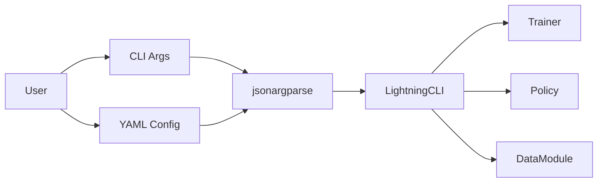

# CLI Design

Command-line interface built on PyTorch Lightning CLI and jsonargparse.

## Components

- `cli.py` - Main entry point using `LightningCLI`
- YAML/JSON config files with CLI overrides
- Type validation from type hints
- Dynamic class loading via `class_path`

## Usage

```bash
# Train with config
physicalai fit --config configs/train.yaml

# Override parameters
physicalai fit --config configs/train.yaml --trainer.max_epochs 200

# Print config
physicalai fit --print_config
```

## Architecture


