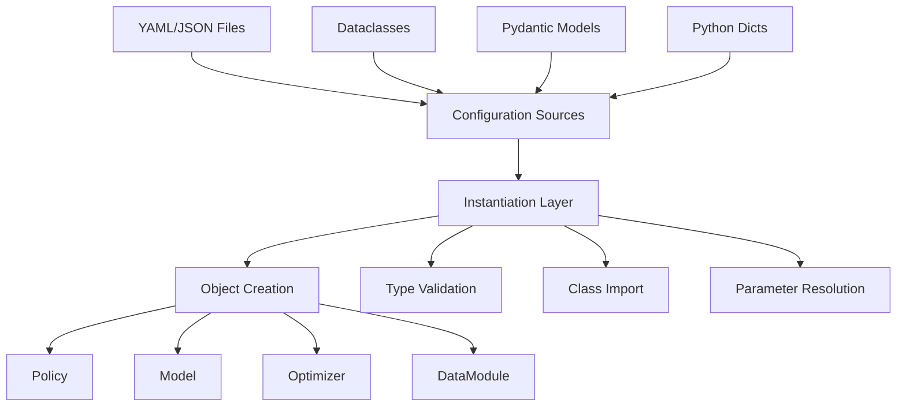

# Config System Design Documentation

Documentation for the GetiAction configuration system implementation.

## Overview

The configuration system provides flexible, type-safe configuration
loading supporting multiple patterns: dataclasses, Pydantic models, and
dynamic class instantiation.

## Documentation Structure

1. **[Overview](overview.md)** - High-level configuration system
   architecture and supported patterns
2. **[Instantiation System](instantiate.md)** - Object instantiation from
   various configuration sources
3. **[FromConfig Mixin](mixin.md)** - Mixin class for adding configuration
   loading to any class

## Key Features

- **Multiple Patterns**: Dataclasses (type-safe), Pydantic (validated),
  class_path (dynamic)
- **Type Validation**: Automatic type checking and validation
- **Nested Configuration**: Recursive instantiation of nested objects
- **Error Messages**: Clear, actionable error messages
- **CLI Integration**: Seamless integration with jsonargparse and Lightning CLI

## Quick Links

- [Config Module Code](../../../src/getiaction/config/) - Implementation
- [Config Tests](../../../tests/unit/config/) - Test suite
- [Example Configs](../../../../configs/) - YAML configuration examples
- [CLI User Guide](../../guides/cli.md) - User-facing CLI documentation
- [CLI Design](../cli/overview.md) - CLI integration details

## Configuration Patterns

### 1. Dataclass (Type-Safe)

```python
@dataclass
class ModelConfig:
    hidden_size: int = 128
    num_layers: int = 3

config = ModelConfig(hidden_size=256)
model = Model.from_dataclass(config)
```

### 2. Pydantic (Validated)

```python
class ModelConfig(BaseModel):
    hidden_size: int = Field(ge=1, le=1024)
    num_layers: int = Field(ge=1)

config = ModelConfig(hidden_size=256)  # Validates
model = Model.from_pydantic(config)
```

### 3. class_path (Dynamic)

```yaml
model:
  class_path: getiaction.policies.dummy.policy.Dummy
  init_args:
    hidden_size: 256
```

## Architecture Diagram



## Core Components

### instantiate.py

Functions for object instantiation:

- `instantiate_obj()` - Universal instantiator
- `instantiate_obj_from_dict()` - From dict/YAML
- `instantiate_obj_from_pydantic()` - From Pydantic
- `instantiate_obj_from_dataclass()` - From dataclass
- `instantiate_obj_from_file()` - From files

### mixin.py

`FromConfig` mixin class:

- `from_config()` - Universal loader (auto-detects type)
- `from_dict()` - From dictionary
- `from_pydantic()` - From Pydantic model
- `from_dataclass()` - From dataclass

## Integration Example

```python
class MyPolicy(Policy, FromConfig):
    def __init__(self, model: nn.Module, optimizer: Optimizer):
        super().__init__()
        self.model = model
        self.optimizer = optimizer

# All these work automatically:
policy = MyPolicy.from_dict(dict_config)
policy = MyPolicy.from_pydantic(pydantic_config)
policy = MyPolicy.from_dataclass(dataclass_config)
policy = MyPolicy.from_config(any_config)  # Auto-detect type
```

This system provides maximum flexibility while maintaining type safety and
clear error messages.
