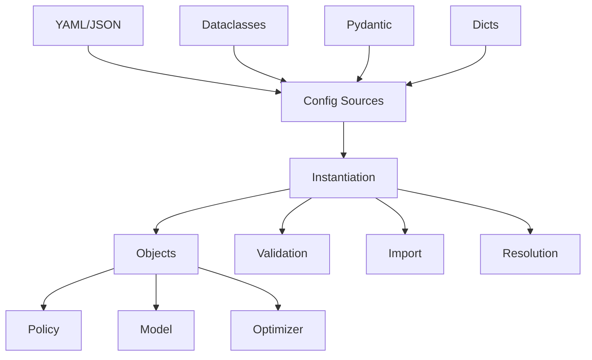

# Configuration System

Flexible configuration loading supporting dataclasses, Pydantic, and YAML.

## Components

**instantiate.py** - Object instantiation from various sources:

```python test="skip" reason="interface overview, not executable"
instantiate_obj(config)                # Universal
instantiate_obj_from_dict(config)      # From dict/YAML
instantiate_obj_from_pydantic(config)  # From Pydantic
instantiate_obj_from_dataclass(config) # From dataclass
instantiate_obj_from_file(path)        # From file
```

**mixin.py** - `FromConfig` mixin for classes:

```python test="skip" reason="interface overview, not executable"
class MyModel(nn.Module, FromConfig):
    pass

model = MyModel.from_config(config)  # Auto-detects type
```

## Architecture



## Configuration Patterns

### Pattern 1: Dataclass (Type-Safe)

```python test="skip" reason="illustrative pattern, not runnable as-is"
@dataclass
class ModelConfig:
    hidden_size: int = 128
    num_layers: int = 3

config = ModelConfig(hidden_size=256)
model = Model.from_dataclass(config)
```

**Benefits:**

- IDE autocomplete
- Type checking at definition time
- No external dependencies
- Simple and clean

### Pattern 2: Pydantic (Validated)

```python test="skip" reason="illustrative pattern, not runnable as-is"
class ModelConfig(BaseModel):
    hidden_size: int = Field(ge=1, le=1024)
    num_layers: int = Field(ge=1)

    @field_validator("hidden_size")
    @classmethod
    def validate_power_of_2(cls, v):
        if v & (v - 1) != 0:
            raise ValueError("Must be power of 2")
        return v

config = ModelConfig(hidden_size=256)  # Validates
model = Model.from_pydantic(config)
```

**Benefits:**

- Runtime validation
- Custom validators
- Clear error messages
- JSON schema generation

### Pattern 3: class_path (Dynamic)

```yaml
model:
  class_path: getiaction.policies.dummy.policy.Dummy
  init_args:
    model:
      class_path: getiaction.policies.dummy.model.Dummy
      init_args:
        hidden_size: 256
```

**Benefits:**

- No code changes to swap components
- Configuration-driven experiments
- Works with any class
- Standard in ML ecosystem (Lightning, Hydra, etc.)

## Usage Examples

### Basic Usage

```python test="skip" reason="requires getiaction install"
# From dict with class_path
config = {
    "class_path": "getiaction.policies.dummy.policy.Dummy",
    "init_args": {"hidden_size": 256}
}
policy = instantiate_obj_from_dict(config)

# From YAML file
policy = instantiate_obj_from_file("configs/policy.yaml")

# Using mixin
class MyPolicy(Policy, FromConfig):
    pass

policy = MyPolicy.from_config(config)  # Works with any pattern
```

### Nested Configurations

```yaml
model:
  class_path: getiaction.policies.dummy.policy.Dummy
  init_args:
    model:
      class_path: getiaction.policies.dummy.model.Dummy
      init_args:
        action_shape: [7]
    optimizer:
      class_path: torch.optim.Adam
      init_args:
        lr: 0.001
```

The system handles nested instantiation automatically.

### FromConfig Mixin

```python test="skip" reason="illustrative pattern, not runnable as-is"
class Dummy(Policy, FromConfig):
    def __init__(self, model: nn.Module, optimizer: Optimizer):
        super().__init__()
        self.model = model
        self.optimizer = optimizer

# All work automatically:
policy = Dummy.from_dict(dict_config)
policy = Dummy.from_pydantic(pydantic_config)
policy = Dummy.from_dataclass(dataclass_config)
policy = Dummy.from_config(any_config)  # Auto-detects
```

## Type Validation

Types are validated automatically from type hints:

```python test="skip" reason="illustrative pattern, not runnable as-is"
class Model:
    def __init__(self, hidden_size: int, dropout: float = 0.1):
        pass

config = {"class_path": "Model", "init_args": {"hidden_size": 128}}
model = instantiate_obj_from_dict(config)  # Valid

config = {"class_path": "Model", "init_args": {"hidden_size": "128"}}
model = instantiate_obj_from_dict(config)  # TypeError
```

## Best Practices

- Use dataclasses for static configs
- Use Pydantic for user-provided configs
- Use `class_path` for experiments
- Add type hints for validation
- Provide defaults using `Field()` or dataclass defaults
