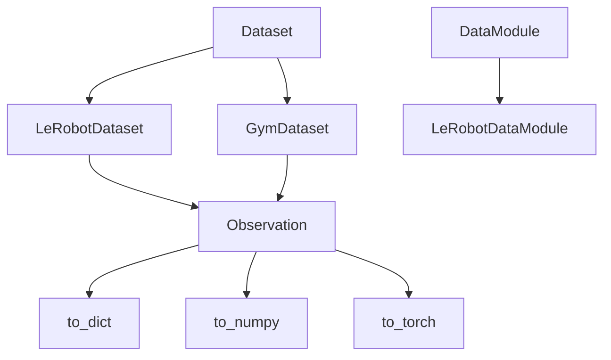
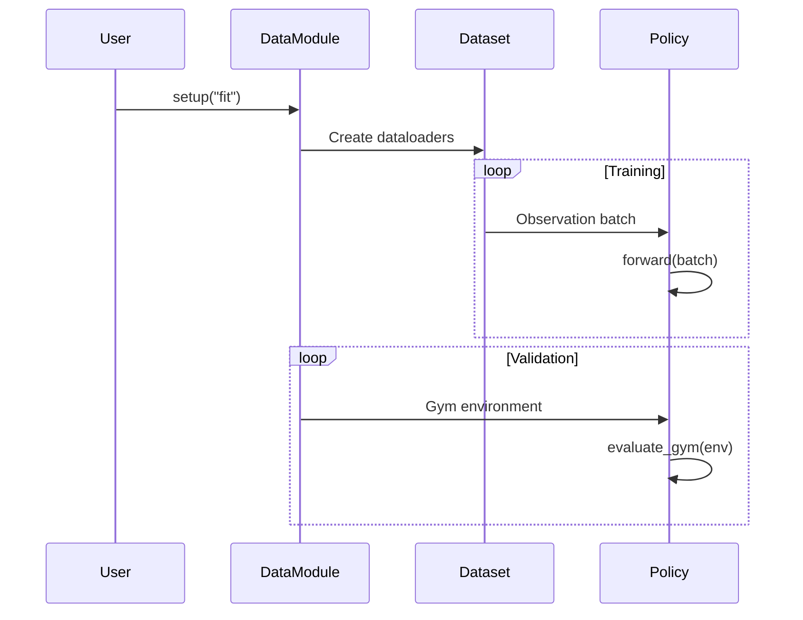

# Data Module

Dataset management and data loading for robot learning.

## Components

```text
data/
├── dataset.py       # Abstract Dataset base class
├── observation.py   # Observation dataclass and Feature types
├── datamodules.py   # Lightning DataModule implementations
├── gym.py           # Gym environment as dataset wrapper
└── lerobot/         # LeRobot dataset integration
    ├── dataset.py   # LeRobotDataset wrapper
    ├── datamodule.py
    └── converters.py
```

## Architecture



## Observation

The `Observation` dataclass is the unified data format throughout the library:

```python
@dataclass(frozen=True)
class Observation:
    action: Tensor | None = None
    state: Tensor | None = None
    images: dict[str, Tensor] | None = None
    task: Tensor | None = None
    # ... metadata fields
```

**Key features:**

- **Immutable** - Frozen dataclass for safety
- **Device transfer** - `obs.to("cuda")` moves all tensors
- **Format conversion** - `to_dict()`, `to_numpy()`, `to_torch()`
- **Indexing** - `obs[0]` or `obs[0:4]` for batch slicing

## Dataset

Abstract base class for all datasets:

```python
class Dataset(TorchDataset, ABC):
    def __getitem__(self, idx: int) -> Observation: ...
    def __len__(self) -> int: ...

    @property
    def observation_features(self) -> dict[str, Feature]: ...

    @property
    def action_features(self) -> dict[str, Feature]: ...

    @property
    def stats(self) -> dict[str, dict]: ...  # Normalization statistics
```

## DataModule

Lightning DataModule that coordinates training and evaluation:

```python
class DataModule(LightningDataModule):
    def __init__(
        self,
        train_dataset: Dataset,
        train_batch_size: int = 16,
        val_gym: Gym | None = None,      # For rollout evaluation
        num_rollouts_val: int = 10,
        max_episode_steps: int = 300,
    ): ...
```

**Training vs Validation:**

- **Training** - Uses `Dataset` for supervised learning on demonstrations
- **Validation/Test** - Uses `Gym` environments for rollout evaluation

## LeRobot Integration

Wraps HuggingFace LeRobot datasets:

```python
from getiaction.data import LeRobotDataModule

datamodule = LeRobotDataModule(
    repo_id="lerobot/aloha_sim_transfer_cube_human",
    train_batch_size=32,
)
```

The `LeRobotDataset` automatically:

- Downloads from HuggingFace Hub
- Extracts observation and action features
- Provides normalization statistics
- Handles delta timestamps for temporal data

## Feature Types

```python
class FeatureType(StrEnum):
    VISUAL = "VISUAL"   # Camera images
    ACTION = "ACTION"   # Robot actions
    STATE = "STATE"     # Proprioceptive state
    ENV = "ENV"         # Environment info

@dataclass
class Feature:
    normalization_data: NormalizationParameters | None
    ftype: FeatureType | None
    shape: tuple[int, ...] | None
    name: str | None
```

## Data Flow



## See Also

- [LeRobot Integration](lerobot.md) - HuggingFace dataset details
- [Observation Format](observation.md) - Data representation
- [Gym Design](../gyms/overview.md) - Environment wrappers
