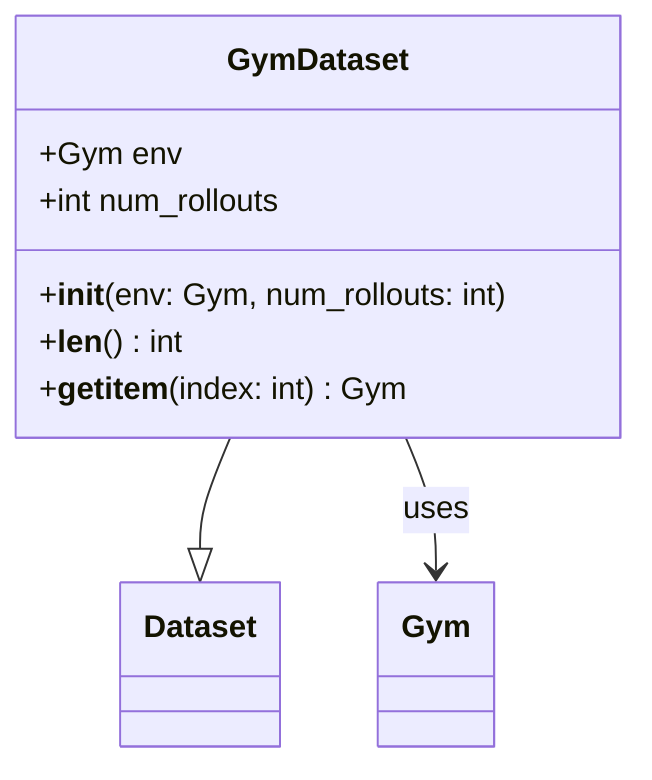

# GymDataset

The Gym dataset is needed for environments from `gymnasium` to work in training.

We calculate the length of an evaluation dataset based on the number of rollouts.

```mermaid
classDiagram
    class Dataset
    class Gym

    class GymDataset{
        +Gym env
        +int num_rollouts
        +__init__(env: Gym, num_rollouts: int)
        +__len__() int
        +__getitem__(index: int) Gym
    }
    GymDataset --|> Dataset
    GymDataset --> Gym : uses
```
