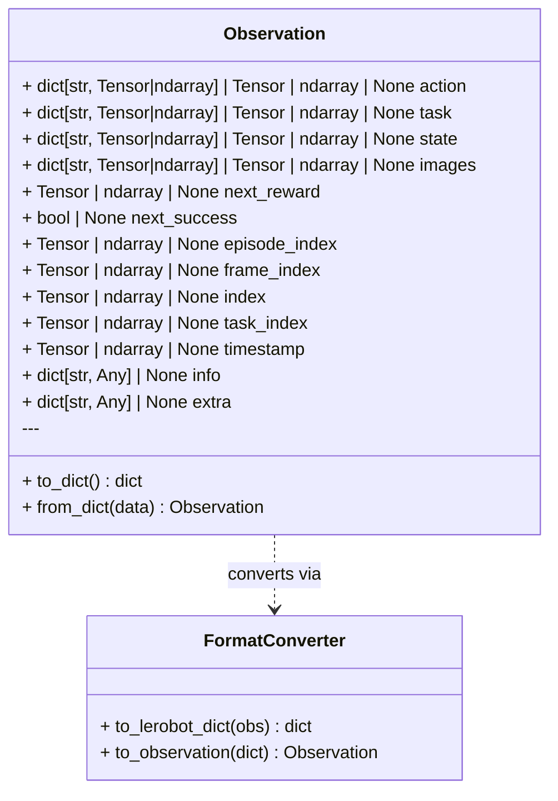

# Observation

The `Observation` dataclass is the unified data container for the getiaction
pipeline. It serves as both a single sample and batch representation, following
PyTorch's convention where the same type is used for both (differentiated by
tensor shapes).

## Overview

In imitation learning and reinforcement learning, an observation represents the
input environment state that a policy must map to an action. For imitation
learning, it also holds the corresponding ground truth action that the policy
must learn to predict.

### Key Features

- **Unified Container**: Works for both single samples (unbatched) and batches
- **Clean Attribute Access**: Access fields as attributes (`batch.action`, `batch.images`)
- **Framework Agnostic**: Core dataclass has no framework-specific dependencies
- **Immutable**: Frozen dataclass prevents accidental modifications
- **Type Safe**: Full type hints for IDE autocomplete and type checking
- **Flexible**: Supports tensors, numpy arrays, nested dicts, and custom metadata

## Class Structure



## Core Fields

### Observation Data

- **`action`**: Robot actions (joint positions, velocities, gripper commands)

  - Can be single tensor or dict of action components
  - Shape: `[action_dim]` (single) or `[B, action_dim]` (batch)

- **`state`**: Robot state (proprioceptive information)

  - Joint positions, velocities, end-effector pose, etc.
  - Shape: `[state_dim]` (single) or `[B, state_dim]` (batch)

- **`images`**: Visual observations

  - Can be single tensor or dict of camera views
  - Shape: `[C, H, W]` (single) or `[B, C, H, W]` (batch)
  - Example: `{"top": tensor, "wrist": tensor}`

- **`task`**: Task specification (optional)
  - Task embedding, one-hot encoding, or language instruction
  - Shape: `[task_dim]` (single) or `[B, task_dim]` (batch)

### Metadata Fields

- **`episode_index`**: Episode identifier
- **`frame_index`**: Frame number within episode
- **`index`**: Global sample index
- **`task_index`**: Task identifier
- **`timestamp`**: Time in seconds

### RL Fields (Optional)

- **`next_reward`**: Reward for the action
- **`next_success`**: Whether the episode succeeded
- **`info`**: Additional episode information
- **`extra`**: Custom user metadata

## Usage Patterns

### Creating Single Observations

```python
from getiaction.data import Observation
import torch

# Simple observation
obs = Observation(
    action=torch.tensor([1.0, 2.0, 3.0]),
    state=torch.tensor([0.5, 0.6]),
    images={"top": torch.rand(3, 224, 224)},
)

# With metadata
obs = Observation(
    action=torch.tensor([1.0, 2.0, 3.0]),
    state=torch.tensor([0.5, 0.6]),
    episode_index=torch.tensor(5),
    frame_index=torch.tensor(10),
)
```

### Creating Batched Observations

```python
import torch

# Batched observation (e.g., from collate function)
batch = Observation(
    action=torch.tensor([[1.0, 2.0], [3.0, 4.0]]),  # [B=2, action_dim=2]
    state=torch.tensor([[0.5, 0.6], [0.7, 0.8]]),   # [B=2, state_dim=2]
    images={"top": torch.rand(2, 3, 224, 224)},     # [B=2, C=3, H=224, W=224]
)

# Same type, different shapes
print(type(obs) == type(batch))  # True - both are Observation
```

### Attribute Access

```python
# Clean attribute access (no dictionary indexing)
action = batch.action           # torch.Tensor of shape [B, action_dim]
state = batch.state             # torch.Tensor of shape [B, state_dim]
top_image = batch.images["top"] # torch.Tensor of shape [B, C, H, W]

# Works for both single and batched
single_action = obs.action      # torch.Tensor of shape [action_dim]
batch_action = batch.action     # torch.Tensor of shape [B, action_dim]
```

### Conversion Methods

```python
# Convert to dictionary (generic), non-flattened
obs_dict = obs.to_dict(flatten=False)
# Returns: {"action": tensor, "state": tensor, "images": {...}, ...}

# Create from dictionary
obs_restored = Observation.from_dict(obs_dict)

# Convert to LeRobot format (framework-specific)
from getiaction.data.lerobot import FormatConverter

lerobot_dict = FormatConverter.to_lerobot_dict(obs)
# Returns: {"action": tensor, "observation.state": tensor,
#           "observation.images.top": tensor, ...}

# Convert from LeRobot format
obs_from_lerobot = FormatConverter.to_observation(lerobot_dict)
```

## Integration with Data Pipeline

### 1. Dataset Integration

```python
from getiaction.data import Dataset, Observation
import torch

class MyDataset(Dataset):
    """Dataset returns single Observations."""

    def __getitem__(self, idx: int) -> Observation:
        """Return a single observation (unbatched)."""
        return Observation(
            action=torch.tensor([1.0, 2.0]),      # [action_dim]
            state=torch.tensor([0.5, 0.6]),       # [state_dim]
            images={"top": torch.rand(3, 64, 64)}, # [C, H, W]
            episode_index=torch.tensor(idx // 100),
            frame_index=torch.tensor(idx % 100),
        )

# Get single sample
dataset = MyDataset(num_samples=1000)
sample = dataset[0]  # Returns Observation (unbatched)
print(sample.action.shape)  # torch.Size([2])
```

### 2. DataLoader Integration

```python
from torch.utils.data import DataLoader
from getiaction.data.datamodules import _collate_observations

# DataLoader with custom collate function
dataloader = DataLoader(
    dataset,
    batch_size=8,
    collate_fn=_collate_observations,  # Converts list[Observation] → Observation
)

# Get batched sample
batch = next(iter(dataloader))  # Returns Observation (batched)
print(batch.action.shape)       # torch.Size([8, 2])
print(batch.state.shape)        # torch.Size([8, 2])
print(batch.images["top"].shape)  # torch.Size([8, 3, 64, 64])
```

### 3. DataModule Integration

```python
from getiaction.data import DataModule

# DataModule handles collation automatically
datamodule = DataModule(
    train_dataset=dataset,
    val_dataset=dataset,
    train_batch_size=8,
    val_batch_size=8,
)

# Train dataloader returns batched Observations
train_loader = datamodule.train_dataloader()
batch = next(iter(train_loader))  # Observation with batch dimension

print(f"Batch type: {type(batch)}")           # <class 'Observation'>
print(f"Action shape: {batch.action.shape}")  # torch.Size([8, 2])
```

### 4. LeRobot DataModule Integration

```python
from getiaction.data.lerobot import LeRobotDataModule

# Works with LeRobot datasets from HuggingFace
datamodule = LeRobotDataModule(
    repo_id="lerobot/pusht",
    train_batch_size=8,
    data_format="getiaction",  # Returns Observations
)

train_loader = datamodule.train_dataloader()
batch = next(iter(train_loader))  # Observation (batched)

print(f"Action shape: {batch.action.shape}")  # torch.Size([8, 2])
print(f"Images shape: {batch.images.shape}")  # torch.Size([8, 3, 96, 96])
```

## Integration with Policies

### First-Party Policy (Custom Policies)

```python
from getiaction.policies.base import Policy
from getiaction.data import Observation
import torch

class MyCustomPolicy(Policy):
    """Custom policy using Observation batches."""

    def forward(self, batch: Observation) -> torch.Tensor:
        """Forward pass with clean attribute access."""
        # Access fields directly
        action = batch.action      # [B, action_dim]
        state = batch.state        # [B, state_dim]
        images = batch.images["top"]  # [B, C, H, W]

        # Your policy logic here
        prediction = self.model(images, state)
        return prediction

    def training_step(self, batch: Observation, batch_idx: int):
        """Training step receives Observation."""
        prediction = self.forward(batch)
        loss = self.loss_fn(prediction, batch.action)
        return loss
```

### Third-Party Policy (LeRobot Integration)

```python
from getiaction.policies.lerobot import ACT
from getiaction.data import Observation
from getiaction.data.lerobot import FormatConverter
import torch

class ACT(Policy):
    """ACT policy from LeRobot framework."""

    def forward(self, batch: Observation) -> torch.Tensor:
        """Convert to LeRobot format when needed."""
        # Convert Observation to LeRobot's expected format
        lerobot_batch = FormatConverter.to_lerobot_dict(batch)
        # LeRobot format: {"action": tensor,
        #                  "observation.images.top": tensor,
        #                  "observation.state": tensor}

        # Pass to LeRobot policy
        return self.lerobot_policy(lerobot_batch)

    def training_step(self, batch: Observation, batch_idx: int):
        """Training step with format conversion."""
        lerobot_batch = FormatConverter.to_lerobot_dict(batch)
        loss = self.lerobot_policy.forward(lerobot_batch)
        return loss
```

### Policy Usage Example

```python
from getiaction.train import Trainer

# Create policy
policy = MyCustomPolicy()

# Create datamodule
datamodule = DataModule(
    train_dataset=dataset,
    train_batch_size=8,
)

# Train - seamless integration
trainer = Trainer(max_epochs=100)
trainer.fit(policy, datamodule)

# During training:
# 1. DataLoader collates list[Observation] → Observation (batched)
# 2. Policy receives batched Observation
# 3. Policy accesses fields via attributes
# 4. Training proceeds normally
```

## Complete End-to-End Example

```python
from getiaction.data import Dataset, DataModule, Observation
from getiaction.policies.base import Policy
from getiaction.train import Trainer
import torch

# 1. Dataset returns single Observations
class RobotDataset(Dataset):
    def __getitem__(self, idx: int) -> Observation:
        return Observation(
            action=torch.randn(7),           # [action_dim]
            state=torch.randn(10),           # [state_dim]
            images={"top": torch.rand(3, 224, 224)},  # [C, H, W]
        )

# 2. DataModule handles batching
datamodule = DataModule(
    train_dataset=RobotDataset(1000),
    train_batch_size=32,
)

# 3. Policy processes batched Observations
class RobotPolicy(Policy):
    def forward(self, batch: Observation) -> torch.Tensor:
        # Clean attribute access
        images = batch.images["top"]  # [32, 3, 224, 224]
        state = batch.state           # [32, 10]

        # Your model
        features = self.vision_encoder(images)
        prediction = self.actor(features, state)
        return prediction

    def training_step(self, batch: Observation, batch_idx: int):
        prediction = self.forward(batch)
        loss = self.loss_fn(prediction, batch.action)
        return loss

# 4. Train
policy = RobotPolicy()
trainer = Trainer(max_epochs=100)
trainer.fit(policy, datamodule)

# Throughout the pipeline:
# Dataset[i]      → Observation (single)    [action_dim]
# DataLoader      → Observation (batch)     [B, action_dim]
# Policy.forward  → Observation (batch)     [B, action_dim]
# Same type, different shapes! 🎉
```

## Design Rationale

### Why Same Type for Single and Batch?

Following PyTorch's convention:

```python
# PyTorch uses same type for single and batch
single_tensor = torch.tensor([1.0, 2.0])        # shape: [2]
batch_tensor = torch.tensor([[1.0, 2.0],
                              [3.0, 4.0]])      # shape: [2, 2]
type(single_tensor) == type(batch_tensor)       # True - both torch.Tensor

# We do the same with Observation
single_obs = Observation(action=torch.tensor([1.0, 2.0]))  # [action_dim]
batch_obs = Observation(action=torch.tensor([[1.0, 2.0],
                                              [3.0, 4.0]]))  # [B, action_dim]
type(single_obs) == type(batch_obs)                         # True
```

### Benefits

1. **Type Consistency**: Same function works on single or batch
2. **Clean API**: No need for separate BatchObservation class
3. **Familiar Pattern**: Follows PyTorch, Gymnasium, HuggingFace conventions
4. **Code Reuse**: Processing logic works for both single and batch
5. **IDE Support**: Better autocomplete and type checking

### Framework Agnostic Design

The core `Observation` is framework agnostic:

- ✅ No LeRobot dependencies
- ✅ No OpenVLA dependencies
- ✅ No framework-specific methods

Framework-specific conversions are handled separately:

```python
# Framework-specific conversion is explicit
from getiaction.data.lerobot import FormatConverter
lerobot_dict = FormatConverter.to_lerobot_dict(obs)

# Easy to extend for new frameworks
from getiaction.data.openvla import OpenVLAConverter
openvla_dict = OpenVLAConverter.convert(obs)
```

## API Reference

### Methods

#### `to_dict() -> dict[str, Any]`

Convert Observation to nested dictionary format.

```python
obs = Observation(action=torch.tensor([1.0, 2.0]))
obs_dict = obs.to_dict()
# Returns: {"action": tensor([1.0, 2.0]), "state": None, ...}
```

#### `from_dict(data: dict[str, Any]) -> Observation` (classmethod)

Create Observation from dictionary.

```python
data = {"action": torch.tensor([1.0, 2.0]), "state": torch.tensor([0.5])}
obs = Observation.from_dict(data)
```

### Integration Methods

#### `FormatConverter.to_lerobot_dict(obs: Observation) -> dict`

Convert to LeRobot's flattened format.

```python
from getiaction.data.lerobot import FormatConverter

lerobot_dict = FormatConverter.to_lerobot_dict(obs)
# Returns: {"action": tensor, "observation.state": tensor, ...}
```

#### `FormatConverter.to_observation(lerobot_dict: dict) -> Observation`

Convert from LeRobot format to Observation.

```python
obs = FormatConverter.to_observation(lerobot_dict)
```

## See Also

- [DataModule Documentation](./datamodules.md) - Data loading and batching
- [LeRobot Integration](./lerobot.md) - LeRobot dataset and format conversion
- [Policy Base Class](../policy/base.md) - Policy interface and training
- [ACT Policy](../policy/lerobot.md) - LeRobot ACT policy integration
