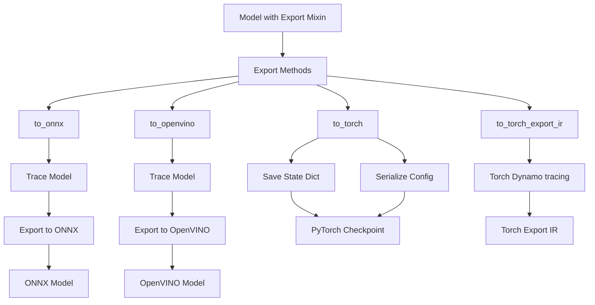

# Export System

Export trained models to multiple formats.

## Backends

- **PyTorch** - Save checkpoint with config
- **ONNX** - Cross-platform deployment
- **OpenVINO** - Intel hardware optimization
- **Torch Export IR** - Edge/mobile deployment

## Export Mixin

Add export capabilities to policy classes:

```python test="skip" reason="interface example, not executable"
from getiaction.export import Export
from getiaction.policies.base import Policy

class MyPolicy(Export, Policy):
    pass

policy = MyPolicy()
policy.to_torch("model.pt")
policy.to_onnx("model.onnx")
policy.to_openvino("model.xml")
policy.to_torch_export_ir("model.ptir")
```

## Architecture



## Export Formats

### PyTorch Checkpoints

Standard PyTorch checkpoint with embedded configuration:

```python test="skip" reason="requires getiaction install and model config"
from getiaction.policies.act import ACT

policy = ACT(...)
policy.to_torch("checkpoint.pt")
```

**Checkpoint Contents:**

- Model state dictionary (weights and biases)
- Model configuration (serialized as dict)

### ONNX Format

Optimized format for deployment and inference:

```python test="skip" reason="requires getiaction install and model config"
policy = ACT(...)
policy.to_onnx("model.onnx")
```

**ONNX Benefits:**

- Cross-platform inference
- Hardware acceleration support
- Runtime optimizations
- Deployment to edge devices

### OpenVINO Format

Optimized format for deployment and inference on Intel hardware:

```python test="skip" reason="requires getiaction install and model config"
policy = ACT(...)
policy.to_openvino("model.xml")
```

**OpenVINO Benefits:**

- Cross-platform inference
- Hardware acceleration support on Intel hardware
- Runtime optimizations

### Torch IR Format

That format aims to preserve input model graph in the original pythorch aten dialect.
Model can be loaded and executed by pytorch without any extra deps:

```python test="skip" reason="requires getiaction install and model config"
policy = ACT(...)
policy.to_torch_export_ir("model.ptir")

loaded_program = torch.export.load("model.ptir")
output = loaded_program.module()(policy.model.sample_input)
```

**Torch IR Benefits:**

- Cross-platform inference
- Hardware acceleration support via executorch
- Runtime optimizations

## Configuration Serialization for Torch models

The export system automatically serializes model configurations to preserve reproducibility:

- **Dataclasses** → Serialized to class_path and init_args
- **Nested Configs** → Recursively serialized
- **StrEnum Values** → Converted to strings
- **NumPy Arrays** → Converted to lists
- **Tuples** → Converted to lists

## Integration with Policy Base Class

All policies automatically inherit export capabilities:

```python test="skip" reason="interface example, not executable"
from getiaction.policies.act import ACT

class ACT(Export, Policy):
    """Export is inherited automatically."""
    pass

# All policies support export
policy.to_torch("checkpoint.pt")
policy.to_onnx("model.onnx")
```

## Best Practices

### 1. Implement sample_input Property

For ONNX export, provide a sample input:

```python test="skip" reason="interface example, not executable"
class MyModel(nn.Module):
    @property
    def sample_input(self) -> dict[str, torch.Tensor]:
        return {"action": torch.randn(1, *self.action_shape)}
```

### 2. Provide extra_export_args

Customize ONNX export with additional arguments:

```python test="skip" reason="interface example, not executable"
class MyModel(nn.Module):
    @property
    def extra_export_args(self) -> dict:
        return {
            "onnx": {
                "output_names": ["action"],
                "dynamic_axes": {"action": {0: "batch_size"}},
            }
        }
```

### 3. Use config Property

Store model configuration for serialization:

```python test="skip" reason="interface example, not executable"
class MyModel(nn.Module):
    def __init__(self, config: MyConfig):
        super().__init__()
        self.config = config  # Will be automatically serialized
```

`self.config` should be a dataclass containing integral python datatypes,
or related getiaction entities. Only in that case, serializaiton is guaranteed.

## Usage Examples

### Basic Export

```python test="skip" reason="requires getiaction install, trained model, and datamodule"
from getiaction.policies.act import ACT
from getiaction.train import Trainer

# Create and train model
policy = ACT(...)
trainer = Trainer(max_epochs=100)
trainer.fit(policy, datamodule)

# Export to PyTorch
policy.to_torch("trained_model.pt")

# Export to ONNX
policy.to_onnx("trained_model.onnx")

# Export to OpenVINO
policy.to_openvino("trained_model.xml")

# Export to Torch IR
policy.to_torch_export_ir("trained_model.ptir")
```

### Custom ONNX Export

```python test="skip" reason="requires getiaction install and trained model"
# Export with custom arguments
policy.to_onnx(
    "model.onnx",
    opset_version=14,
    output_names=["predictions"],
)
```

### Providing Input Sample

```python test="skip" reason="requires getiaction install and trained model"
# Explicit input sample
input_sample = {
    "image": torch.randn(1, 3, 224, 224),
    "state": torch.randn(1, 14),
}
policy.to_onnx("model.onnx", input_sample=input_sample)
```

## Related Documentation

- [Configuration System](../config/README.md) - Configuration serialization
- [Policy Base Class](../policy/README.md) - Policy interface

This design provides a consistent, flexible interface for model export across
the entire GetiAction codebase.
