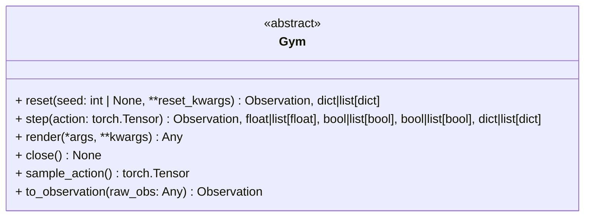

# Gym

Abstract interface for unified environment interaction.

Gym defines the backend-agnostic API used across action environments.
All environments must implement reset, step, sampling, and observation conversion.

