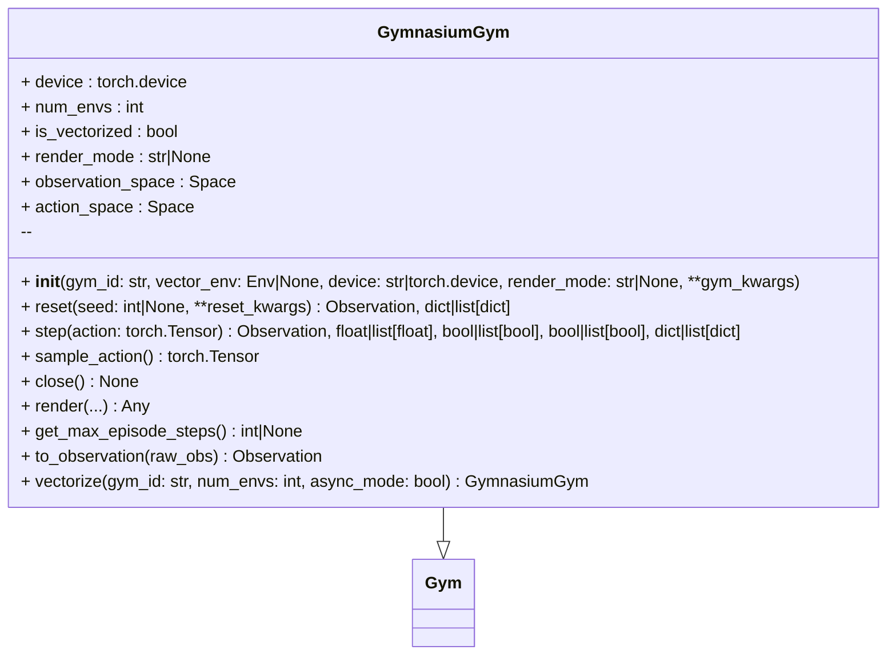

# Gymnasium Gym

Adapter providing unified Gym API over Gymnasium environments.

Supports single and vectorized modes. Normalizes actions, batching, and observation structure.



## Vector Environments

```python
from physicalai.gyms.gymnasium_gym import GymnasiumGym

# sync vector
env = GymnasiumGym.vectorize("CartPole-v1", num_envs=16)

# async vector
env = GymnasiumGym.vectorize("CartPole-v1", num_envs=8, async_mode=True)
```

## Reset + step

```python
obs, info = env.reset(seed=0)
action = env.sample_action()
obs, reward, terminated, truncated, info = env.step(action)
```
