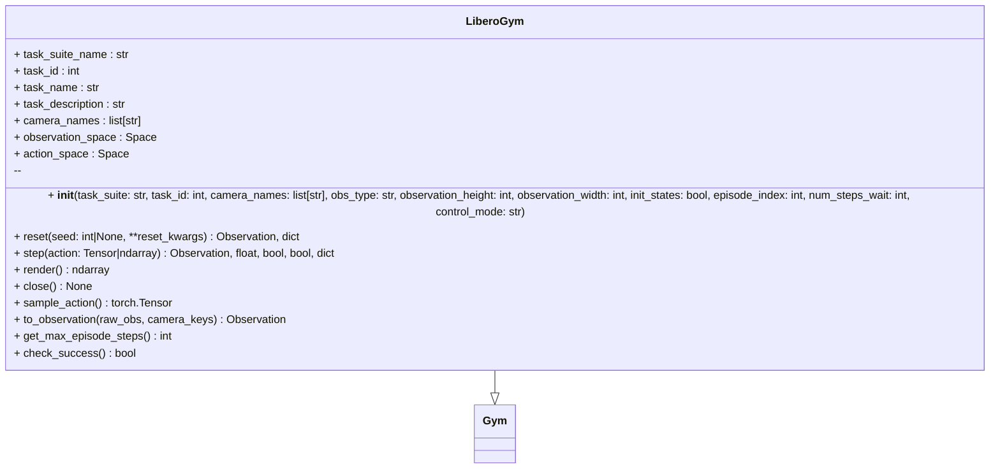

# LiberoGym

LIBERO benchmark environment wrapper for robot learning evaluation.

Provides a Gym interface for the LIBERO benchmark suite with exact LeRobot compatibility.
Supports all 5 LIBERO task suites with configurable camera views, observation types, and control modes.



## Installation

Requires optional LIBERO dependencies:

```bash
uv pip install -e '.[libero]'
```

or

```bash
pip install 'hf-libero>=0.1.3,<0.2.0'
```

## Task Suites

LIBERO provides 5 benchmark suites with varying episode limits:

- `libero_spatial` - 280 steps
- `libero_object` - 280 steps
- `libero_goal` - 300 steps
- `libero_10` - 520 steps
- `libero_90` - 400 steps

## Single Environment

```python
from physicalai.gyms import LiberoGym

# Create a single gym for one task
gym = LiberoGym(
    task_suite="libero_spatial",
    task_id=0,
    observation_height=224,
    observation_width=224,
)

# Reset and step
obs, info = gym.reset(seed=42)
action = gym.sample_action()
obs, reward, terminated, truncated, info = gym.step(action)
```

## Multiple Environments

```python
from physicalai.gyms import create_libero_gyms

# Create gyms for multiple task suites
gyms = create_libero_gyms(
    task_suites=["libero_spatial", "libero_object"],
    task_ids=[0, 1, 2],  # First 3 tasks from each suite
    observation_height=224,
    observation_width=224,
)

# Use with DataModule for validation
from physicalai.data import LeRobotDataModule

datamodule = LeRobotDataModule(
    repo_id="your_dataset",
    batch_size=32,
    val_gyms=gyms,
)
```

## Configuration

Key parameters:

- **task_suite**: Suite name (e.g., "libero_spatial")
- **task_id**: Task index within suite (0-based)
- **camera_names**: Camera views (default: `["agentview_image", "robot0_eye_in_hand_image"]`)
- **obs_type**: "pixels_agent_pos" (images + state) or "pixels" (images only)
- **observation_height/width**: Image dimensions (default: 256x256)
- **init_states**: Use predefined init states for reproducibility
- **control_mode**: "relative" (delta actions) or "absolute" (absolute control)

## Observation Format

- **State space**: 8-dim (3 pos + 3 orientation + 2 gripper)
- **Action space**: 7-dim continuous control in [-1, 1]
- **Images**: Automatically rotated 180° to match LeRobot conventions
- **Camera mapping**: `agentview_image` → `image`, `robot0_eye_in_hand_image` → `image2`
