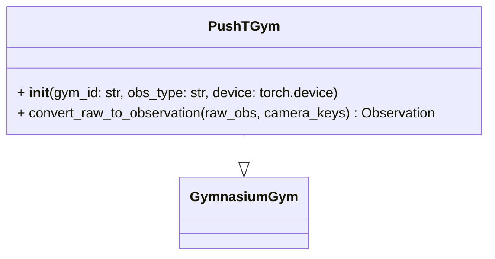

# PushTGym

Convenience wrapper around Gymnasium PushT. Provides typed image+position observations.



Example:

```python
from physicalai.gyms import PushTGym

# default configuration
env = PushTGym()

obs, info = env.reset(seed=0)
action = env.sample_action()

obs, reward, terminated, truncated, info = env.step(action)
```
