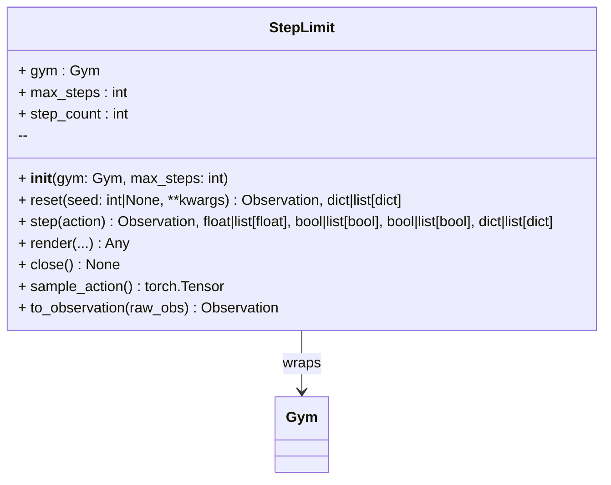

# StepLimit

A wrapper that enforces a maximum number of steps per episode.

`StepLimit` tracks environment steps and forces truncation once `max_steps` is reached.
Useful for tasks without natural termination, or when controlling rollout length.



Example:

```python
from physicalai.gyms import GymnasiumGym
from physicalai.gyms.step_limit import StepLimit

env = GymnasiumGym("CartPole-v1")
env = StepLimit(env, max_steps=200)

obs, info = env.reset()
action = env.sample_action()
obs, reward, terminated, truncated, info = env.step(action)
```

or with our helper function:

```python
from physicalai.gyms.step_limit import with_step_limit
env = with_step_limit(env, max_steps=200)
```
