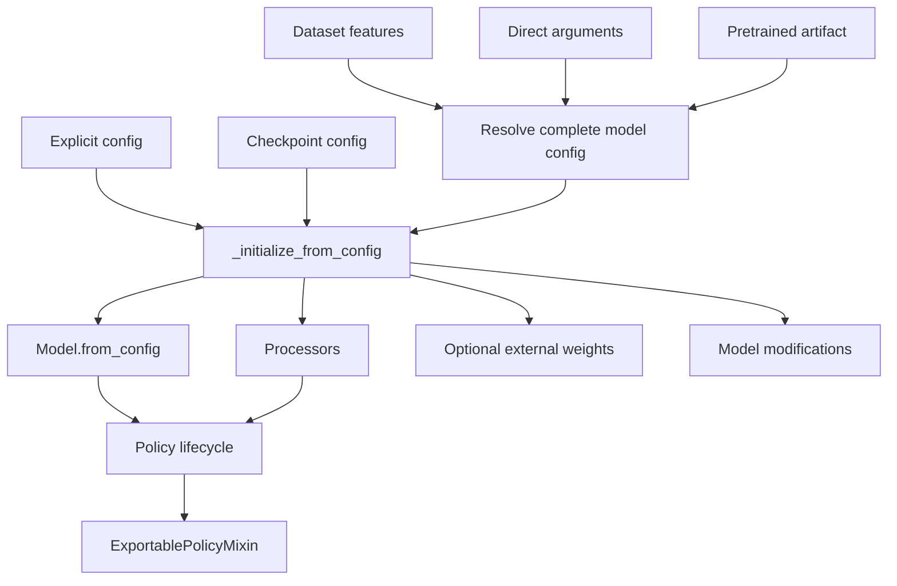

# Policy Design

Policies are Lightning modules that wrap PyTorch models for training, validation,
inference, checkpointing, and export. This document describes the design for native
PhysicalAI policies.

The central construction rule is:

> Every route that creates a model resolves a complete model config and passes it
> through one policy-owned materialization method.

The examples use `MyPolicy`, `MyModel`, and `MyModelConfig`. A concrete policy may
have different model components and processors, but should preserve the lifecycle and
ownership boundaries described here.

## Structure

A native policy normally separates configuration, model computation, processing, and
Lightning integration:

```text
policy_name/
|-- config.py        # Serializable model configuration
|-- model.py         # PyTorch model
|-- policy.py        # Lightning lifecycle and construction routes
|-- preprocessor.py  # Observation conversion and normalization
`-- postprocessor.py # Action conversion and denormalization
```

Small policies may combine these files. The separation of responsibilities matters
more than the file layout.


```mermaid
graph TD
    D[Dataset features] --> R[Resolve complete model config]
    A[Direct arguments] --> R
    H[Pretrained artifact] --> R
    C[Explicit config] --> I[_initialize_from_config]
    K[Checkpoint config] --> I
    R --> I
    I --> M[Model.from_config]
    I --> P[Processors]
    I --> W[Optional external weights]
    I --> X[Model modifications]
    M --> L[Policy lifecycle]
    P --> L
    L --> E[ExportablePolicyMixin]
```

## Base Contracts

### Model

`Model` is the PyTorch computation boundary. It receives preprocessed tensors and
owns network computation, training loss, validation loss, and temporal indices.

```python
class MyModel(Model, FromConfig):
    def forward(
        self,
        batch: dict[str, Tensor],
    ) -> Tensor | tuple[Tensor, dict[str, Tensor | float]]:
        if self.training:
            return self.compute_loss(batch)
        return self.predict_action_chunk(batch)

    def compute_loss(
        self,
        batch: dict[str, Tensor],
    ) -> tuple[Tensor, dict[str, Tensor | float]]:
        ...

    @torch.no_grad()
    def compute_val_loss(
        self,
        batch: dict[str, Tensor],
    ) -> tuple[Tensor, dict[str, Tensor | float]]:
        ...

    @torch.no_grad()
    def predict_action_chunk(self, batch: dict[str, Tensor]) -> Tensor:
        ...
```

`compute_loss()` returns a loss tensor with gradients and a metrics dictionary with
at least a `"loss"` key. `compute_val_loss()` may reuse the training loss.

The model also implements `observation_delta_indices`, `action_delta_indices`, and
`reward_delta_indices`. Data loading uses these properties to select the temporal
context required by the model.

### Policy

`Policy` is the Lightning and environment-facing boundary. It receives
`Observation` objects and owns:

- model and processor lifecycle;
- training and validation integration;
- optimizer construction;
- checkpoint config persistence;
- pretrained artifact resolution and weight loading;
- action queue management inherited from the base class;
- optional export integration through `ExportablePolicyMixin`.

A native policy implements at least `forward()`, `predict_action_chunk()`,
`compute_val_loss()`, `training_step()`, and `configure_optimizers()`.

The base `Policy.select_action()` calls `predict_action_chunk()` when its action queue
is empty, queues up to `n_action_steps`, and returns one action at a time. `reset()`
clears that queue at the start of an episode. The resolved model action horizon and
the value passed to `Policy.__init__()` must therefore agree.

The base class also:

- transfers `Observation` batches to the active Lightning device;
- dispatches observation validation to `compute_val_loss()`;
- runs validation and test rollouts for gym batches;
- aggregates rollout metrics across an epoch.

## Model Configuration

The model config is a serializable description of the final model and its input and
output contract. Features are ordered lists because order affects model inputs, action
concatenation, postprocessing, and exported manifests.

```python
@dataclass
class MyModelConfig(Config):
    input_features: list[Feature]
    output_features: list[Feature]
    hidden_size: int = 1024
    chunk_size: int = 32
    n_action_steps: int = 32
```

Architecture fields stay flat so `FromConfig` can map them directly to matching model
constructor arguments:

```python
class MyModel(Model, FromConfig):
    def __init__(
        self,
        input_features: list[Feature],
        output_features: list[Feature],
        *,
        hidden_size: int = 1024,
        chunk_size: int = 32,
        n_action_steps: int = 32,
    ) -> None:
        super().__init__()
        self._config = MyModelConfig(
            input_features=input_features,
            output_features=output_features,
            hidden_size=hidden_size,
            chunk_size=chunk_size,
            n_action_steps=n_action_steps,
        )
        ...

    @property
    def config(self) -> MyModelConfig:
        return self._config
```

Config defaults and constructor defaults should match. Avoid a second policy-specific
mapping that manually expands every config field into a differently shaped model API.

Normalization parameters are optional data on each `Feature`. They do not define the
feature contract. A feature still has a name, type, shape, and position when no
normalization statistics are available.

## Ownership

| Owner | Responsibilities |
| --- | --- |
| Model config | Ordered features, architecture, chunk size, action horizon, and serializable model behavior |
| Policy | Training lifecycle, optimizer settings, export settings, artifact selection, external weight loading, and model modifications |
| Dataset | Training feature contract, feature order, and optional normalization statistics |
| Model | Network construction, loss computation, temporal indices, and action prediction |
| Processors | Conversion and normalization before and after the model |
| Pretrained resolver | Artifact lookup and translation of artifact metadata into a model config plus weight paths |

Optimizer settings, training lifecycle controls, and artifact locations are not model
configuration. Conversely, feature-dependent architecture and output interpretation
must not be inferred indirectly from optimizer settings or `dataset_stats`.

## One Materialization Path

The policy resolves configuration separately from materializing model-dependent
objects. All construction routes delegate to `_initialize_from_config()` after they
have produced the final config.

```python
def _initialize_from_config(
    self,
    config: MyModelConfig,
    *,
    weights_path: Path | None = None,
) -> None:
    if self.model is not None:
        raise RuntimeError("Policy model is already initialized")

    self._input_features = config.input_features
    self._output_features = config.output_features
    self._n_action_steps = config.n_action_steps
    self._chunk_size = config.chunk_size
    self.model = MyModel.from_config(config)
    self._preprocessor, self._postprocessor = make_policy_processors(config)

    if weights_path is not None:
        self.model.load_weights(weights_path)

    self._apply_model_modifications()
```

The order is deliberate:

1. Record the resolved feature and action contract.
2. Construct the model from that complete config.
3. Construct processors from the same config.
4. Load compatible external weights into the final architecture.
5. Apply requested modifications such as gradient checkpointing or LoRA.

Rejecting double initialization prevents a route from silently rebuilding a model,
discarding loaded weights, or applying modifications twice.

## Construction Routes

### Explicit config

`from_config()` creates the policy with policy-owned options and immediately
materializes the model. It does not imply pretrained weight loading.

```python
@classmethod
def from_config(
    cls,
    config: MyModelConfig,
    *,
    optimizer_lr: float = 1e-4,
) -> "MyPolicy":
    policy = cls(
        n_action_steps=config.n_action_steps,
        optimizer_lr=optimizer_lr,
    )
    policy._initialize_from_config(config)
    return policy
```

### Fresh eager construction

When the constructor receives complete input and output features, it can initialize
immediately:

```text
policy constructor
    -> resolve config from features and model defaults
    -> _initialize_from_config
```

This route is useful when the feature contract is already known independently of a
trainer or dataset.

### Lazy dataset construction

When features are omitted, `setup("fit")` obtains ordered observation and action
features from the training dataset, resolves the final config, and initializes once:

```text
Lightning setup
    -> training dataset input and output features
    -> resolve fresh or pretrained config
    -> _initialize_from_config
```

This is the primary training route. It uses dataset features directly rather than
reconstructing feature identity, type, shape, and order from `dataset_stats`.

If the policy was initialized eagerly, `setup()` validates its resolved feature
contract against the dataset. A mismatch raises an error instead of rebuilding the
model and losing its weights.

### Pretrained construction

A pretrained resolver returns a model config and weight artifacts separately. Dataset
or constructor features may replace the artifact's feature metadata before model
construction when the architecture supports that adaptation.

```python
pretrained_config, weights_path = self._from_hf(pretrained_name_or_path)
config = replace(
    pretrained_config,
    input_features=resolved_input_features,
    output_features=resolved_output_features,
    n_action_steps=self._n_action_steps,
)
self._initialize_from_config(config, weights_path=weights_path)
```

The final feature-dependent architecture is constructed before weights are loaded.
Artifact location and download controls remain policy concerns rather than fields in
the model config.

### Lightning checkpoint restoration

The checkpoint stores the complete model config as structured data:

```python
def on_save_checkpoint(self, checkpoint: dict[str, Any]) -> None:
    checkpoint["model_config"] = self._require_model().config.to_dict()
```

During restoration, the policy deserializes the config and initializes the
architecture before Lightning restores the state dictionary:

```python
def on_load_checkpoint(self, checkpoint: dict[str, Any]) -> None:
    config_data = checkpoint.get("model_config")
    if isinstance(config_data, Mapping):
        self._restore_model_config(config_data)
```

If the policy is already initialized, restoration verifies that the configs match.
Otherwise it delegates to `_initialize_from_config()`. This route does not fetch or
reload external pretrained weights; Lightning restores the checkpoint tensors.

| Route | Config source | Weight source |
| --- | --- | --- |
| Explicit config | Caller-provided model config | None |
| Fresh eager | Constructor features and defaults | None |
| Fresh lazy | Training dataset features and policy model options | None |
| Pretrained | Artifact config adapted to resolved features | External artifact |
| Checkpoint | Serialized `model_config` | Lightning state dictionary |

## Processing and Runtime Flow

The processors and model receive the same ordered feature contract:

```text
Observation
    -> preprocessor
    -> model tensors
    -> predicted action chunk
    -> postprocessor
    -> environment actions
```

The preprocessor converts `Observation` fields into model inputs and normalizes
floating-point features when normalization data is present.

The postprocessor reverses output normalization in the same order. For multiple
action features, concatenation and slicing must follow `config.output_features`
exactly.

A typical policy delegates runtime behavior as follows:

```python
def forward(self, batch: Observation):
    model = self._require_model()
    if self.training:
        return model(self._prepare_batch(batch, require_actions=True))
    return self.predict_action_chunk(batch)

def compute_val_loss(self, batch: Observation):
    model = self._require_model()
    return model.compute_val_loss(self._prepare_batch(batch, require_actions=True))

def predict_action_chunk(self, batch: Observation) -> Tensor:
    model = self._require_model()
    actions = model.predict_action_chunk(
        self._prepare_batch(batch, require_actions=False)
    )
    return self._postprocessor(actions)
```

## Export

Export-capable policies continue to inherit `ExportablePolicyMixin`. The mixin owns
backend integration, sample-input handling, and manifest creation; this policy design
does not change that boundary.

The policy supplies export input and output schemas derived from its resolved config.
Schema order must match `config.input_features` and `config.output_features`, so the
contract remains stable from dataset through runtime:

```text
dataset feature order
    -> model config
    -> model and processors
    -> export schemas and manifest
    -> runtime input and output order
```

Not every policy implements export schema hooks immediately. Inheriting the
mixin and defining `inputs_schema`, `outputs_schema`, and any required sample inputs
are separate implementation steps; model construction must not depend on export.

### Config-driven export metadata

`ExportablePolicyMixin` exposes four policy extension points:

- `inputs_schema` describes raw runtime inputs and their order;
- `outputs_schema` describes exported model outputs and their order;
- `extra_export_args` supplies backend-specific parameters and manifest components;
- `get_supported_export_backends()` declares the backends implemented by the policy.

Schemas should be derived from the resolved model config rather than rebuilt from
`dataset_stats` or maintained as a second feature list. ACT provides the basic pattern:
one canonical state input, one or more canonically named image inputs, and one action
chunk output. A VLA policy can append a language input as SmolVLA does.

```python
@property
def inputs_schema(self) -> list[InferenceFeature] | None:
    if self.model is None:
        return None

    config = self._require_model().config
    state_feature = next(
        feature for feature in config.input_features
        if feature.ftype == FeatureType.STATE
    )
    schema = [
        InferenceFeature(
            ftype=InferenceFeatureType.STATE,
            shape=tuple(state_feature.shape),
            name=STATE,
            dtype=InferenceFeatureDtype.FLOAT32,
        )
    ]

    image_features = [
        feature for feature in config.input_features
        if feature.ftype == FeatureType.VISUAL
    ]
    for feature in image_features:
        name = IMAGES if len(image_features) == 1 else f"{IMAGES}.{feature.name}"
        schema.append(
            InferenceFeature(
                ftype=InferenceFeatureType.VISUAL,
                shape=tuple(feature.shape),
                name=name,
                dtype=InferenceFeatureDtype.FLOAT32,
            )
        )

    schema.append(
        InferenceFeature(
            ftype=InferenceFeatureType.LANGUAGE,
            shape=(config.tokenizer_max_length,),
            name=TASK,
            dtype=InferenceFeatureDtype.STRING,
        )
    )
    return schema

@property
def outputs_schema(self) -> list[InferenceFeature] | None:
    if self.model is None:
        return None
    config = self.model.config
    action_feature = config.output_features[0]
    return [
        InferenceFeature(
            ftype=InferenceFeatureType.ACTION,
            shape=(config.chunk_size, *action_feature.shape),
            name=ACTION,
            dtype=InferenceFeatureDtype.FLOAT32,
        )
    ]
```

Config feature order is retained within the state, image, and output groups; canonical runtime names keep the
manifest independent of dataset-specific prefixes.

Output names come from `outputs_schema`, and a difference between
the predicted chunk and execution horizon adds a manifest postprocessor:

```python
@property
def extra_export_args(self) -> dict[str, ExportParameters]:
    config = self._require_model().config
    output_names = [feature.name for feature in (self.outputs_schema or [])]
    postprocessors: list[ComponentSpec] = []
    if config.chunk_size != config.n_action_steps:
        postprocessors.append(
            ComponentSpec.model_validate(
                {
                    "type": "action_chunk_trimmer",
                    "n_action_steps": config.n_action_steps,
                }
            )
        )

    preprocessors = [
        ComponentSpec.model_validate(
            {
                "type": "resize",
                "image_resolution": config.image_size,
                "mode": "letterbox",
            }
        )
    ]
    return {
        "onnx": ONNXExportParameters(
            exporter_kwargs={"output_names": output_names},
            preprocessors_specs=preprocessors,
            postprocessors_specs=postprocessors,
        ),
        "openvino": OpenVINOExportParameters(
            outputs=output_names,
            preprocessors_specs=preprocessors,
            postprocessors_specs=postprocessors,
        ),
        "executorch": ExecuTorchExportParameters(
            preprocessors_specs=preprocessors,
            postprocessors_specs=postprocessors,
        ),
        "torch": TorchExportParameters(
            preprocessors_specs=[ComponentSpec(type="to_float_tensor")],
            postprocessors_specs=postprocessors,
        ),
    }

@staticmethod
def get_supported_export_backends() -> list[str | ExportBackend]:
    return [
        ExportBackend.TORCH,
        ExportBackend.OPENVINO,
        ExportBackend.ONNX,
        ExportBackend.EXECUTORCH,
    ]
```

`ExportablePolicyMixin` can use `inputs_schema` to create a raw sample when a caller
does not provide one. A `LANGUAGE`/`STRING` entry describes raw task text, so traced
export requires a tokenizer preprocessor such as SmolVLA's Hugging Face or OpenVINO
tokenizer component. The reference template includes the language manifest entry but
does not yet implement that tokenizer boundary; it demonstrates export metadata, not
end-to-end raw-text conversion.

Policy-specific options may populate additional backend parameters when they describe
required processing. MolmoAct2, for example, derives normalization components and
token IDs from its resolved config. A generic policy should not copy tokenizer,
normalization, or image-processing metadata it does not use.

The export destination, selected backend, and one-off conversion overrides remain
arguments to `policy.export(...)`. They are not part of model construction and should
not be added to the model config merely to invoke an export.

## Invariants

A native policy should maintain these invariants:

1. A policy instance materializes its model at most once.
2. Every model is constructed from a complete model config.
3. Every construction route delegates to `_initialize_from_config()`.
4. The model and processors receive the same ordered features.
5. External weights load only after the final architecture is constructed.
6. Checkpoint restoration does not fetch external pretrained weights.
7. `config.n_action_steps` agrees with the base policy action queue.
8. Lazy training uses the dataset's ordered feature contract.
9. Eager feature mismatches fail instead of silently rebuilding the model.
10. Export schema order matches model config and dataset feature order.

## Author Checklist

When adding or migrating a native policy:

- Define one serializable model config with ordered input and output features.
- Keep model config and model constructor fields flat and aligned.
- Make the model constructible with `Model.from_config(config)`.
- Build model and processors only in `_initialize_from_config()`.
- Keep pretrained config resolution separate from weight loading.
- Read lazy training features directly from the dataset.
- Save and restore the complete model config in Lightning checkpoints.
- Implement training, validation, and action prediction against `Observation`.
- Keep `n_action_steps` synchronized across config, postprocessing, and the action queue.
- Derive export schemas from the same ordered feature contract when export is supported.

## See Also

- [Data design](../data/README.md)
- [Trainer design](../trainer/README.md)
- [Export design](../export/README.md)